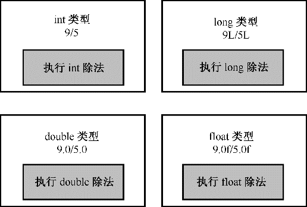

### 3.4.2　除法分支

除法运算符（/）的行为取决于操作数的类型。如果两个操作数都是整数，则C++将执行整数除法。这意味着结果的小数部分将被丢弃，使得最后的结果是一个整数。如果其中有一个（或两个）操作数是浮点值，则小数部分将保留，结果为浮点数。程序清单3.11演示了C++除法如何处理不同类型的值。和程序清单3.10一样，该程序也调用setf()成员函数来修改结果的显示方式。

程序清单3.11　divide.cpp

```css
// divide.cpp -- integer and floating-point division
#include <iostream>
int main()
{
    using namespace std;
    cout.setf(ios_base::fixed, ios_base::floatfield);
    cout << "Integer division: 9/5 = " << 9 / 5 << endl;
    cout << "Floating-point division: 9.0/5.0 = ";
    cout << 9.0 / 5.0 << endl;
    cout << "Mixed division: 9.0/5 = " << 9.0 / 5 << endl;
    cout << "double constants: 1e7/9.0 = ";
    cout << 1.e7 / 9.0 << endl;
    cout << "float constants: 1e7f/9.0f = ";
    cout << 1.e7f / 9.0f << endl;
    return 0;
}
```

> **注意：**
> 如果编译器不接受setf()中的ios_base，请使用ios。
> 有些基于ANSI C之前的编译器的C++实现不支持浮点常量的f后缀。如果面临这样的问题，可以用(float) 1.e7 / (float) 9.0代替1.e7f / 9.0f。
> 有些实现会删除结尾的零。

下面是使用某种实现时，程序清单3.11中程序的输出：

```css
Integer division: 9/5 = 1
Floating-point division: 9.0/5.0 = 1.800000
Mixed division: 9.0/5 = 1.800000
double constants: 1e7/9.0 = 1111111.111111
float constants: 1e7f/9.0f = 1111111.125000
```

从第一行输出可知，整数9除以5的结果为整数1。4/5的小数部分（或0.8）被丢弃。在本章后面学习求模运算符时，将会看到这种除法的实际应用。接下来的两行表明，当至少有一个操作数是浮点数时，结果为1.8。实际上，对不同类型进行运算时，C++将把它们全部转换为同一类型。本章稍后将介绍这种自动转换。最后两行的相对精度表明，如果两个操作数都是double类型，则结果为double类型；如果两个操作数都是float类型，则结果为float类型。记住，浮点常量在默认情况下为double类型。


**运算符重载简介**

在程序清单3.11中，除法运算符表示了3种不同的运算：int除法、float除法和double除法。C++根据上下文（这里是操作数的类型）来确定运算符的含义。使用相同的符号进行多种操作叫作运算符重载（operator overloading）。C++有一些内置的重载示例。C++还允许扩展运算符重载，以便能够用于用户定义的类，因此在这里看到的是一个重要的OOP属性（参见图3.4）。


<center class="my_markdown"><b class="my_markdown">图3.4 各种除法</b></center>


