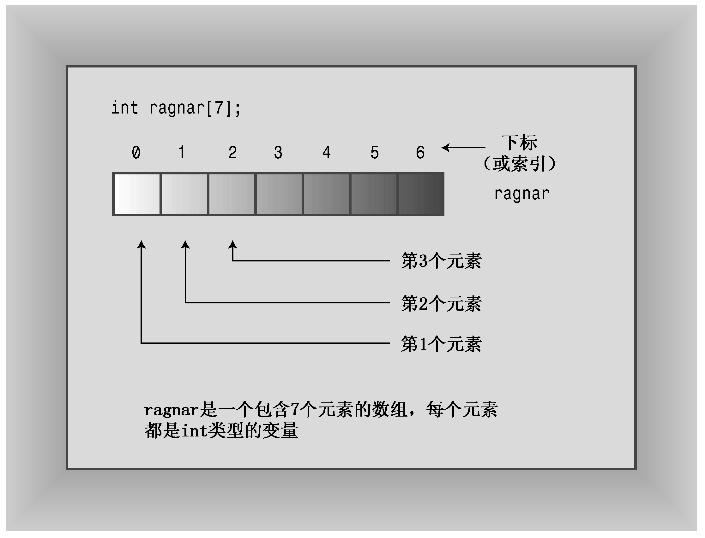

### 4.1　数组

数组（array）是一种数据格式，能够存储多个同类型的值。例如，数组可以存储60个int类型的值（这些值表示游戏5年来的销售量）、12个short值（这些值表示每个月的天数）或365个float值（这些值指出一年中每天在食物方面的开销）。每个值都存储在一个独立的数组元素中，计算机在内存中依次存储数组的各个元素。

要创建数组，可使用声明语句。数组声明应指出以下三点：

+ 存储在每个元素中的值的类型；
+ 数组名；
+ 数组中的元素数。

在C++中，可以通过修改简单变量的声明，添加中括号（其中包含元素数目）来完成数组声明。例如，下面的声明创建一个名为months的数组，该数组有12个元素，每个元素都可以存储一个short类型的值：

```css
short months[12];         // creates array of 12 short
```

事实上，可以将数组中的每个元素看作是一个简单变量。

声明数组的通用格式如下：

```css
typeName arrayName[arraySize];
```

表达式arraySize指定元素数目，它必须是整型常数（如10）或const值，也可以是常量表达式（如8 * sizeof（int）），即其中所有的值在编译时都是已知的。具体地说，arraySize不能是变量，变量的值是在程序运行时设置的。然而，本章稍后将介绍如何使用new运算符来避开这种限制。


**作为复合类型的数组**

数组之所以被称为复合类型，是因为它是使用其他类型来创建的（C语言使用术语“派生类型”，但由于C++对类关系使用术语“派生”，所以它必须创建一个新术语）。不能仅仅将某种东西声明为数组，它必须是特定类型的数组。没有通用的数组类型，但存在很多特定的数组类型，如char数组或long数组。例如，请看下面的声明：

```css
float loans[20];
```

loans的类型不是“数组”，而是“float数组”。这强调了loans数组是使用float类型创建的。


数组的很多用途都是基于这样一个事实：可以单独访问数组元素。方法是使用下标或索引来对元素进行编号。C++数组从0开始编号（这没有商量的余地，必须从0开始。Pascal和BASIC用户必须调整习惯）。C++使用带索引的方括号表示法来指定数组元素。例如，months[0]是months数组的第一个元素，months[11]是最后一个元素。注意，最后一个元素的索引比数组长度小1（参见图4.1）。因此，数组声明能够使用一个声明创建大量的变量，然后便可以用索引来标识和访问各个元素。


<center class="my_markdown"><b class="my_markdown">图4.1 创建数组</b></center>


**有效下标值的重要性**

编译器不会检查使用的下标是否有效。例如，如果将一个值赋给不存在的元素months[101]，编译器并不会指出错误。但是程序运行后，这种赋值可能引发问题，它可能破坏数据或代码，也可能导致程序异常终止。所以必须确保程序只使用有效的下标值。


程序清单4.1中的马铃薯分析程序说明了数组的一些属性，包括声明数组、给数组元素赋值以及初始化数组。

程序清单4.1　arrayone.cpp

```css
// arrayone.cpp -- small arrays of integers
#include <iostream>
int main()
{
    using namespace std;
    int yams[3]; // creates array with three elements
    yams[0] = 7; // assign value to first element
    yams[1] = 8;
    yams[2] = 6;
    int yamcosts[3] = {20, 30, 5}; // create, initialize array
// NOTE: If your C++ compiler or translator can't initialize
// this array, use static int yamcosts[3] instead of
// int yamcosts[3]
    cout << "Total yams = ";
    cout << yams[0] + yams[1] + yams[2] << endl;
    cout << "The package with " << yams[1] << " yams costs ";
    cout << yamcosts[1] << " cents per yam.\n";
    int total = yams[0] * yamcosts[0] + yams[1] * yamcosts[1];
    total = total + yams[2] * yamcosts[2];
    cout << "The total yam expense is " << total << " cents.\n";
    cout << "\nSize of yams array = " << sizeof yams;
    cout << " bytes.\n";
    cout << "Size of one element = " << sizeof yams[0];
    cout << " bytes.\n";
    return 0;
}
```

下面是该程序的输出：

```css
Total yams = 21
The package with 8 yams costs 30 cents per yam.
The total yam expense is 410 cents.
Size of yams array = 12 bytes.
Size of one element = 4 bytes.
```

