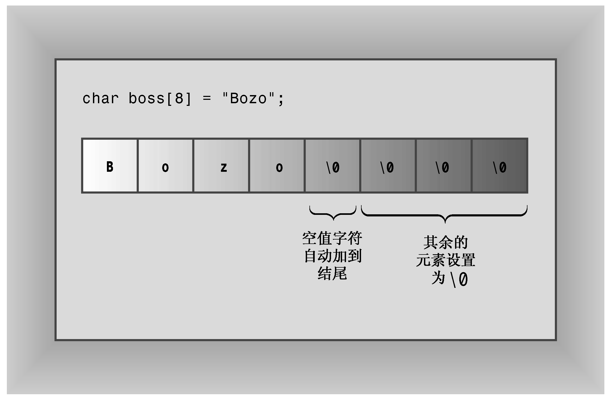

### 4.2　字符串

字符串是存储在内存的连续字节中的一系列字符。C++处理字符串的方式有两种。第一种来自C语言，常被称为C-风格字符串（C-style string）。本章将首先介绍它，然后介绍另一种基于string类库的方法。

存储在连续字节中的一系列字符意味着可以将字符串存储在char数组中，其中每个字符都位于自己的数组元素中。字符串提供了一种存储文本信息的便捷方式，如提供给用户的消息（“请告诉我您的瑞士银行账号”）或来自用户的响应（“您肯定在开玩笑”）。C-风格字符串具有一种特殊的性质：以空字符（null character）结尾，空字符被写作\0，其ASCII码为0，用来标记字符串的结尾。例如，请看下面两个声明：

```css
char dog[8] = { 'b', 'e', 'a', 'u', 'x', ' ', 'I', 'I'};  // not a string!
char cat[8] = {'f', 'a', 't', 'e', 's', 's', 'a', '\0'};  // a string!
```

这两个数组都是char数组，但只有第二个数组是字符串。空字符对C-风格字符串而言至关重要。例如，C++有很多处理字符串的函数，其中包括cout使用的那些函数。它们都逐个地处理字符串中的字符，直到到达空字符为止。如果使用cout显示上面的cat这样的字符串，则将显示前7个字符，发现空字符后停止。但是，如果使用cout显示上面的dog数组（它不是字符串），cout将打印出数组中的8个字母，并接着将内存中随后的各个字节解释为要打印的字符，直到遇到空字符为止。由于空字符（实际上是被设置为0的字节）在内存中很常见，因此这一过程将很快停止。但尽管如此，还是不应将不是字符串的字符数组当作字符串来处理。

在cat数组示例中，将数组初始化为字符串的工作看上去冗长乏味——使用大量单引号，且必须记住加上空字符。不必担心，有一种更好的、将字符数组初始化为字符串的方法——只需使用一个用引号括起的字符串即可，这种字符串被称为字符串常量（string constant）或字符串字面值（string literal），如下所示：

```css
char bird[11] = "Mr. Cheeps";    // the \0 is understood
char fish[] = "Bubbles";         // let the compiler count
```

用引号括起的字符串隐式地包括结尾的空字符，因此不用显式地包括它（参见图4.2）。另外，各种C++输入工具通过键盘输入，将字符串读入 char数组中时，将自动加上结尾的空字符（如果在运行程序清单4.1中的程序时发现，必须使用关键字static来初始化数组，则初始化上述char数组时也必须使用该关键字）。


<center class="my_markdown"><b class="my_markdown">图4.2 将数组初始化为字符串</b></center>

当然，应确保数组足够大，能够存储字符串中所有字符——包括空字符。使用字符串常量初始化字符数组是这样的一种情况，即让编译器计算元素数目更为安全。让数组比字符串长没有什么害处，只是会浪费一些空间而已。这是因为处理字符串的函数根据空字符的位置，而不是数组长度来进行处理。C++对字符串长度没有限制。

> **警告：**
> 在确定存储字符串所需的最短数组时，别忘了将结尾的空字符计算在内。

注意，字符串常量（使用双引号）不能与字符常量（使用单引号）互换。字符常量（如'S'）是字符串编码的简写表示。在ASCII系统上，'S'只是83的另一种写法，因此，下面的语句将83赋给shirt_size：

```css
char shirt_size = 'S';   // this is fine
```

但"S"不是字符常量，它表示的是两个字符（字符S和\0）组成的字符串。更糟糕的是，"S"实际上表示的是字符串所在的内存地址。因此下面的语句试图将一个内存地址赋给shirt_size：

```css
char shirt_size = "S";   // illegal type mismatch
```

由于地址在C++中是一种独立的类型，因此C++编译器不允许这种不合理的做法（本章后面讨论指针后，将回过头来讨论这个问题）。

