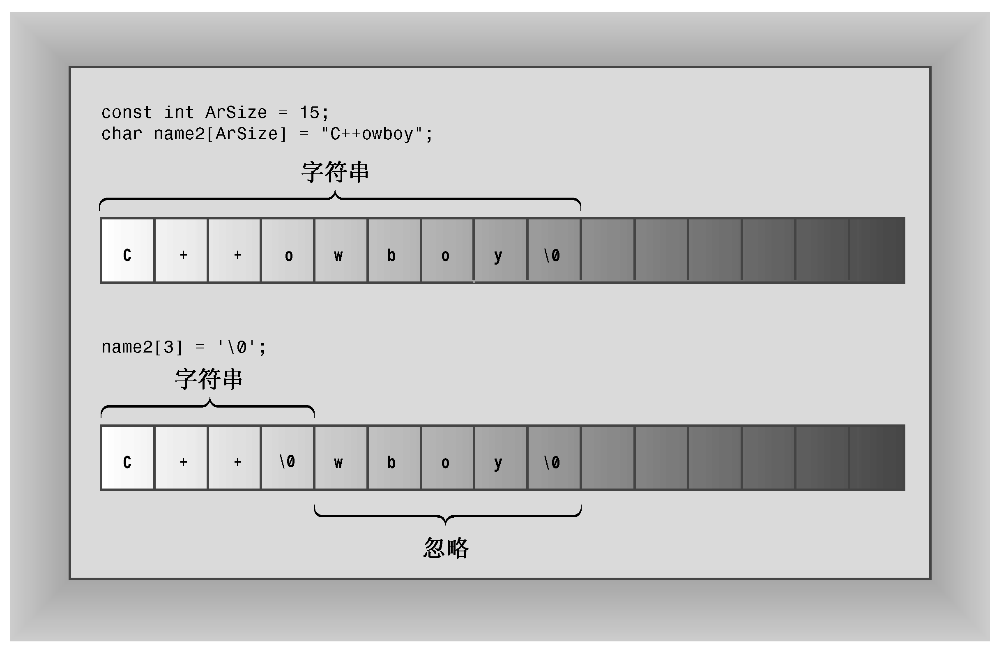

### 4.2.2　在数组中使用字符串

要将字符串存储到数组中，最常用的方法有两种——将数组初始化为字符串常量、将键盘或文件输入读入到数组中。程序清单4.2演示了这两种方法，它将一个数组初始化为用引号括起的字符串，并使用cin将一个输入字符串放到另一个数组中。该程序还使用了标准C语言库函数strlen()来确定字符串的长度。标准头文件cstring（老式实现为string.h）提供了该函数以及很多与字符串相关的其他函数的声明。

程序清单4.2　strings.cpp

```css
// strings.cpp -- storing strings in an array
#include <iostream>
#include <cstring> // for the strlen() function
int main()
{
    using namespace std;
    const int Size = 15;
    char name1[Size];                // empty array
    char name2[Size] = "C++owboy";  // initialized array
    // NOTE: some implementations may require the static keyword
    // to initialize the array name2
    cout << "Howdy! I'm " << name2;
    cout << "! What's your name?\n";
    cin >> name1;
    cout << "Well, " << name1 << ", your name has ";
    cout << strlen(name1) << " letters and is stored\n";
    cout << "in an array of " << sizeof(name1) << " bytes.\n";
    cout << "Your initial is " << name1[0] << ".\n";
    name2[3] = '\0'; // set to null character
    cout << "Here are the first 3 characters of my name: ";
    cout << name2 << endl;
    return 0;
}
```

下面是该程序的运行情况：

```css
Howdy! I'm C++owboy! What's your name?
Basicman
Well, Basicman, your name has 8 letters and is stored
in an array of 15 bytes.
Your initial is B.
Here are the first 3 characters of my name: C++
```

**程序说明**

从程序清单4.2中可以学到什么呢？首先，sizeof运算符指出整个数组的长度：15字节，但strlen()函数返回的是存储在数组中的字符串的长度，而不是数组本身的长度。另外，strlen()只计算可见的字符，而不把空字符计算在内。因此，对于Basicman，返回的值为8，而不是9。如果cosmic是字符串，则要存储该字符串，数组的长度不能短于strlen（cosmic）+1。

由于name1和name2是数组，所以可以用索引来访问数组中各个字符。例如，该程序使用name1[0]找到数组的第一个字符。另外，该程序将name2[3]设置为空字符。这使得字符串在第3个字符后即结束，虽然数组中还有其他的字符（参见图4.3）。


<center class="my_markdown"><b class="my_markdown">图4.3　使用\0截短字符串</b></center>

该程序使用符号常量来指定数组的长度。程序常常有多条语句使用了数组长度。使用符号常量来表示数组长度后，当需要修改程序以使用不同的数组长度时，工作将变得更简单——只需在定义符号常量的地方进行修改即可。

