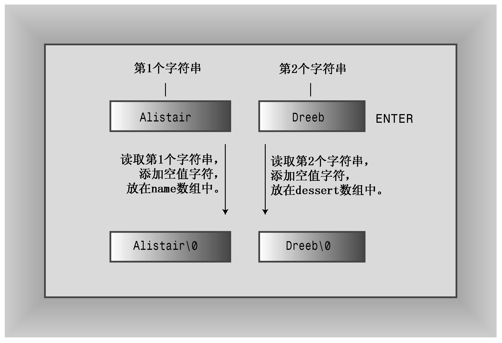

### 4.2.3　字符串输入

程序strings.cpp有一个缺陷，这种缺陷通过精心选择输入被掩盖掉了。程序清单4.3揭开了它的面纱，揭示了字符串输入的技巧。

程序清单4.3　instr1.cpp

```css
// instr1.cpp -- reading more than one string
#include <iostream>
int main()
{
    using namespace std;
    const int ArSize = 20;
    char name[ArSize];
    char dessert[ArSize];
    cout << "Enter your name:\n";
    cin >> name;
    cout << "Enter your favorite dessert:\n";
    cin >> dessert;
    cout << "I have some delicious " << dessert;
    cout << " for you, " << name << ".\n";
    return 0;
}
```

该程序的意图很简单：读取来自键盘的用户名和用户喜欢的甜点，然后显示这些信息。下面是该程序的运行情况：

```css
Enter your name:
Alistair Dreeb
Enter your favorite dessert:
I have some delicious Dreeb for you, Alistair.
```

我们甚至还没有对“输入甜点的提示”作出反应，程序便把它显示出来了，然后立即显示最后一行。

cin是如何确定已完成字符串输入呢？由于不能通过键盘输入空字符，因此cin需要用别的方法来确定字符串的结尾位置。cin使用空白（空格、制表符和换行符）来确定字符串的结束位置，这意味着cin在获取字符数组输入时只读取一个单词。读取该单词后，cin将该字符串放到数组中，并自动在结尾添加空字符。

这个例子的实际结果是，cin把Alistair作为第一个字符串，并将它放到name数组中。这把Dreeb留在输入队列中。当cin在输入队列中搜索用户喜欢的甜点时，它发现了Dreeb，因此cin读取Dreeb，并将它放到dessert数组中（参见图4.4）。


<center class="my_markdown"><b class="my_markdown">图4.4 使用cin读取字符串输入时的情况</b></center>

另一个问题是，输入字符串可能比目标数组长（运行中没有揭示出来）。像这个例子一样使用cin，确实不能防止将包含30个字符的字符串放到20个字符的数组中的情况发生。

很多程序都依赖于字符串输入，因此有必要对该主题做进一步探讨。我们必须使用cin的较高级特性，这将在第17章介绍。

