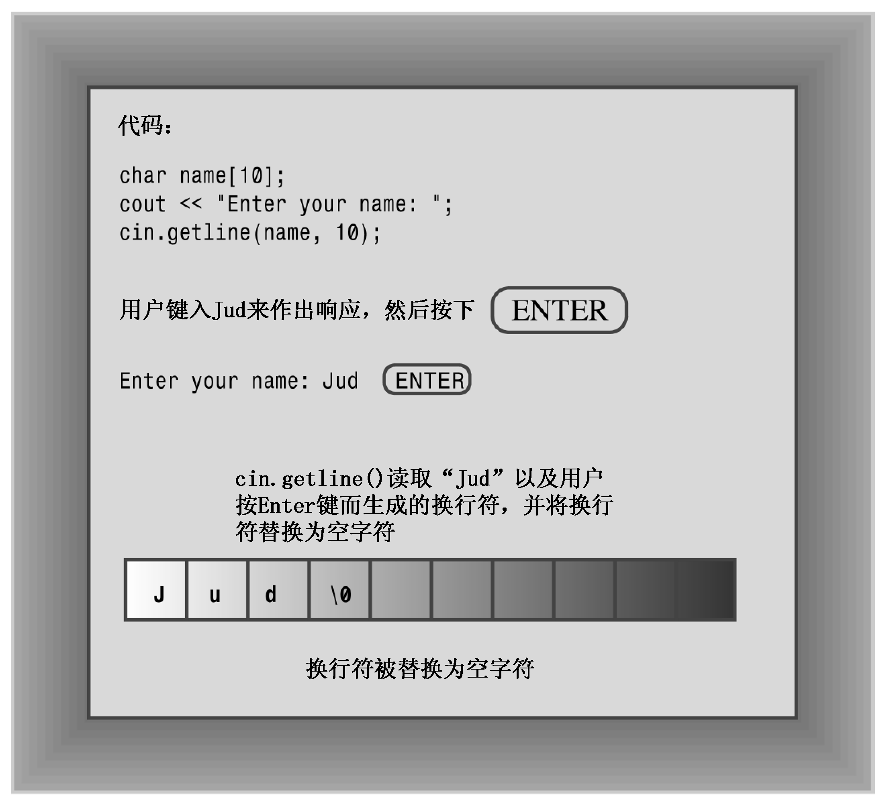

### 4.2.4　每次读取一行字符串输入

每次读取一个单词通常不是最好的选择。例如，假设程序要求用户输入城市名，用户输入New York或Sao Paulo。您希望程序读取并存储完整的城市名，而不仅仅是New或Sao。要将整条短语而不是一个单词作为字符串输入，需要采用另一种字符串读取方法。具体地说，需要采用面向行而不是面向单词的方法。幸运的是，istream中的类（如cin）提供了一些面向行的类成员函数：getline()和get()。这两个函数都读取一行输入，直到到达换行符。然而，随后getline()将丢弃换行符，而get()将换行符保留在输入序列中。下面详细介绍它们，首先介绍getline()。

#### 1．面向行的输入：getline()

getline()函数读取整行，它使用通过回车键输入的换行符来确定输入结尾。要调用这种方法，可以使用cin.getline()。该函数有两个参数。第一个参数是用来存储输入行的数组的名称，第二个参数是要读取的字符数。如果这个参数为20，则函数最多读取19个字符，余下的空间用于存储自动在结尾处添加的空字符。getline()成员函数在读取指定数目的字符或遇到换行符时停止读取。

例如，假设要使用getline()将姓名读入到一个包含20个元素的name数组中。可以使用这样的函数调用：

```css
cin.getline(name,20);
```

这将把一行读入到name数组中——如果这行包含的字符不超过19个（getline()成员函数还可以接受第三个可选参数，这将在第17章讨论）。

程序清单4.4将程序清单4.3修改为使用cin.getline()，而不是简单的cin。除此之外，该程序没有做其他修改。

程序清单4.4　instr2.cpp

```css
// instr2.cpp -- reading more than one word with getline
#include <iostream>
int main()
{
    using namespace std;
    const int ArSize = 20;
    char name[ArSize];
    char dessert[ArSize];
    cout << "Enter your name:\n";
    cin.getline(name, ArSize); // reads through newline
    cout << "Enter your favorite dessert:\n";
    cin.getline(dessert, ArSize);
    cout << "I have some delicious " << dessert;
    cout << " for you, " << name << ".\n";
    return 0;
}
```

下面是该程序的输出：

```css
Enter your name:
Dirk Hammernose
Enter your favorite dessert:
Radish Torte
I have some delicious Radish Torte for you, Dirk Hammernose.
```

该程序现在可以读取完整的姓名以及用户喜欢的甜点！getline()函数每次读取一行。它通过换行符来确定行尾，但不保存换行符。相反，在存储字符串时，它用空字符来替换换行符（参见图4.5）。


<center class="my_markdown"><b class="my_markdown">图4.5 getline()读取并替换换行符</b></center>

#### 2．面向行的输入：get()

我们来试试另一种方法。istream类有另一个名为get()的成员函数，该函数有几种变体。其中一种变体的工作方式与getline()类似，它们接受的参数相同，解释参数的方式也相同，并且都读取到行尾。但get并不再读取并丢弃换行符，而是将其留在输入队列中。假设我们连续两次调用get()：

```css
cin.get(name, ArSize);
cin.get(dessert, ArSize);    // a problem
```

由于第一次调用后，换行符将留在输入队列中，因此第二次调用时看到的第一个字符便是换行符。因此get()认为已到达行尾，而没有发现任何可读取的内容。如果不借助于帮助，get()将不能跨过该换行符。

幸运的是，get()有另一种变体。使用不带任何参数的cin.get()调用可读取下一个字符（即使是换行符），因此可以用它来处理换行符，为读取下一行输入做好准备。也就是说，可以采用下面的调用序列：

```css
cin.get(name, ArSize);      // read first line
cin.get();                  // read newline
cin.get(dessert, Arsize);   // read second line
```

另一种使用get()的方式是将两个类成员函数拼接起来（合并），如下所示：

```css
cin.get(name, ArSize).get(); // concatenate member functions
```

之所以可以这样做，是由于cin.get（name，ArSize）返回一个cin对象，该对象随后将被用来调用get()函数。同样，下面的语句将把输入中连续的两行分别读入数组name1和name2 中，其效果与两次调用cin.getline()相同：

```css
cin.getline(name1, ArSize).getline(name2, ArSize);
```

程序清单4.5采用了拼接方式。第11章将介绍如何在类定义中使用这项特性。

程序清单4.5　instr3.cpp

```css
// instr3.cpp -- reading more than one word with get() & get()
#include <iostream>
int main()
{
    using namespace std;
    const int ArSize = 20;
    char name[ArSize];
    char dessert[ArSize];
    cout << "Enter your name:\n";
    cin.get(name, ArSize).get(); // read string, newline
    cout << "Enter your favorite dessert:\n";
    cin.get(dessert, ArSize).get();
    cout << "I have some delicious " << dessert;
    cout << " for you, " << name << ".\n";
    return 0;
}
```

下面是程序清单4.5中程序的运行情况：

```css
Enter your name:
Mai Parfait
Enter your favorite dessert:
Chocolate Mousse
I have some delicious Chocolate Mousse for you, Mai Parfait.
```

需要指出的一点是，C++允许函数有多个版本，条件是这些版本的参数列表不同。如果使用的是cin.get（name，ArSize），则编译器知道是要将一个字符串放入数组中，因而将使用适当的成员函数。如果使用的是cin.get()，则编译器知道是要读取一个字符。第8章将探索这种特性——函数重载。

为什么要使用get()，而不是getline()呢？首先，老式实现没有getline()。其次，get()使输入更仔细。例如，假设用get()将一行读入数组中。如何知道停止读取的原因是由于已经读取了整行，而不是由于数组已填满呢？查看下一个输入字符，如果是换行符，说明已读取了整行；否则，说明该行中还有其他输入。第17章将介绍这种技术。总之，getline()使用起来简单一些，但get()使得检查错误更简单些。可以用其中的任何一个来读取一行输入；只是应该知道，它们的行为稍有不同。

#### 3．空行和其他问题

当getline()或get()读取空行时，将发生什么情况？最初的做法是，下一条输入语句将在前一条getline()或get()结束读取的位置开始读取；但当前的做法是，当get()（不是getline()）读取空行后将设置失效位（failbit）。这意味着接下来的输入将被阻断，但可以用下面的命令来恢复输入：

```css
cin.clear();
```

另一个潜在的问题是，输入字符串可能比分配的空间长。如果输入行包含的字符数比指定的多，则getline()和get()将把余下的字符留在输入队列中，而getline()还会设置失效位，并关闭后面的输入。

第5章、第6章和第17章将介绍这些属性，并探讨程序如何避免这些问题。

