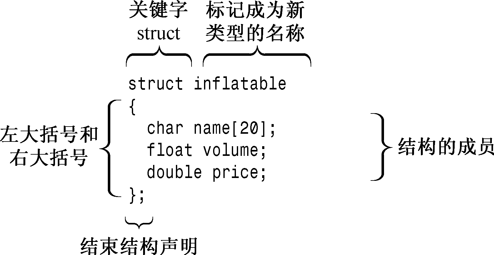

### 4.4　结构简介

假设要存储有关篮球运动员的信息，则可能需要存储他（她）的姓名、工资、身高、体重、平均得分、命中率、助攻次数等。希望有一种数据格式可以将所有这些信息存储在一个单元中。数组不能完成这项任务，因为虽然数组可以存储多个元素，但所有元素的类型必须相同。也就是说，一个数组可以存储20个int，另一个数组可以存储10个float，但同一个数组不能在一些元素中存储int，在另一些元素中存储float。

C++中的结构的可以满足要求（存储篮球运动员的信息）。结构是一种比数组更灵活的数据格式，因为同一个结构可以存储多种类型的数据，这使得能够将有关篮球运动员的信息放在一个结构中，从而将数据的表示合并到一起。如果要跟踪整个球队，则可以使用结构数组。结构也是C++ OOP堡垒（类）的基石。学习有关结构的知识将使我们离C++的核心OOP更近。

结构是用户定义的类型，而结构声明定义了这种类型的数据属性。定义了类型后，便可以创建这种类型的变量。因此创建结构包括两步。首先，定义结构描述——它描述并标记了能够存储在结构中的各种数据类型。然后按描述创建结构变量（结构数据对象）。

例如，假设Bloataire公司要创建一种类型来描述其生产线上充气产品的成员。具体地说，这种类型应存储产品名称、容量（单位为立方英尺）和售价。下面的结构描述能够满足这些要求：

```css
struct inflatable   // structure declaration
{
    char name[20];
    float volume;
    double price;
};
```

关键字struct表明，这些代码定义的是一个结构的布局。标识符inflatable是这种数据格式的名称，因此新类型的名称为inflatable。这样，便可以像创建char或int类型的变量那样创建inflatable类型的变量了。接下来的大括号中包含的是结构存储的数据类型的列表，其中每个列表项都是一条声明语句。这个例子使用了一个适合用于存储字符串的char数组、一个float和一个double。列表中的每一项都被称为结构成员，因此inflatable结构有3个成员（参见图 4.6）。总之，结构定义指出了新类型（这里是inflatable）的特征。


<center class="my_markdown"><b class="my_markdown">图4.6 结构描述的组成部分</b></center>

定义结构后，便可以创建这种类型的变量了：

```css
inflatable hat;             // hat is a structure variable of type inflatable
inflatable woopie_cushion;  // type inflatable variable
inflatable mainframe;       // type inflatable variable
```

如果您熟悉C语言中的结构，则可能已经注意到了，C++允许在声明结构变量时省略关键字struct：

```css
struct inflatable goose;  // keyword struct required in C
inflatable vincent;       // keyword struct not required in C++
```

在C++中，结构标记的用法与基本类型名相同。这种变化强调的是，结构声明定义了一种新类型。在C++中，省略struct不会出错。

由于hat的类型为inflatable，因此可以使用成员运算符（.）来访问各个成员。例如，hat.volume指的是结构的volume成员，hat.price指的是price成员。同样，vincent.price是vincent变量的price成员。总之，通过成员名能够访问结构的成员，就像通过索引能够访问数组的元素一样。由于price成员被声明为double类型，因此hat.price和vincent.price相当于是double类型的变量，可以像使用常规double变量那样来使用它们。总之，hat是一个结构，而hat.price是一个double变量。顺便说一句，访问类成员函数（如cin.getline()）的方式是从访问结构成员变量（如vincent.price）的方式衍生而来的。

