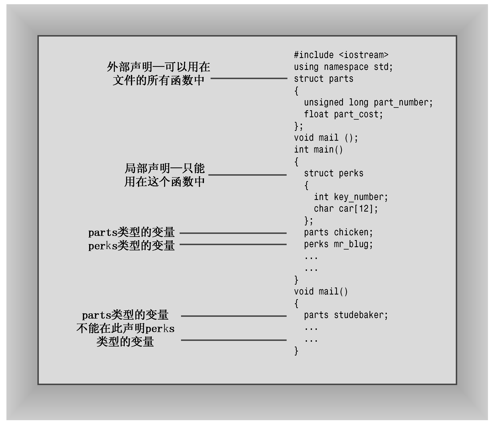

### 4.4.1　在程序中使用结构

介绍结构的主要特征后，下面在一个使用结构的程序中使用这些概念。程序清单4.11说明了有关结构的这些问题，还演示了如何初始化结构。

程序清单4.11　structur.cpp

```css
// structur.cpp -- a simple structure
#include <iostream>
struct inflatable // structure declaration
{
    char name[20];
    float volume;
    double price;
};
int main()
{
    using namespace std;
    inflatable guest =
    {
        "Glorious Gloria", // name value
        1.88,              // volume value
        29.99              // price value
    }; // guest is a structure variable of type inflatable
// It's initialized to the indicated values
    inflatable pal =
    {
        "Audacious Arthur",
        3.12,
        32.99
    }; // pal is a second variable of type inflatable
// NOTE: some implementations require using
// static inflatable guest =
    cout << "Expand your guest list with " << guest.name;
    cout << " and " << pal.name << "!\n";
// pal.name is the name member of the pal variable
    cout << "You can have both for $";
    cout << guest.price + pal.price << "!\n";
    return 0;
}
```

下面是该程序的输出：

```css
Expand your guest list with Glorious Gloria and Audacious Arthur!
You can have both for $62.98!
```

**程序说明**

结构声明的位置很重要。对于structur.cpp而言，有两种选择。可以将声明放在main()函数中，紧跟在开始括号的后面。另一种选择是将声明放到main()的前面，这里采用的便是这种方式，位于函数外面的声明被称为外部声明。对于这个程序来说，两种选择之间没有实际区别。但是对于那些包含两个或更多函数的程序来说，差别很大。外部声明可以被其后面的任何函数使用，而内部声明只能被该声明所属的函数使用。通常应使用外部声明，这样所有函数都可以使用这种类型的结构（参见图4.7）。


<center class="my_markdown"><b class="my_markdown">图4.7　局部结构声明和外部结构声明</b></center>

变量也可以在函数内部和外部定义，外部变量由所有的函数共享（这将在第9章做更详细的介绍）。C++不提倡使用外部变量，但提倡使用外部结构声明。另外，在外部声明符号常量通常更合理。

接下来，请注意初始化方式：

```css
inflatable guest =
{
    "Glorious Gloria", // name value
    1.88,              // volume value
    29.99              // price value
};
```

和数组一样，使用由逗号分隔值列表，并将这些值用花括号括起。在该程序中，每个值占一行，但也可以将它们全部放在同一行中。只是应用逗号将它们分开：

```css
inflatable duck = {"Daphne", 0.12, 9.98};
```

可以将结构的每个成员都初始化为适当类型的数据。例如，name成员是一个字符数组，因此可以将其初始化为一个字符串。

可将每个结构成员看作是相应类型的变量。因此，pal.price是一个double变量，而pal.name是一个char数组。当程序使用cout显示pal.name时，将把该成员显示为字符串。另外，由于pal.name是一个字符数组，因此可以用下标来访问其中的各个字符。例如，pal.name[0]是字符A。不过pal[0]没有意义，因为pal是一个结构，而不是数组。

