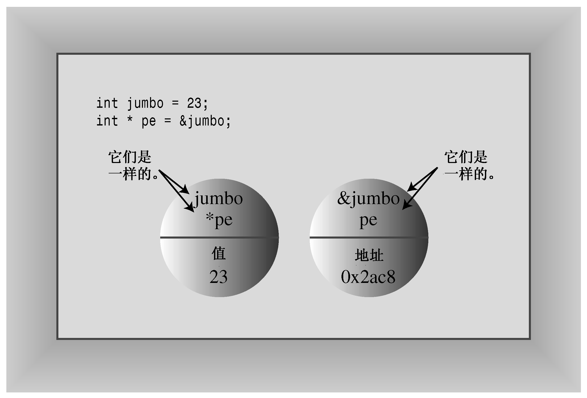

### 4.7　指针和自由存储空间

在第3章的开头，提到了计算机程序在存储数据时必须跟踪的3种基本属性。为了方便，这里再次列出了这些属性：

+ 信息存储在何处；
+ 存储的值为多少；
+ 存储的信息是什么类型。

您使用过一种策略来达到上述目的：定义一个简单变量。声明语句指出了值的类型和符号名，还让程序为值分配内存，并在内部跟踪该内存单元。

下面来看一看另一种策略，它在开发C++类时非常重要。这种策略以指针为基础，指针是一个变量，其存储的是值的地址，而不是值本身。在讨论指针之前，我们先看一看如何找到常规变量的地址。只需对变量应用地址运算符（&），就可以获得它的位置；例如，如果home是一个变量，则&home是它的地址。程序清单4.14演示了这个运算符的用法。

程序清单4.14　address.cpp

```css
// address.cpp -- using the & operator to find addresses
#include <iostream>
int main()
{
    using namespace std;
    int donuts = 6;
    double cups = 4.5;
    cout << "donuts value = " << donuts;
    cout << " and donuts address = " << &donuts << endl;
// NOTE: you may need to use unsigned (&donuts)
// and unsigned (&cups)
    cout << "cups value = " << cups;
    cout << " and cups address = " << &cups << endl;
    return 0;
}
```

下面是该程序在某个系统上的输出：

```css
donuts value = 6 and donuts address = 0x0065fd40
cups value = 4.5 and cups address = 0x0065fd44
```

显示地址时，该实现的cout使用十六进制表示法，因为这是常用于描述内存的表示法（有些实现可能使用十进制表示法）。在该实现中，donuts的存储位置比cups要低。两个地址的差为0x0065fd44 – 0x0065fd40（即4）。这是有意义的，因为donuts的类型为int，而这种类型使用4个字节。当然，不同系统给定的地址值可能不同。有些系统可能先存储cups，再存储donuts，这样两个地址值的差将为8个字节，因为cups的类型为double。另外，在有些系统中，可能不会将这两个变量存储在相邻的内存单元中。

使用常规变量时，值是指定的量，而地址为派生量。下面来看看指针策略，它是C++内存管理编程理念的核心（参见旁注“指针与C++基本原理”）。


**指针与C++基本原理**

面向对象编程与传统的过程性编程的区别在于，OOP强调的是在运行阶段（而不是编译阶段）进行决策。运行阶段指的是程序正在运行时，编译阶段指的是编译器将程序组合起来时。运行阶段决策就好比度假时，选择参观哪些景点取决于天气和当时的心情；而编译阶段决策更像不管在什么条件下，都坚持预先设定的日程安排。

运行阶段决策提供了灵活性，可以根据当时的情况进行调整。例如，考虑为数组分配内存的情况。传统的方法是声明一个数组。要在C++中声明数组，必须指定数组的长度。因此，数组长度在程序编译时就设定好了；这就是编译阶段决策。您可能认为，在80%的情况下，一个包含20个元素的数组足够了，但程序有时需要处理200个元素。为了安全起见，使用了一个包含200个元素的数组。这样，程序在大多数情况下都浪费了内存。OOP通过将这样的决策推迟到运行阶段进行，使程序更灵活。在程序运行后，可以这次告诉它只需要20个元素，而还可以下次告诉它需要205个元素。

总之，使用OOP时，可以在运行阶段确定数组的长度。为使用这种方法，语言必须允许在程序运行时创建数组。稍后你会看到，C++采用的方法是，使用关键字new请求正确数量的内存以及使用指针来跟踪新分配的内存的位置。

在运行阶段做决策并非OOP独有的，但使用C++编写这样的代码比使用C语言简单。


处理存储数据的新策略刚好相反，将地址视为指定的量，而将值视为派生量。一种特殊类型的变量——指针用于存储值的地址。因此，指针名表示的是地址。*运算符被称为间接值（indirect value）或解除引用（dereferencing）运算符，将其应用于指针，可以得到该地址处存储的值（这和乘法使用的符号相同；C++根据上下文来确定所指的是乘法还是解除引用）。例如，假设manly是一个指针，则&manly表示的是一个地址，而*manly表示存储在该地址处的值。*manly与常规int变量等效。程序清单4.15说明了这几点，它还演示了如何声明指针。

程序清单4.15　pointer.cpp

```css
// pointer.cpp -- our first pointer variable
#include <iostream>
int main()
{
    using namespace std;
    int updates = 6;       // declare a variable
    int * p_updates;       // declare pointer to an int
    p_updates = &updates;  // assign address of int to pointer
// express values two ways
    cout << "Values: updates = " << updates;
    cout << ", *p_updates = " << *p_updates << endl;
// express address two ways
    cout << "Addresses: &updates = " << &updates;
    cout << ", p_updates = " << p_updates << endl;
// use pointer to change value
    *p_updates = *p_updates + 1;
    cout << "Now updates = " << updates << endl;
    return 0;
}
```

下面是该程序的输出：

```css
Values: updates = 6, *p_updates = 6
Addresses: &updates = 0x0065fd48, p_updates = 0x0065fd48
Now updates = 7
```

从中可知，int变量updates和指针变量p_updates只不过是同一枚硬币的两面。变量updates表示值，并使用&运算符来获得地址；而变量p_updates表示地址，并使用*运算符来获得值（参见图 4.8）。由于p_updates指向updates，因此*p_updates和updates完全等价。可以像使用int变量那样使用*p_updates。正如程序清单4.15表明的，甚至可以将值赋给*p_updates。这样做将修改指向的值，即updates。


<center class="my_markdown"><b class="my_markdown">图4.8 硬币的两面</b></center>

