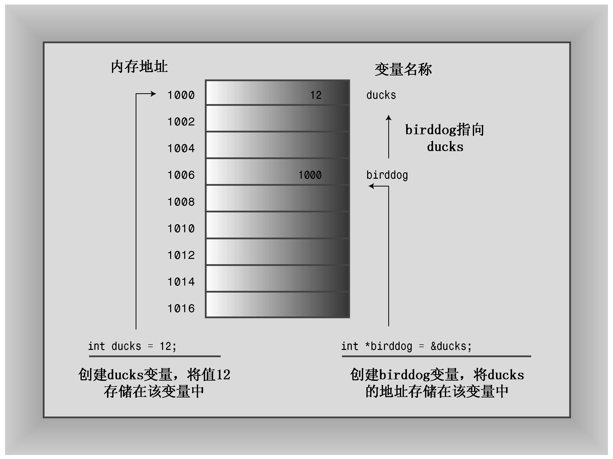

### 4.7.1　声明和初始化指针

我们来看看如何声明指针。计算机需要跟踪指针指向的值的类型。例如，char的地址与double的地址看上去没什么两样，但char和double使用的字节数是不同的，它们存储值时使用的内部格式也不同。因此，指针声明必须指定指针指向的数据的类型。

例如，前一个示例包含这样的声明：

```css
int * p_updates;
```

这表明，* p_updates的类型为int。由于*运算符被用于指针，因此p_updates变量本身必须是指针。我们说p_updates指向int类型，我们还说p_updates的类型是指向int的指针，或int*。可以这样说，p_updates是指针（地址），而*p_updates是int，而不是指针（参见图4.9）。

顺便说一句，*运算符两边的空格是可选的。传统上，C程序员使用这种格式：

```css
int *ptr;
```

这强调*ptr是一个int类型的值。而很多C++程序员使用这种格式：

```css
int* ptr;
```


<center class="my_markdown"><b class="my_markdown">图4.9　指针存储地址</b></center>

这强调的是：int*是一种类型——指向int的指针。在哪里添加空格对于编译器来说没有任何区别，您甚至可以这样做：

```css
int*ptr;
```

但要知道的是，下面的声明创建一个指针（p1）和一个int变量（p2）：

```css
int* p1, p2;
```

对每个指针变量名，都需要使用一个*。

> **注意：**
> 在C++中，int *是一种复合类型，是指向int的指针。

可以用同样的句法来声明指向其他类型的指针：

```css
double * tax_ptr;  // tax_ptr points to type double
char * str;        // str points to type char
```

由于已将tax_ptr声明为一个指向double的指针，因此编译器知道*tax_ptr是一个double类型的值。也就是说，它知道*tax_ptr是一个以浮点格式存储的值，这个值（在大多数系统上）占据8个字节。指针变量不仅仅是指针，而且是指向特定类型的指针。tax_ptr的类型是指向double的指针（或double *类型），str是指向char的指针类型（或char *）。尽管它们都是指针，却是不同类型的指针。和数组一样，指针都是基于其他类型的。

虽然tax_ptr和str指向两种长度不同的数据类型，但这两个变量本身的长度通常是相同的。也就是说，char的地址与double的地址的长度相同，这就好比1016可能是超市的街道地址，而1024可以是小村庄的街道地址一样。地址的长度或值既不能指示关于变量的长度或类型的任何信息，也不能指示该地址上有什么建筑物。一般来说，地址需要2个还是4个字节，取决于计算机系统（有些系统可能需要更大的地址，系统可以针对不同的类型使用不同长度的地址）。

可以在声明语句中初始化指针。在这种情况下，被初始化的是指针，而不是它指向的值。也就是说，下面的语句将pt（而不是*pt）的值设置为&higgens：

```css
int higgens = 5;
int * pt = &higgens;
```

程序清单4.16演示了如何将指针初始化为一个地址。

程序清单4.16　init_ptr.cpp

```css
// init_ptr.cpp -- initialize a pointer
#include <iostream>
int main()
{
    using namespace std;
    int higgens = 5;
    int * pt = &higgens;
    cout << "Value of higgens = " << higgens
         << "; Address of higgens = " << &higgens << endl;
    cout << "Value of *pt = " << *pt
         << "; Value of pt = " << pt << endl;
    return 0;
}
```

下面是该程序的示例输出：

```css
Value of higgens = 5; Address of higgens = 0012FED4
Value of *pt = 5; Value of pt = 0012FED4
```

从中可知，程序将pt（而不是*pt）初始化为higgens的地址。在您的系统上，显示的地址可能不同，显示格式也可能不同。

