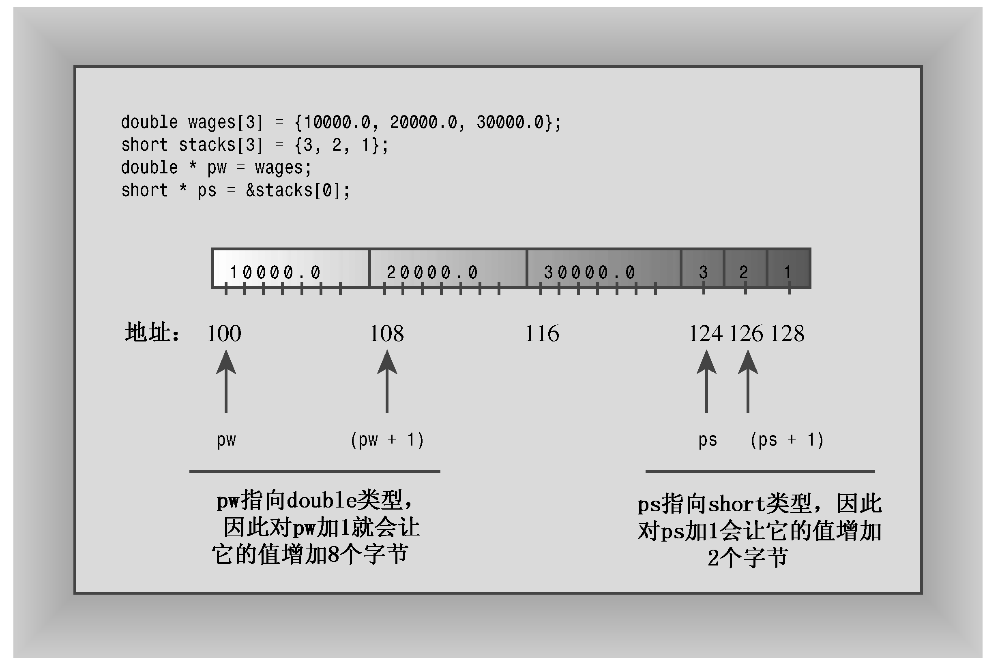

### 4.8.1　程序说明

在多数情况下，C++将数组名解释为数组第1个元素的地址。因此，下面的语句将pw声明为指向double类型的指针，然后将它初始化为wages——wages数组中第1个元素的地址：

```css
double * pw = wages;
```

和所有数组一样，wages也存在下面的等式：

```css
wages = &wages[0] = address of first element of array
```

为表明情况确实如此，该程序在表达式&stacks[0]中显式地使用地址运算符来将ps指针初始化为stacks数组的第1个元素。

接下来，程序查看pw和*pw的值。前者是地址，后者是存储在该地址中的值。由于pw指向第1个元素，因此*pw显示的值为第1个元素的值，即10000。接着，程序将pw加1。正如前面指出的，这样数字地址值将增加8，这使得pw的值为第2个元素的地址。因此，*pw现在的值是20000——第2个元素的值（参见图4.10，为使该图更为清晰，对其中的地址值做了调整）。


<center class="my_markdown"><b class="my_markdown">图4.10　指针加法</b></center>

此后，程序对ps执行相同的操作。这一次由于ps指向的是short类型，而short占用2个字节，因此将指针加1时，其值将增加2。结果是，指针也指向数组中下一个元素。

> **注意：**
> 将指针变量加1后，其增加的值等于指向的类型占用的字节数。

现在来看一看数组表达式stacks[1]。C++编译器将该表达式看作是*（stacks + 1），这意味着先计算数组第2个元素的地址，然后找到存储在那里的值。最后的结果便是stacks [1]的含义（运算符优先级要求使用括号，如果不使用括号，将给*stacks加1，而不是给stacks加1）。

从该程序的输出可知，*（stacks + 1）和stacks[1]是等价的。同样，*（stacks + 2）和stacks[2]也是等价的。通常，使用数组表示法时，C++都执行下面的转换：

```css
arrayname[i] becomes *(arrayname + i)
```

如果使用的是指针，而不是数组名，则C++也将执行同样的转换：

```css
pointername[i] becomes *(pointername + i)
```

因此，在很多情况下，可以相同的方式使用指针名和数组名。对于它们，可以使用数组方括号表示法，也可以使用解除引用运算符（*）。在多数表达式中，它们都表示地址。区别之一是，可以修改指针的值，而数组名是常量：

```css
pointername = pointername + 1; // valid
arrayname = arrayname + 1;     // not allowed
```

另一个区别是，对数组应用sizeof运算符得到的是数组的长度，而对指针应用sizeof得到的是指针的长度，即使指针指向的是一个数组。例如，在程序清单4.19中，pw和wages指的是同一个数组，但对它们应用sizeof运算符得到的结果如下：

```css
24 = size of wages array << displaying sizeof wages
4 = size of pw pointer << displaying sizeof pw
```

这种情况下，C++不会将数组名解释为地址。


**数组的地址**

对数组取地址时，数组名也不会被解释为其地址。等等，数组名难道不被解释为数组的地址吗？不完全如此：数组名被解释为其第1个元素的地址，而对数组名应用地址运算符时，得到的是整个数组的地址：

```css
short tell[10];         // tell an array of 20 bytes
cout << tell << endl;   // displays &tell[0]
cout << &tell << endl;  // displays address of whole array
```

从数字上说，这两个地址相同；但从概念上说，&tell[0]（即tell）是一个2字节内存块的地址，而&tell是一个20字节内存块的地址。因此，表达式tell + 1将地址值加2，而表达式&tell + 1将地址加20。换句话说，tell是一个short指针（short*），而&tell是一个这样的指针，即指向包含20个元素的short数组（short (*) [20]）。

您可能会问，前面有关&tell的类型描述是如何来的呢？首先，您可以这样声明和初始化这种指针：

```css
short (*pas)[20] = &tell; // pas points to array of 20 shorts
```

如果省略括号，优先级规则将使得pas先与[20]结合，导致pas是一个short指针数组，它包含20个元素，因此括号是必不可少的。其次，如果要描述变量的类型，可将声明中的变量名删除。因此，pas的类型为short (*) [20]。另外，由于pas被设置为&tell，因此*pas与tell等价，所以(*pas) [0]为tell数组的第一个元素。


总之，使用new来创建数组以及使用指针来访问不同的元素很简单。只要把指针当作数组名对待即可。然而，要理解为何可以这样做，将是一种挑战。要想真正了解数组和指针，应认真复习它们的相互关系。

