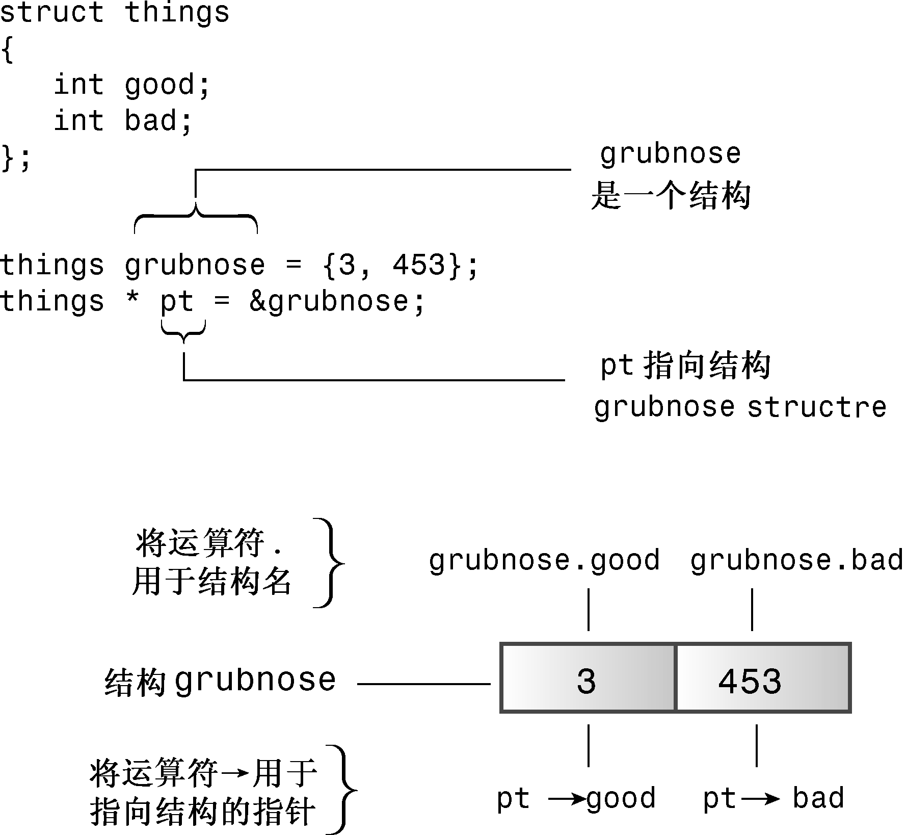

### 4.8.4　使用new创建动态结构

在运行时创建数组优于在编译时创建数组，对于结构也是如此。需要在程序运行时为结构分配所需的空间，这也可以使用new运算符来完成。通过使用new，可以创建动态结构。同样，“动态”意味着内存是在运行时，而不是编译时分配的。由于类与结构非常相似，因此本节介绍的有关结构的技术也适用于类。

将new用于结构由两步组成：创建结构和访问其成员。要创建结构，需要同时使用结构类型和new。例如，要创建一个未命名的inflatable类型，并将其地址赋给一个指针，可以这样做：

```css
inflatable * ps = new inflatable;
```

这将把足以存储inflatable结构的一块可用内存的地址赋给ps。这种句法和C++的内置类型完全相同。

比较棘手的一步是访问成员。创建动态结构时，不能将成员运算符句点用于结构名，因为这种结构没有名称，只是知道它的地址。C++专门为这种情况提供了一个运算符：箭头成员运算符（−>）。该运算符由连字符和大于号组成，可用于指向结构的指针，就像点运算符可用于结构名一样。例如，如果ps指向一个inflatable结构，则ps−>price是被指向的结构的price成员（参见图4.11）。


<center class="my_markdown"><b class="my_markdown">图4.11 标识结构成员</b></center>

> **提示：**
> 有时，C++新手在指定结构成员时，搞不清楚何时应使用句点运算符，何时应使用箭头运算符。规则非常简单。如果结构标识符是结构名，则使用句点运算符；如果标识符是指向结构的指针，则使用箭头运算符。

另一种访问结构成员的方法是，如果ps是指向结构的指针，则*ps就是被指向的值——结构本身。由于*ps是一个结构，因此（*ps）.price是该结构的price成员。C++的运算符优先规则要求使用括号。

程序清单4.21使用new创建一个未命名的结构，并演示了两种访问结构成员的指针表示法。

程序清单4.21　newstrct.cpp

```css
// newstrct.cpp -- using new with a structure
#include <iostream>
struct inflatable    // structure definition
{
    char name[20];
    float volume;
    double price;
};
int main()
{
    using namespace std;
    inflatable * ps = new inflatable;    // allot memory for structure
    cout << "Enter name of inflatable item: ";
    cin.get(ps->name, 20);               // method 1 for member access
    cout << "Enter volume in cubic feet: ";
    cin >> (*ps).volume;                 // method 2 for member access
    cout << "Enter price: $";
    cin >> ps->price;
    cout << "Name: " << (*ps).name << endl;                 // method 2
    cout << "Volume: " << ps->volume << " cubic feet\n"; // method 1
    cout << "Price: $" << ps->price << endl;               // method 1
    delete ps;                           // free memory used by structure
    return 0;
}
```

下面是该程序的运行情况：

```css
Enter name of inflatable item: Fabulous Frodo
Enter volume in cubic feet: 1.4
Enter price: $27.99
Name: Fabulous Frodo
Volume: 1.4 cubic feet
Price: $27.99
```

#### 1．一个使用new和delete的示例

下面介绍一个使用new和delete来存储通过键盘输入的字符串的示例。程序清单4.22定义了一个函数getname()，该函数返回一个指向输入字符串的指针。该函数将输入读入到一个大型的临时数组中，然后使用new [ ]创建一个刚好能够存储该输入字符串的内存块，并返回一个指向该内存块的指针。对于读取大量字符串的程序，这种方法可以节省大量内存（实际编写程序时，使用string类将更容易，因为这样可以使用内置的new和delete）。

假设程序要读取1000个字符串，其中最大的字符串包含79个字符，而大多数字符串都短得多。如果用char数组来存储这些字符串，则需要1000个数组，其中每个数组的长度为80个字符。这总共需要80000个字节，而其中的很多内存没有被使用。另一种方法是，创建一个数组，它包含1000个指向char的指针，然后使用new根据每个字符串的需要分配相应数量的内存。这将节省几万个字节。是根据输入来分配内存，而不是为每个字符串使用一个大型数组。另外，还可以使用new根据需要的指针数量来分配空间。就目前而言，这有点不切实际，即使是使用1000个指针的数组也是这样，不过程序清单4.22还是演示了一些技巧。另外，为演示delete是如何工作的，该程序还用它来释放内存以便能够重新使用。

程序清单4.22　delete.cpp

```css
// delete.cpp -- using the delete operator
#include <iostream>
#include <cstring>        // or string.h
using namespace std;
char * getname(void);     // function prototype
int main()
{
    char * name;          // create pointer but no storage
    name = getname();     // assign address of string to name
    cout << name << " at " << (int *) name << "\n";
    delete [] name;       // memory freed
    name = getname();     // reuse freed memory
    cout << name << " at " << (int *) name << "\n";
    delete [] name;       // memory freed again
    return 0;
}
char * getname()          // return pointer to new string
{
    char temp[80];        // temporary storage
    cout << "Enter last name: ";
    cin >> temp;
    char * pn = new char[strlen(temp) + 1];
    strcpy(pn, temp);     // copy string into smaller space
    return pn;            // temp lost when function ends
}
```

下面是该程序的运行情况：

```css
Enter last name: Fredeldumpkin
Fredeldumpkin at 0x004326b8
Enter last name: Pook
Pook at 0x004301c8
```

#### 2．程序说明

来看一下程序清单4.22中的函数getname()。它使用cin将输入的单词放到temp数组中，然后使用new分配新内存，以存储该单词。程序需要strle(temp)+ 1个字符（包括空字符）来存储该字符串，因此将这个值提供给new。获得空间后，getname()使用标准库函数strcpy()将temp中的字符串复制到新的内存块中。该函数并不检查内存块是否能够容纳字符串，但getname()通过使用new请求合适的字节数来完成了这样的工作。最后，函数返回pn，这是字符串副本的地址。

在main()中，返回值（地址）被赋给指针name。该指针是在main()中定义的，但它指向getname()函数中分配的内存块。然后，程序打印该字符串及其地址。

接下来，在释放name指向的内存块后，main()再次调用getname()。C++不保证新释放的内存就是下一次使用new时选择的内存，从程序运行结果可知，确实不是。

在这个例子中，getname()分配内存，而main()释放内存。将new和delete放在不同的函数中通常并不是个好办法，因为这样很容易忘记使用delete。不过这个例子确实把new和delete分开放置了，只是为了说明这样做也是可以的。

为了解该程序的一些更为微妙的方面，需要知道一些有关C++是如何处理内存的知识。下面介绍一些这样的知识，这些知识将在第9章做全面介绍。

