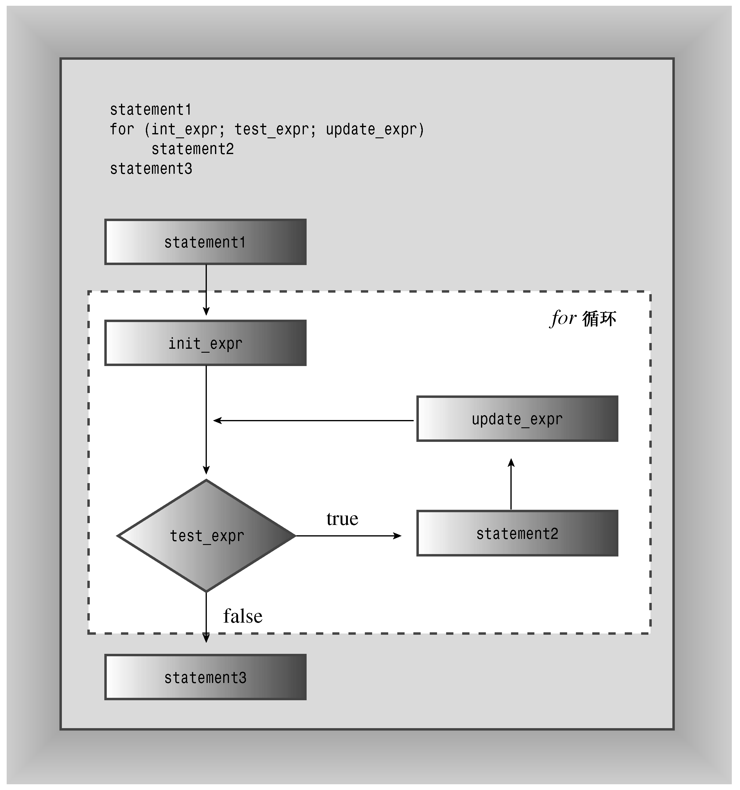

### 5.1.1　for循环的组成部分

for循环为执行重复的操作提供了循序渐进的步骤。我们来具体看一看它是如何工作的。for循环的组成部分完成下面这些步骤。

1．设置初始值。

2．执行测试，看看循环是否应当继续进行。

3．执行循环操作。

4．更新用于测试的值。

C++循环设计中包括了这些要素，很容易识别。初始化、测试和更新操作构成了控制部分，这些操作由括号括起。其中每部分都是一个表达式，彼此由分号隔开。控制部分后面的语句叫作循环体，只要测试表达式为true，它便被执行：

```css
for (initialization; test-expression; update-expression)
 body
```

C++语法将整个for看作一条语句——虽然循环体可以包含一条或多条语句。（包含多条语句时，需要使用复合语句或代码块，这将在本章后面进行讨论。）

循环只执行一次初始化。通常，程序使用该表达式将变量设置为起始值，然后用该变量计算循环周期。

test-expression（测试表达式）决定循环体是否被执行。通常，这个表达式是关系表达式，即对两个值进行比较。这个例子将i的值同5进行比较，看i是否小于5。如果比较结果为真，则程序将执行循环体。实际上，C++并没有将test-expression的值限制为只能为真或假。可以使用任意表达式，C++将把结果强制转换为bool类型。因此，值为0的表达式将被转换为bool值false，导致循环结束。如果表达式的值为非零，则被强制转换为bool值true，循环将继续进行。程序清单5.2通过将表达式i用作测试条件来演示了这一特点。更新部分的i−−与i++相似，只是每使用一次，i值就减1。

程序清单5.2　num_test.cpp

```css
// num_test.cpp -- use numeric test in for loop
#include <iostream>
int main()
{
    using namespace std;
    cout << "Enter the starting countdown value: ";
    int limit;
    cin >> limit;
    int i;
    for (i = limit; i; i--) // quits when i is 0
        cout << "i = " << i << "\n";
    cout << "Done now that i = " << i << "\n";
    return 0;
}
```

下面是该程序的输出：

```css
i = 4
i = 3
i = 2
i = 1
Done now that i = 0
```

注意，循环在i变为0后结束。

关系表达式（如i<5）是如何得到循环终止值0的呢？在引入bool类型之前，如果关系表达式为true，则被判定为1；如果为false，则被判定为0。因此，表达式3<5的值为1，而5<5的值为0。然而，C++添加了bool类型后，关系表达式就判定为bool字面值true和false，而不是1和0了。这种变化不会导致不兼容的问题，因为C++程序在需要整数值的地方将把true和false分别转换为1和0，而在需要bool值的地方将把0转换为false，非0转换为true。

for循环是入口条件（entry-condition）循环。这意味着在每轮循环之前，都将计算测试表达式的值，当测试表达式为false时，将不会执行循环体。例如，假设重新运行程序清单5.2中的程序，但将起始值设置为0，则由于测试条件在首次被判定时便为false，循环体将不被执行：

```css
Enter the starting countdown value: 0
Done now that i = 0
```

这种在循环之前进行检查的方式可避免程序遇到麻烦。

update-expression（更新表达式）在每轮循环结束时执行，此时循环体已经执行完毕。通常，它用来对跟踪循环轮次的变量的值进行增减。然而，它可以是任何有效的C++表达式，还可以是其他控制表达式。这使for循环的功能不仅仅是从0数到5（这是第一个循环示例所做的工作），稍后将介绍一些例子。

for循环体由一条语句组成，不过很快将介绍如何扩展这条规则。图5.1对for循环设计进行了总结。


<center class="my_markdown"><b class="my_markdown">图5.1　for循环</b></center>

for语句看上去有些像函数调用，因为它使用一个后面跟一对括号的名称。然而，for是一个C++关键字，因此编译器不会将for视为一个函数，这还将防止将函数命名为for。

> **提示：**
> C++常用的方式是，在for和括号之间加上一个空格，而省略函数名与括号之间的空格。

```css
for (i = 6; i < 10; i++)
      smart_function(i);
```

> 对于其他控制语句（如if和while），处理方式与for相似。这样从视觉上强化了控制语句和函数调用之间的区别。另外，常见的做法是缩进for语句体，使它看上去比较显著。

#### 1．表达式和语句

for语句的控制部分使用3个表达式。由于其自身强加的句法限制，C++成为非常具有表现力的语言。任何值或任何有效的值和运算符的组合都是表达式。例如，10是值为10的表达式（一点儿都不奇怪），28 * 20是值为560的表达式。在C++中，每个表达式都有值。通常值是很明显的。例如，下面的表达式由两个值和一个加号组成，它的值为49：

```css
22 + 27
```

有时值不这么明显，例如，下面是一个表达式，因为它由两个值和一个赋值运算符组成：

```css
x = 20
```

C++将赋值表达式的值定义为左侧成员的值，因此这个表达式的值为20。由于赋值表达式有值，因此可以编写下面这样的语句：

```css
maids = (cooks = 4) + 3;
```

表达式cooks = 4的值为4，因此maids的值为7。然而，C++虽然允许这样做，但并不意味着应鼓励这种做法。允许存在上述语句存在的原则也允许编写如下的语句：

```css
x = y = z = 0;
```

这种方法可以快速地将若干个变量设置为相同的值。优先级表（见附录D）表明，赋值运算符是从右向左结合的，因此首先将0赋给z，然后将z = 0赋给y，依此类推。

最后，正如前面指出的，像x<y这样的关系表达式将被判定为bool值true或false。程序清单5.3中的小程序指出了有关表达式值的一些重要方面。<<运算符的优先级比表达式中使用的运算符高，因此代码使用括号来获得正确的运算顺序。

程序清单5.3　express.cpp

```css
// express.cpp -- values of expressions
#include <iostream>
int main()
{
    using namespace std;
    int x;
    cout << "The expression x = 100 has the value ";
    cout << (x = 100) << endl;
    cout << "Now x = " << x << endl;
    cout << "The expression x < 3 has the value ";
    cout << (x < 3) << endl;
    cout << "The expression x > 3 has the value ";
    cout << (x > 3) << endl;
    cout.setf(ios_base::boolalpha); //a newer C++ feature
    cout << "The expression x < 3 has the value ";
    cout << (x < 3) << endl;
    cout << "The expression x > 3 has the value ";
    cout << (x > 3) << endl;
    return 0;
}
```

> **注意：**
> 老式C++实现可能要求使用ios：boolalpha，而不是ios_base：：boolalpha来作为cout.setf()的参数。有些老式实现甚至无法识别这两种形式。

下面是该程序的输出：

```css
The expression x = 100 has the value 100
Now x = 100
The expression x < 3 has the value 0
The expression x > 3 has the value 1
The expression x < 3 has the value false
The expression x > 3 has the value true
```

通常，cout在显示bool值之前将它们转换为int，但cout.setf（ios：：boolalpha）函数调用设置了一个标记，该标记命令cout显示true和false，而不是1和0。

> **注意：**
> C++表达式是值或值与运算符的组合，每个C++表达式都有值。

为判定表达式x = 100，C++必须将100赋给x。当判定表达式的值这种操作改变了内存中数据的值时，我们说表达式有副作用（side effect）。因此，判定赋值表达式会带来这样的副作用，即修改被赋值者的值。有可能把赋值看作预期的效果，但从C++的构造方式这个角度来看，判定表达式才是主要作用。并不是所有的表达式都有副作用。例如，判定x + 15将计算出一个新的值，但不会修改x的值。然而，判定++x + 15就有副作用，因为它将x加1。

从表达式到语句的转变很容易，只要加分号即可。因此下面是一个表达式：

```css
age = 100
```

而下面是一条语句：

```css
age = 100;
```

更准确地说，这是一条表达式语句。只要加上分号，所有的表达式都可以成为语句，但不一定有编程意义。例如，如果rodents是个变量，则下面就是一条有效的C++语句：

```css
rodents + 6; // valid, but useless, statement
```

编译器允许这样的语句，但它没有完成任何有用的工作。程序仅仅是计算和，而没有使用得到的结果，然后便进入下一条语句（智能编译器甚至可能跳过这条语句）。

#### 2．非表达式和语句

有些概念对于理解C++至关重要，如了解for循环的结构。不过句法中也有一些相对次要的内容，让认为自己理解语言的人突然觉得不知所措。下面来看看这样的内容。

对任何表达式加上分号都可以成为语句，但是这句话反过来说就不对了。也就是说，从语句中删除分号，并不一定能将它转换为表达式。就我们目前使用的语句而言，返回语句、声明语句和for语句都不满足“语句=表达式+分号”这种模式。例如，下面是一条语句：

```css
int toad;
```

但int toad并不是表达式，因为它没有值。因此，下面的代码是非法的：

```css
eggs = int toad * 1000; // invalid, not an expression
cin >> int toad;        // can’t combine declaration with cin
```

同样，不能把for循环赋给变量。在下面的示例中，for循环不是表达式，因此没有值，也不能给它赋值：

```css
int fx = for (i = 0; i< 4; i++)
cout >> i;        // not possible
```

#### 3．修改规则

C++在C循环的基础上添加了一项特性，要求对for循环句法做一些微妙的调整。

这是原来的句法：

```css
for (expression; expression; expression)
 statement
```

具体地说，正如本章前面指出的，for结构的控制部分由3个表达式组成，它们由分号分隔。然而，C++循环允许像下面这样做：

```css
for (int i = 0; i < 5; i++)
```

也就是说，可以在for循环的初始化部分中声明变量。这很方便，但并不适用于原来的句法，因为声明不是表达式。这种一度是非法的行为最初是通过定义一种新的表达式——声明语句表达式（declaration-statement expression）——来合法化的，声明语句表达式不带分号声明，只能出现在for语句中。然而，这种调整已经被取消了，代之以将for语句的句法修改成下面这样：

```css
for (for-init-statement condition; expression)
 statement
```

乍一看很奇怪，因为这里只有一个分号（而不是两个分号）。但是这是允许的，因为for-init-statement被视为一条语句，而语句有自己的分号。对于for-init-statement来说，它既可以是表达式语句，也可以是声明。这种句法规则用语句替换了后面跟分号的表达式，语句本身有自己的分号。总之，C++程序员希望能够在for循环初始化部分中声明和初始化变量，他们会做C++句法需要和英语所允许的工作。

在for-init-statement中声明变量还有其实用的一面，这也是应该知道的。这种变量只存在于for语句中，也就是说，当程序离开循环后，这种变量将消失：

```css
for (int i = 0; i < 5; i++)
    cout << "C++ knows loops.\n";
cout << i << endl; // oops! i no longer defined
```

您还应知道的一点是，有些较老的C++实现遵循以前的规则，对于前面的循环，将把i视为是在循环之前声明的，因此在循环结束后，i仍可用。

