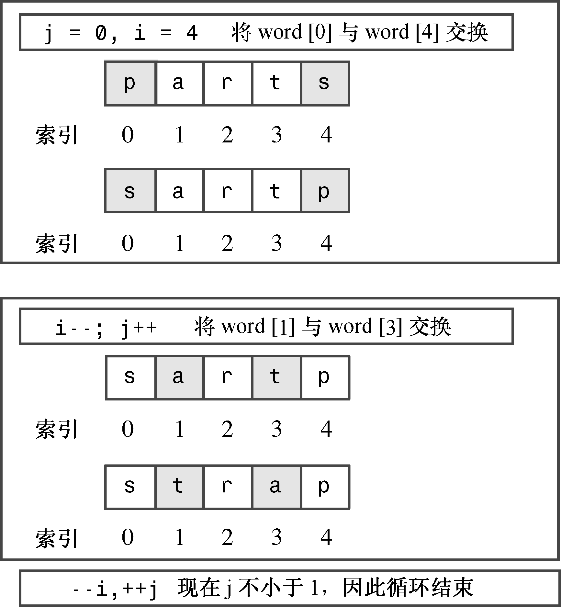

### 5.1.11　其他语法技巧——逗号运算符

正如读者看到的，语句块允许把两条或更多条语句放到按C++句法只能放一条语句的地方。逗号运算符对表达式完成同样的任务，允许将两个表达式放到C++句法只允许放一个表达式的地方。例如，假设有一个循环，每轮都将一个变量加1，而将另一个变量减1。在for循环控制部分的更新部分中完成这两项工作将非常方便，但循环句法只允许这里包含一个表达式。在这种情况下，可以使用逗号运算符将两个表达式合并为一个：

```css
++j, --i // two expressions count as one for syntax purposes
```

逗号并不总是逗号运算符。例如，下面这个声明中的逗号将变量列表中相邻的名称分开：

```css
int i, j; // comma is a separator here, not an operator
```

程序清单5.9在一个程序中使用了两次逗号运算符，该程序将一个string类对象的内容反转。也可以使用char数组来编写该程序，但可输入的单词长度将受char数组大小的限制。注意，程序清单5.6按相反的顺序显示数组的内容，而程序清单5.9将数组中的字符顺序反转。该程序还使用了语句块将几条语句组合成一条。

程序清单5.9　forstr2.cpp

```css
// forstr2.cpp -- reversing an array
#include <iostream>
#include <string>
int main()
{
    using namespace std;
    cout << "Enter a word: ";
    string word;
    cin >> word;
    // physically modify string object
    char temp;
    int i, j;
    for (j = 0, i = word.size() - 1; j < i; --i, ++j)
    {                             // start block
        temp = word[i];
        word[i] = word[j];
        word[j] = temp;
    }                            // end block
    cout << word << "\nDone\n";
    return 0;
}
```

下面是该程序运行情况：

```css
Enter a word: stressed
desserts
Done
```

顺便说一句，在反转字符串方面，string类提供了更为简洁的方式，这将在第16章介绍。

#### 1．程序说明

来看程序清单5.9中的for循环控制部分。

首先，它使用逗号运算符将两个初始化操作放进控制部分第一部分的表达式中。然后，再次使用逗号运算符将两个更新合并到控制部分最后一部分的表达式中。

接下来看循环体。程序用括号将几条语句合并为一个整体。在循环体中，程序将数组第1个元素和最后一个元素调换，从而将单词反转过来。然后，它将j加1，将i减1，让它们分别指向第2个元素和倒数第2个元素，然后将这两个元素调换。注意，测试条件j<i使得到达数组的中间时，循环将停止。如果过了这一点后，循环仍继续下去，则便开始将交换后的元素回到原来的位置（参见图5.2）。

需要注意的另一点是，声明变量temp、i、j的位置。代码在循环之前声明i和j，因为不能用逗号运算符将两个声明组合起来。这是因为声明已经将逗号用于其他用途——分隔列表中的变量。也可以使用一个声明语句表达式来创建并初始化两个变量，但是这样看起来有些乱：

```css
int j = 0, i = word.size() - 1;
```

在这种情况下，逗号只是一个列表分隔符，而不是逗号运算符，因此该表达式对j和i进行声明和初始化。然而，看上去好像只声明了j。

另外，可以在for循环内部声明temp：

```css
char temp = word[i];
```

这样，temp在每轮循环中都将被分配和释放。这比在循环前声明temp的速度要慢一些。另外，如果在循环内部声明temp，则它将在循环结束后被丢弃。


<center class="my_markdown"><b class="my_markdown">图5.2 反转字符串</b></center>

#### 2．逗号运算符花絮

到目前为止，逗号运算符最常见的用途是将两个或更多的表达式放到一个for循环表达式中。不过C++还为这个运算符提供了另外两个特性。首先，它确保先计算第一个表达式，然后计算第二个表达式（换句话说，逗号运算符是一个顺序点）。如下所示的表达式是安全的：

```css
i = 20, j = 2 * i // i set to 20, then j set to 40
```

其次，C++规定，逗号表达式的值是第二部分的值。例如，上述表达式的值为40，因为j = 2 * i的值为40。

在所有运算符中，逗号运算符的优先级是最低的。例如，下面的语句：

```css
cats = 17,240;
```

被解释为：

```css
(cats = 17), 240;
```

也就是说，将cats设置为17，240不起作用。然而，由于括号的优先级最高，下面的表达式将把cats设置为240——逗号右侧的表达式值：

```css
cats = (17,240);
```

