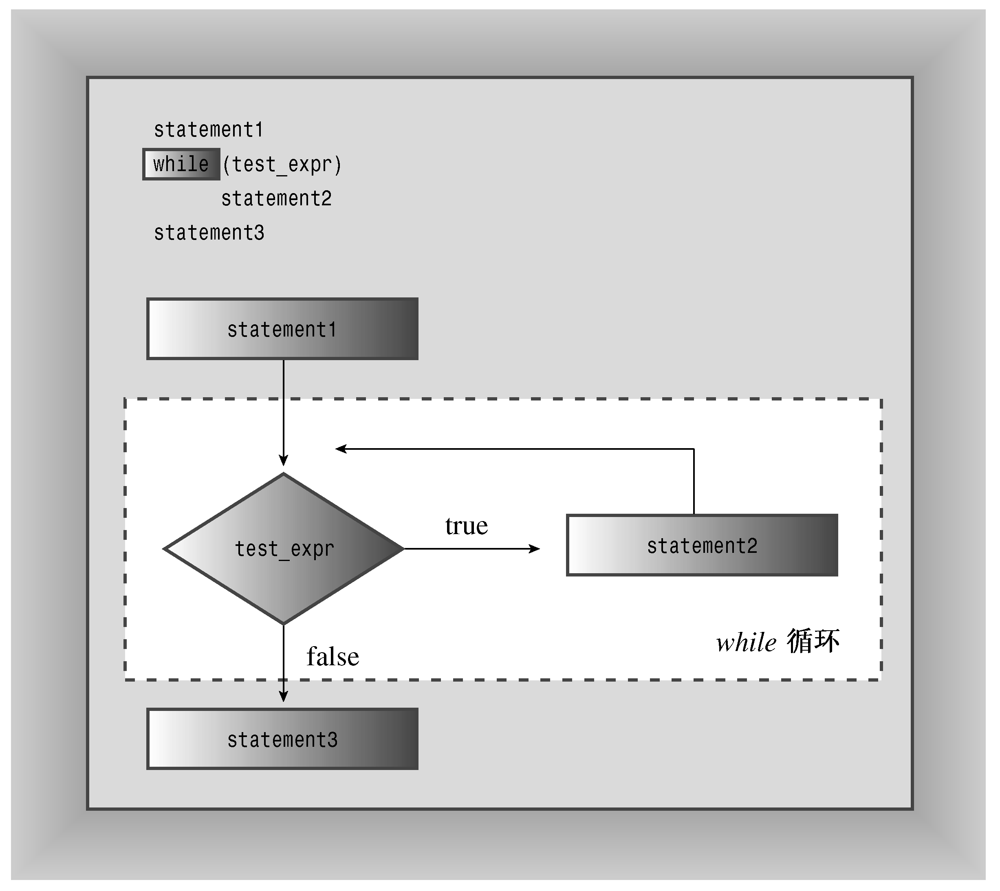

### 5.2　while循环

while循环是没有初始化和更新部分的for循环，它只有测试条件和循环体：

```css
while (test-condition)
 body
```

首先，程序计算圆括号内的测试条件（test-condition）表达式。如果该表达式为true，则执行循环体中的语句。与for循环一样，循环体也由一条语句或两个花括号定义的语句块组成。执行完循环体后，程序返回测试条件，对它进行重新评估。如果该条件为非零，则再次执行循环体。测试和执行将一直进行下去，直到测试条件为false为止（参见图5.3）。显然，如果希望循环最终能够结束，循环体中的代码必须完成某种影响测试条件表达式的操作。例如，循环可以将测试条件中使用的变量加1或从键盘输入读取一个新值。和for循环一样，while循环也是一种入口条件循环。因此，如果测试条件一开始便为false，则程序将不会执行循环体。


<center class="my_markdown"><b class="my_markdown">图5.3 while循环的结构</b></center>

程序清单5.13使用了一个while循环。该循环遍历字符串，并显示其中的字符及其ASCII码。循环在遇到空值字符时停止。这种逐字符遍历字符串直到遇到空值字符的技术是C++处理C-风格字符串的标准方法。由于字符串中包含了结尾标记，因此程序通常不需要知道字符串的长度。

程序清单5.13　while.cpp

```css
// while.cpp -- introducing the while loop
#include <iostream>
const int ArSize = 20;
int main()
{
    using namespace std;
    char name[ArSize];
    cout << "Your first name, please: ";
    cin >> name;
    cout << "Here is your name, verticalized and ASCIIized:\n";
    int i = 0;                      // start at beginning of string
    while (name[i] != ‘\0’)      // process to end of string
    {
        cout << name[i] << ": " << int(name[i]) << endl;
        i++;                       // don’t forget this step
    }
    return 0;
}
```

下面是该程序的运行情况：

```css
Your first name, please: Muffy
Here is your name, verticalized and ASCIIized:
M: 77
u: 117
f: 102
f: 102
y: 121
```

verticalized和ASCIIized并不是真正的单词，甚至将来也不会是单词。不过它们确实在输出中添加了一种“可爱”的氛围。

**程序说明**

程序清单5.13中的while条件像这样：

```css
while (name[i] != ‘\0’)
```

它可以测试数组中特定的字符是不是空值字符。为使该测试最终能够成功，循环体必须修改i的值，这是通过在循环体结尾将i加1来实现的。省略这一步将导致循环停留在同一个数组元素上，打印该字符及其编码，直到强行终止该程序。导致死循环是循环最常见的问题之一。通常，在循环体中忘记更新某个值时，便会出现这种情况。

可以这样修改while行：

```css
while (name[i])
```

经过这种修改后，程序的工作方式将不变。这是由于name[i]是常规字符，其值为该字符的编码——非零值或true。然而，当name[i]为空值字符时，其编码将为0或false。这种表示法更为简洁（也更常用），但没有程序清单5.13中的表示法清晰。对于后一种情况，“笨拙”的编译器生成的代码的速度将更快，“聪明”的编译器对于这两个版本生成的代码将相同。

要打印字符的ASCII码，必须通过强制类型转换将name[i]转换为整型。这样，cout将把值打印成整数，而不是将它解释为字符编码。

不同于C-风格字符串，string对象不使用空字符来标记字符串末尾，因此要将程序清单5.13转换为使用string类的版本，只需用string对象替换char数组即可。第16章将讨论可用于标识string对象中最后一个字符的技术。

