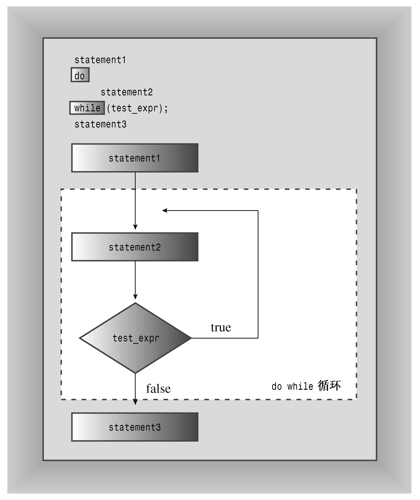

### 5.3　do while循环

前面已经学习了for循环和while循环。第三种C++循环是do while，它不同于另外两种循环，因为它是出口条件（exit condition）循环。这意味着这种循环将首先执行循环体，然后再判定测试表达式，决定是否应继续执行循环。如果条件为false，则循环终止；否则，进入新一轮的执行和测试。这样的循环通常至少执行一次，因为其程序流必须经过循环体后才能到达测试条件。下面是其句法：

```css
do
    body
while (test-expression);
```

循环体是一条语句或用括号括起的语句块。图5.4总结了do while循环的程序流程。


<center class="my_markdown"><b class="my_markdown">图5.4 do while循环的结构</b></center>

通常，入口条件循环比出口条件循环好，因为入口条件循环在循环开始之前对条件进行检查。例如，假设程序清单5.13使用do while（而不是while），则循环将打印空值字符及其编码，然后才发现已到达字符串结尾。但是有时do while测试更合理。例如，请求用户输入时，程序必须先获得输入，然后对它进行测试。程序清单5.15演示了如何在这种情况下使用do while。

程序清单5.15　dowhile.cpp

```css
// dowhile.cpp -- exit-condition loop
#include <iostream>
int main()
{
    using namespace std;
    int n;
    cout << "Enter numbers in the range 1-10 to find ";
    cout << "my favorite number\n";
    do
    {
        cin >> n; // execute body
    } while (n != 7); // then test
    cout << "Yes, 7 is my favorite.\n" ;
    return 0;
}
```

下面是该程序的运行情况：

```css
Enter numbers in the range 1-10 to find my favorite number
9
4
7
Yes, 7 is my favorite.
```


**奇特的for循环**

虽然不是很常见，但有时出现下面这样的代码，：

```css
int I = 0;
for(;;) // sometimes called a "forever loop"
{
    I++;
    // do something ...
    if (30 >= I) break; // if statement and break (Chapter 6)
}
```

或另一种变体：

```css
int I = 0;
for(;;I++)
{
    if (30 >= I) break;
        // do something ...
}
```

上述代码基于这样一个事实：for循环中的空测试条件被视为true。这些例子既不易于阅读，也不能用作编写循环的通用模型。第一个例子的功能在do while循环中将表达得更清晰：

```css
int I = 0;
do {
    I++;
    // do something;
   }
while (30 > I);
```

同样，第二个例子使用while循环可以表达得更清晰：

```css
while (I < 30)
{
    // do something
    I++;
}
```

通常，编写清晰、容易理解的代码比使用语言的晦涩特性来显示自己的能力更为有用。


