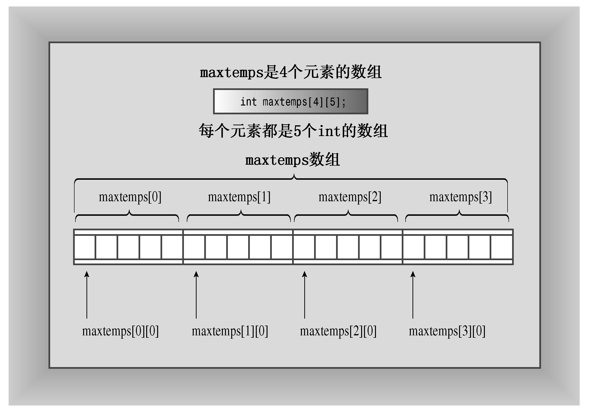
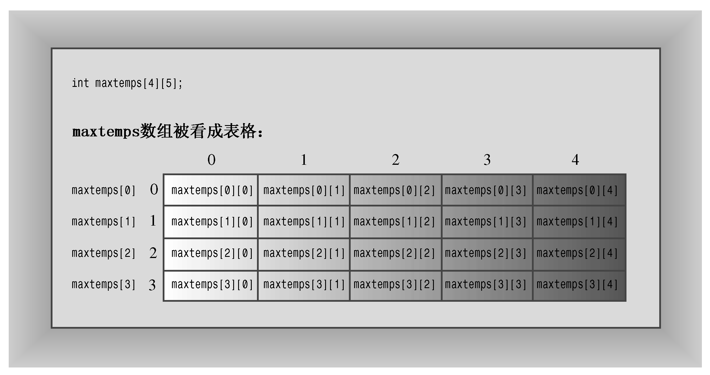

### 5.6　嵌套循环和二维数组

如本章前面所述，for循环是一种处理数组的工具。下面进一步讨论如何使用嵌套for循环中来处理二维数组。

首先，介绍一下什么是二维数组。到目前为止，本章使用的数组都是一维数组，因为每个数组都可以看作是一行数据。二维数组更像是一个表格——既有数据行又有数据列。例如，可以用二维数组来表示6个不同地区每季度的销售额，每一个地区占一行数据。也可以用二维数组来表示RoboDork在计算机游戏板上的位置。

C++没有提供二维数组类型，但用户可以创建每个元素本身都是数组的数组。例如，假设要存储5个城市在4年间的最高温度。在这种情况下，可以这样声明数组：

```css
int maxtemps[4][5];
```

该声明意味着maxtemps是一个包含4个元素的数组，其中每个元素都是一个由5个整数组成的数组（参见图5.5）。可以将maxtemps数组看作由4行组成，其中每一行有5个温度值。


<center class="my_markdown"><b class="my_markdown">图5.5　由数组组成的数组</b></center>

表达式maxtemps[0]是maxtemps数组的第一个元素，因此maxtemps[0]本身就是一个由5个int组成的数组。maxtemps[0] 数组的第一个元素是maxtemps [0] [0]，该元素是一个int。因此，需要使用两个下标来访问int元素。可以认为第一个下标表示行，第二个下标表示列（参见图5.6）。


<center class="my_markdown"><b class="my_markdown">图5.6　使用下标访问数组元素</b></center>

假设要打印数组所有的内容，可以用一个for循环来改变行，用另一个被嵌套的for循环来改变列：

```css
for (int row = 0; row < 4; row++)
{
      for (int col = 0; col < 5; ++col)
           cout << maxtemps[row][col] << "\t";
      cout << endl;
}
```

对于每个row值，内部的for循环将遍历所有的col值。这个示例在每个值之后打印一个制表符（使用C++转义字符表示时为\t），打印完每行后，打印一个换行符。

