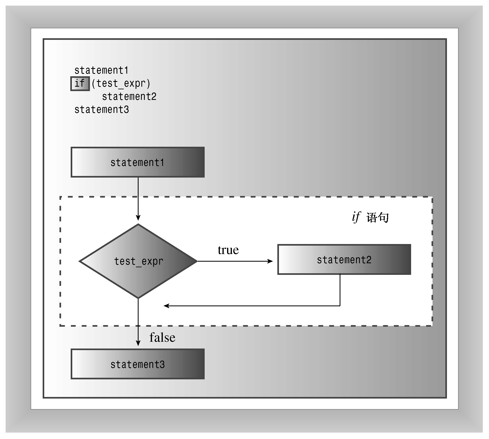

### 6.1　if语句

当C++程序必须决定是否执行某个操作时，通常使用if语句来实现选择。if有两种格式：if和if else。首先看一看简单的if，它模仿英语，如“If you have a Captain Cookie card, you get a free cookie（如果您有一张Captain Cookie卡，就可获得免费的小甜饼）”。如果测试条件为true，则if语句将引导程序执行语句或语句块；如果条件是false，程序将跳过这条语句或语句块。因此，if语句让程序能够决定是否应执行特定的语句。

if语句的语法与while相似：

```css
if (test-condition)
 statement
```

如果test-condition（测试条件）为true，则程序将执行statement（语句），后者既可以是一条语句，也可以是语句块。如果测试条件为false，则程序将跳过语句（参见图6.1）。和循环测试条件一样，if测试条件也将被强制转换为bool值，因此0将被转换为false，非零为true。整个if语句被视为一条语句。


<center class="my_markdown"><b class="my_markdown">图6.1　if语句的结构</b></center>

通常情况下，测试条件都是关系表达式，如那些用来控制循环的表达式。例如，假设读者希望程序计算输入中的空格数和字符总数，则可以在while循环中使用cin.get（char）来读取字符，然后使用if语句识别空格字符并计算其总数。程序清单6.1完成了这项工作，它使用句点（.）来确定句子的结尾。

程序清单6.1　if.cpp

```css
// if.cpp -- using the if statement
#include <iostream>
int main()
{
    using std::cin; // using declarations
    using std::cout;
    char ch;
    int spaces = 0;
    int total = 0;
    cin.get(ch);
    while (ch != '.') // quit at end of sentence
    {
        if (ch == ' ') // check if ch is a space
            ++spaces;
        ++total; // done every time
        cin.get(ch);
    }
    cout << spaces << " spaces, " << total;
    cout << " characters total in sentence\n";
    return 0;
}
```

下面是该程序的输出：

```css
The balloonist was an airhead
with lofty goals.
6 spaces, 46 characters total in sentence
```

正如程序中的注释指出的，仅当ch为空格时，语句++spaces;才被执行。因为语句++total;位于if语句的外面，因此在每轮循环中都将被执行。注意，字符总数中包括按回车键生成的换行符。

