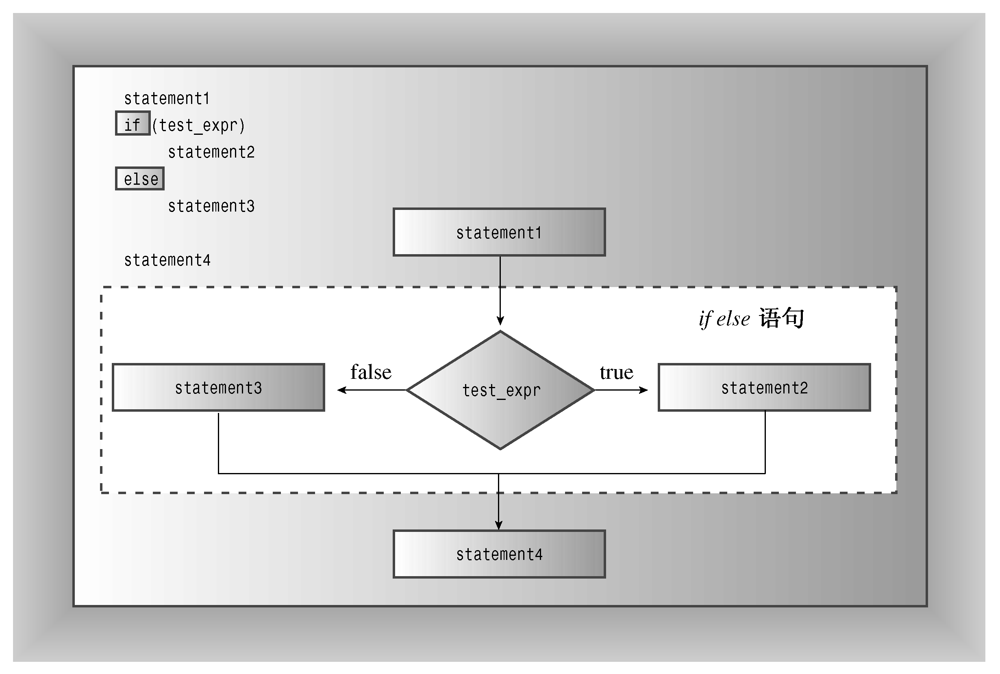

### 6.1.1　if else语句

if语句让程序决定是否执行特定的语句或语句块，而if else语句则让程序决定执行两条语句或语句块中的哪一条，这种语句对于选择其中一种操作很有用。C++的if else语句模仿了简单的英语，如“If you have a Captain Cookie card, you get a Cookie Plus Plus, else you just get a Cookie d'Ordinaire（如果您拥有Captain Cookie卡，将可获得Cookie Plus Plus，否则只能获得Cookie d'Ordinaire）”。if else语句的通用格式如下：

```css
if (test-condition)
 statement1
else
 statement2
```

如果测试条件为true或非零，则程序将执行statement1，跳过statement2；如果测试条件为false或0，则程序将跳过statement1，执行statement2。因此，如果answer是1492，则下面的代码片段将打印第一条信息，否则打印第二条信息：

```css
if (answer == 1492)
    cout << "That's right!\n";
else
    cout << "You'd better review Chapter 1 again.\n";
```

每条语句都既可以是一条语句，也可以是用大括号括起的语句块（参见图6.2）。从语法上看，整个if else结构被视为一条语句。

例如，假设要通过对字母进行加密编码来修改输入的文本（换行符不变）。这样，每个输入行都被转换为一行输出，且长度不变。这意味着程序对换行符采用一种操作，而对其他字符采用另一种操作。正如程序清单6.2所表明的，if else使得这项工作非常简单。该程序清单还演示了限定符std::，这是编译指令using的替代品之一。


<center class="my_markdown"><b class="my_markdown">图6.2　if else语句的结构</b></center>

程序清单6.2　ifelse.cpp

```css
// ifelse.cpp -- using the if else statement
#include <iostream>
int main()
{
    char ch;
    std::cout << "Type, and I shall repeat.\n";
    std::cin.get(ch);
    while (ch != '.')
    {
        if (ch == '\n')
            std::cout << ch; // done if newline
        else
            std::cout << ++ch; // done otherwise
        std::cin.get(ch);
    }
// try ch + 1 instead of ++ch for interesting effect
    std::cout << "\nPlease excuse the slight confusion.\n";
        // std::cin.get();
        // std::cin.get();
    return 0;
}
```

下面是该程序的运行情况：

```css
Type, and I shall repeat.
An ineffable joy suffused me as I beheld
Bo!jofggbcmf!kpz!tvggvtfe!nf!bt!J!cfifme
the wonders of modern computing.
uif!xpoefst!pg!npefso!dpnqvujoh
Please excuse the slight confusion.
```

注意，程序清单6.2中的注释之一指出，将++ch改为ch+1将产生一种有趣的效果。能推断出它是什么吗？如果不能，就试验一下，然后看看是否可以解释发生的情况（提示：想一想cout是如何处理不同的类型的）。

