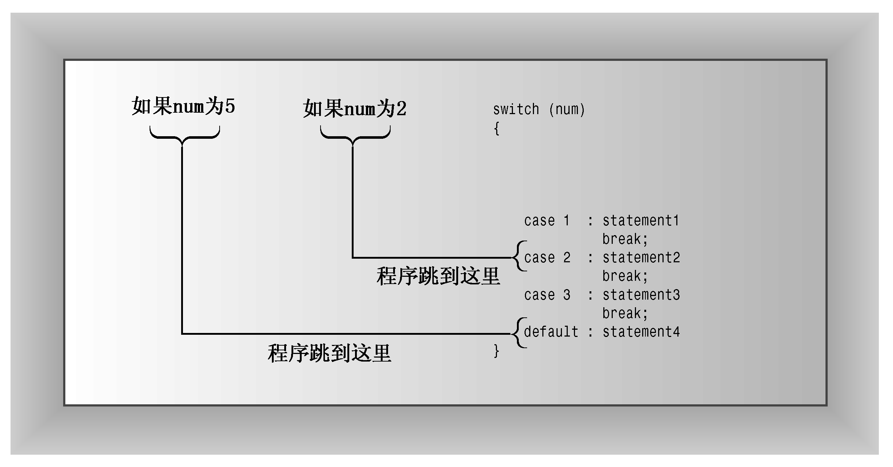

### 6.5　switch语句

假设要创建一个屏幕菜单，要求用户从5个选项中选择一个，例如，便宜、适中、昂贵、奢侈、过度。虽然可以扩展if else if else序列来处理这5种情况，但C++的switch语句能够更容易地从大型列表中进行选择。下面是switch语句的通用格式：

```css
switch (integer-expression)
{
     case label1 : statement(s)
     case label2 : statement(s)
    ...
     default : statement(s)
}
```

C++的switch语句就像指路牌，告诉计算机接下来应执行哪行代码。执行到switch语句时，程序将跳到使用integer-expression的值标记的那一行。例如，如果integer-expression的值为4，则程序将执行标签为case 4：那一行。顾名思义，integer-expression必须是一个结果为整数值的表达式。另外，每个标签都必须是整数常量表达式。最常见的标签是int或char常量（如1或'q'），也可以是枚举量。如果integer-expression不与任何标签匹配，则程序将跳到标签为default的那一行。Default标签是可选的，如果被省略，而又没有匹配的标签，则程序将跳到switch后面的语句处执行（参见图6.3）。

switch语句与Pascal等语言中类似的语句之间存在重大的差别。C++中的case标签只是行标签，而不是选项之间的界线。也是说，程序跳到switch中特定代码行后，将依次执行之后的所有语句，除非有明确的其他指示。程序不会在执行到下一个case处自动停止，要让程序执行完一组特定语句后停止，必须使用break语句。这将导致程序跳到switch后面的语句处执行。

程序清单6.10演示了如何使用switch和break来让用户选择简单菜单。该程序使用showmenu()函数显示一组选项，然后使用switch语句，根据用户的反应执行相应的操作。

> **注意：**
> 有些硬件/操作系统组合不会将（程序清单6.10的case 1中使用的）转义序列\a解释为振铃。


<center class="my_markdown"><b class="my_markdown">图6.3　switch语句的结构</b></center>

程序清单6.10　switch.cpp

```css
// switch.cpp -- using the switch statement
#include <iostream>
using namespace std;
void showmenu(); // function prototypes
void report();
void comfort();
int main()
{
    showmenu();
    int choice;
    cin >> choice;
    while (choice != 5)
    {
        switch(choice)
        {
            case 1 :  cout << "\a\n";
                      break;
            case 2 :  report();
                      break;
            case 3 :  cout << "The boss was in all day.\n";
                      break;
            case 4 :  comfort();
                      break;
            default : cout << "That's not a choice.\n";
        }
        showmenu();
        cin >> choice;
    }
    cout << "Bye!\n";
    return 0;
}
void showmenu()
{
    cout << "Please enter 1, 2, 3, 4, or 5:\n"
            "1) alarm           2) report\n"
            "3) alibi           4) comfort\n"
            "5) quit\n";
}
void report()
{
    cout << "It's been an excellent week for business.\n"
        "Sales are up 120%. Expenses are down 35%.\n";
}
void comfort()
{
    cout << "Your employees think you are the finest CEO\n"
        "in the industry. The board of directors think\n"
        "you are the finest CEO in the industry.\n";
}
```

下面是该程序的运行情况：

```css
Please enter 1, 2, 3, 4, or 5:
1) alarm           2) report
3) alibi           4) comfort
5) quit
4
Your employees think you are the finest CEO
in the industry. The board of directors think
you are the finest CEO in the industry.
Please enter 1, 2, 3, 4, or 5:
1) alarm           2) report
3) alibi           4) comfort
5) quit
2
It's been an excellent week for business.
Sales are up 120%. Expenses are down 35%.
Please enter 1, 2, 3, 4, or 5:
1) alarm           2) report
3) alibi           4) comfort
5) quit
6
That's not a choice.
Please enter 1, 2, 3, 4, or 5:
1) alarm           2) report
3) alibi           4) comfort
5) quit
5
Bye!
```

当用户输入了5时，while循环结束。输入1到4将执行switch列表中相应的操作，输入6将执行默认语句。

为让这个程序正确运行，输入必须是整数。例如，如果输入一个字母，输入语句将失效，导致循环不断运行，直到您终止程序。为应对不按指示办事的用户，最好使用字符输入。

如前所述，该程序需要break语句来确保只执行switch语句中的特定部分。为检查情况是否如此，可以删除程序清单6.10中的break语句，然后看看其运行情况。例如，读者将发现，输入2后，将执行case标签为2、3、4和defualt中的所有语句。C++之所以这样，是由于这种行为很有用。例如，它使得使用多个标签很简单。例如，假设重新编写程序清单6.10，使用字符（而不是整数）作为菜单选项和switch标签，则可以为大写标签和小写标签提供相同的语句：

```css
char choice;
cin >> choice;
while (choice != 'Q' && choice != 'q')
{
    switch(choice)
    {
        case 'a':
        case 'A': cout << "\a\n";
                  break;
        case 'r':
        case 'R': report();
                  break;
        case 'l':
        case 'L': cout << "The boss was in all day.\n";
                  break;
        case 'c':
        case 'C': comfort();
                  break;
        default : cout << "That's not a choice.\n";
    }
    showmenu();
    cin >> choice;
}
```

由于case 'a'后面没有break语句，因此程序将接着执行下一行——case 'A'后面的语句。

