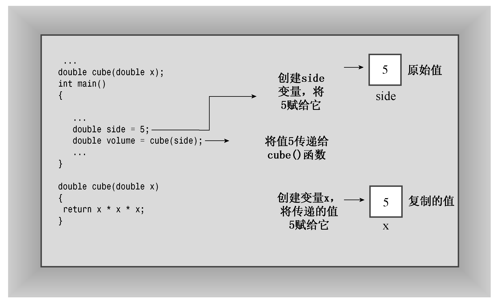
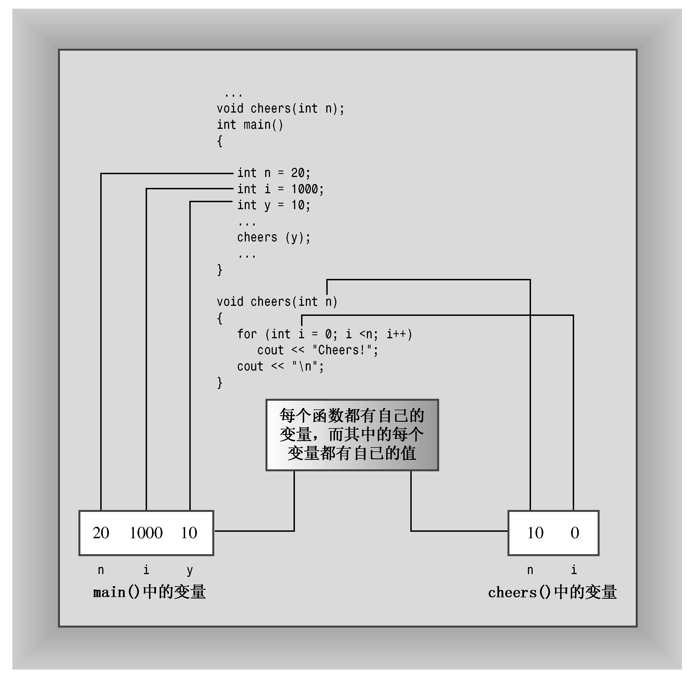

### 7.2　函数参数和按值传递

下面详细介绍一下函数参数。C++通常按值传递参数，这意味着将数值参数传递给函数，而后者将其赋给一个新的变量。例如，程序清单7.2包含下面的函数调用：

```css
double volume = cube(side);
```

其中，side是一个变量，在前面的程序运行中，其值为5。cube()的函数头如下：

```css
double cube(double x)
```

被调用时，该函数将创建一个新的名为x的double变量，并将其初始化为5。这样，cube()执行的操作将不会影响main()中的数据，因为cube()使用的是side的副本，而不是原来的数据。稍后将介绍一个实现这种保护的例子。用于接收传递值的变量被称为形参。传递给函数的值被称为实参。出于简化的目的，C++标准使用参数（argument）来表示实参，使用参量（parameter）来表示形参，因此参数传递将参数赋给参量（参见图7.2）。


<center class="my_markdown"><b class="my_markdown">图7.2　按值传递</b></center>

在函数中声明的变量（包括参数）是该函数私有的。在函数被调用时，计算机将为这些变量分配内存；在函数结束时，计算机将释放这些变量使用的内存（有些C++文献将分配和释放内存称为创建和毁坏变量，这样似乎更激动人心）。这样的变量被称为局部变量，因为它们被限制在函数中。前面提到过，这样做有助于确保数据的完整性。这还意味着，如果在main()中声明了一个名为x的变量，同时在另一个函数中也声明了一个名为x的变量，则它们将是两个完全不同的、毫无关系的变量，这与加利福尼亚州的Albany与纽约的Albany是两个完全不同的地方是一样的道理（参见图7.3）。这样的变量也被称为自动变量，因为它们是在程序执行过程中自动被分配和释放的。


<center class="my_markdown"><b class="my_markdown">图7.3　局部变量</b></center>

