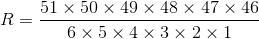

### 7.2.2　另一个接受两个参数的函数

下面创建另一个功能更强大的函数，它执行重要的计算任务。另外，该函数将演示局部变量的用法，而不是形参的用法。

目前，美国许多州都采用某种纸牌游戏的形式来发行彩票，让参与者从卡片中选择一定数目的选项。例如，从51个数字中选取6个。随后，彩票管理者将随机抽取6个数。如果参与者选择的数字与这6个完全相同，将赢得大约几百万美元的奖金。我们的函数将计算中奖的几率（是的，能够成功预测获奖号码的函数将更有用，但虽然C++的功能非常强大，目前还不具备超自然能力）。

首先，需要一个公式。假设必须从51个数中选取6个，而获奖的概率为1/R，则R的计算公式如下：



选择6个数时，分母为前6个整数的乘积或6的阶乘。分子也是6个连续整数的乘积，从51开始，依次减1。推而广之，如果从numbers个数中选取picks个数，则分母是picks的阶乘，分子为numbers开始向前的picks个整数的乘积。可以用for循环进行计算：

```css
long double result = 1.0;
for (n = numbers, p = picks; p > 0; n--, p--)
    result = result * n / p ;
```

循环不是首先将所有的分子项相乘，而是首先将1.0与第一个分子项相乘，然后除以第一个分母项。然后下一轮循环乘以第二个分子项，并除以第二个分母项。这样得到的乘积将比先进行乘法运算得到的小。例如，对于(10 * 9)/(2 * 1)和(10 / 2)*(9 / 1)，前者将计算90/2，得到45，后者将计算为5*9，得到45。这两种方法得到的结果相同，但前者的中间值（90）大于后者。因子越多，中间值的差别就越大。当数字非常大时，这种交替进行乘除运算的策略可以防止中间结果超出最大的浮点数。

程序清单7.4在probability()函数中使用了这个公式。由于选择的数目和总数目都为正，因此该程序将这些变量声明为unsigned int类型（简称unsigned）。将若干整数相乘可以得到相当大的结果，因此lotto.cpp将该函数的返回值声明为long double类型。另外，如果使用整型，则像49/6这样的运算将出现舍入误差。

> **注意：**
> 有些C++实现不支持long double类型，如果所用的C++实现是这样的，请使用double类型。

程序清单7.4　lotto.cpp

```css
// lotto.cpp -- probability of winning
#include <iostream>
// Note: some implementations require double instead of long double
long double probability(unsigned numbers, unsigned picks);
int main()
{
    using namespace std;
    double total, choices;
    cout << "Enter the total number of choices on the game card and\n"
            "the number of picks allowed:\n";
    while ((cin >> total >> choices) && choices <= total)
    {
        cout << "You have one chance in ";
        cout << probability(total, choices); // compute the odds
        cout << " of winning.\n";
        cout << "Next two numbers (q to quit): ";
    }
    cout << "bye\n";
    return 0;
}
// the following function calculates the probability of picking picks
// numbers correctly from numbers choices
long double probability(unsigned numbers, unsigned picks)
{
    long double result = 1.0; // here come some local variables
    long double n;
    unsigned p;
    for (n = numbers, p = picks; p > 0; n--, p--)
        result = result * n / p ;
    return result;
}
```

下面是该程序的运行情况：

```css
Enter the total number of choices on the game card and
the number of picks allowed:
49 6
You have one chance in 1.39838e+007 of winning.
Next two numbers (q to quit): 51 6
You have one chance in 1.80095e+007 of winning.
Next two numbers (q to quit): 38 6
You have one chance in 2.76068e+006 of winning.
Next two numbers (q to quit): q
bye
```

请注意，增加游戏卡中可供选择的数字数目，获奖的可能性将急剧降低。

**程序说明**

程序清单7.4中的probability()函数演示了可以在函数中使用的两种局部变量。首先是形参（number和picks），这是在左括号前面的函数头中声明的；其次是其他局部变量（result、n和p），它们是在将函数定义括起的括号内声明的。形参与其他局部变量的主要区别是，形参从调用probability()的函数那里获得自己的值，而其他变量是从函数中获得自己的值。

