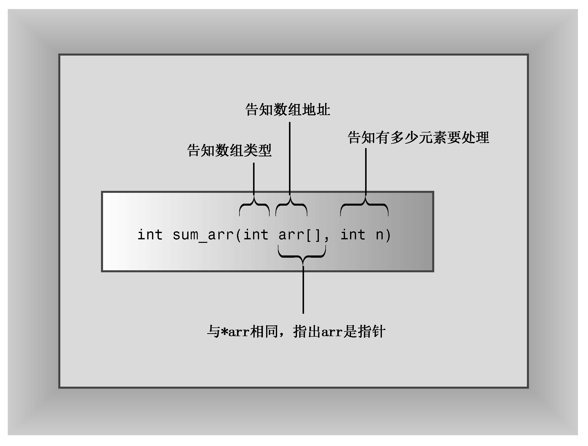

### 7.3.2　将数组作为参数意味着什么

我们来看一看程序清单 7.5暗示了什么。函数调用sum_arr(cookies, ArSize)将cookies数组第一个元素的地址和数组中的元素数目传递给sum_arr()函数。sum_arr()函数将cookies的地址赋给指针变量arr，将ArSize赋给int变量n。这意味着，程序清单7.5实际上并没有将数组内容传递给函数，而是将数组的位置（地址）、包含的元素种类（类型）以及元素数目（n变量）提交给函数（参见图 7.4）。有了这些信息后，函数便可以使用原来的数组。传递常规变量时，函数将使用该变量的拷贝；但传递数组时，函数将使用原来的数组。实际上，这种区别并不违反C++按值传递的方法，sum_arr()函数仍传递了一个值，这个值被赋给一个新变量，但这个值是一个地址，而不是数组的内容。


<center class="my_markdown"><b class="my_markdown">图7.4　告知函数有关数组的信息</b></center>

数组名与指针对应是好事吗？确实是一件好事。将数组地址作为参数可以节省复制整个数组所需的时间和内存。如果数组很大，则使用拷贝的系统开销将非常大；程序不仅需要更多的计算机内存，还需要花费时间来复制大块的数据。另一方面，使用原始数据增加了破坏数据的风险。在经典的C语言中，这确实是一个问题，但ANSI C和C++中的const限定符提供了解决这种问题的办法。稍后将介绍一个这样的示例，但先来修改程序清单7.5，以演示数组函数是如何运作的。程序清单7.6表明，cookies和arr的值相同。它还演示了指针概念如何使sum_arr函数比以前更通用。该程序使用限定符std::而不是编译指令using来提供对cout和endl的访问权。

程序清单7.6　arrfun2.cpp

```css
// arrfun2.cpp -- functions with an array argument
#include <iostream>
const int ArSize = 8;
int sum_arr(int arr[], int n);
// use std:: instead of using directive
int main()
{
    int cookies[ArSize] = {1,2,4,8,16,32,64,128};
// some systems require preceding int with static to
// enable array initialization
    std::cout << cookies << " = array address, ";
// some systems require a type cast: unsigned (cookies)
    std::cout << sizeof(cookies)<< " = sizeof cookies\n";
    int sum = sum_arr(cookies, ArSize);
    std::cout << "Total cookies eaten: " << sum << std::endl;
    sum = sum_arr(cookies, 3); // a lie
    std::cout << "First three eaters ate " << sum << " cookies.\n";
    sum = sum_arr(cookies + 4, 4); // another lie
    std::cout << "Last four eaters ate " << sum << " cookies.\n";
    return 0;
}
// return the sum of an integer array
int sum_arr(int arr[], int n)
{
    int total = 0;
    std::cout << arr << " = arr, ";
// some systems require a type cast: unsigned (arr)
    std::cout << sizeof(arr)<< " = sizeof arr\n";
    for (int i = 0; i < n; i++)
        total = total + arr[i];
    return total;
}
```

下面是该程序的输出（地址值和数组的长度将随系统而异）：

```css
003EF9FC = array address, 32 = sizeof cookies
003EF9FC = arr, 4 = sizeof arr
Total cookies eaten: 255
003EF9FC = arr, 4 = sizeof arr
First three eaters ate 7 cookies.
003EFA0C = arr, 4 = sizeof arr
Last four eaters ate 240 cookies.
```

注意，地址值和数组的长度随系统而异。另外，有些C++实现以十进制而不是十六进制格式显示地址，还有些编译器以十六进制显示地址时，会加上前缀0x。

**程序说明**

程序清单7.6说明了数组函数的一些有趣的地方。首先，cookies和arr指向同一个地址。但sizeof cookies的值为32，而sizeof arr为4。这是由于sizeof cookies是整个数组的长度，而sizeof arr只是指针变量的长度（上述程序运行结果是从一个使用4字节地址的系统中获得的）。顺便说一句，这也是必须显式传递数组长度，而不能在sum_arr()中使用sizeof arr的原因；指针本身并没有指出数组的长度。

由于sum_arr()只能通过第二个参数获知数组中的元素数量，因此可以对函数“说谎”。例如，程序第二次使用该函数时，这样调用它：

```css
sum = sum_arr(cookies, 3);
```

通过告诉该函数cookies有3个元素，可以让它计算前3个元素的总和。

为什么在这里停下了呢？还可以提供假的数组起始位置：

```css
sum = sum_arr(cookies + 4, 4);
```

由于cookies是第一个元素的地址，因此cookies + 4是第5个元素的地址。这条语句将计算数组第5、6、7、8个元素的总和。请注意输出中第三次函数调用选择将不同于前两个调用的地址赋给arr的。是的，可以将&cookies[4]，而不是cookies + 4作为参数；它们的含义是相同的。

> **注意：**
> 为将数组类型和元素数量告诉数组处理函数，请通过两个不同的参数来传递它们：

```css
void fillArray(int arr[], int size); // prototype
```

> 而不要试图使用方括号表示法来传递数组长度：

```css
void fillArray(int arr[size]); // NO -- bad prototype
```

