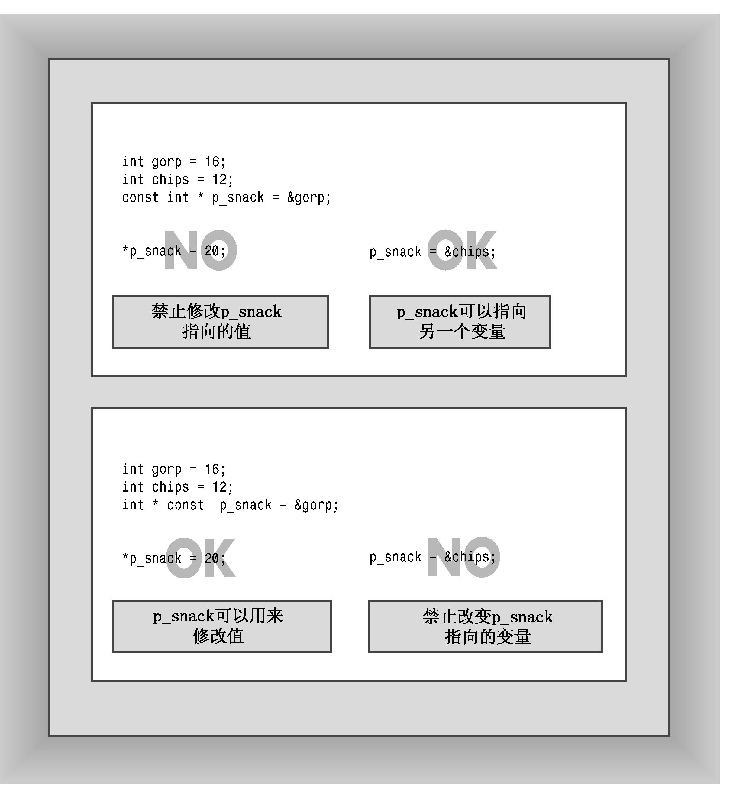

### 7.3.5　指针和const

将const用于指针有一些很微妙的地方（指针看起来总是很微妙），我们来详细探讨一下。可以用两种不同的方式将const关键字用于指针。第一种方法是让指针指向一个常量对象，这样可以防止使用该指针来修改所指向的值，第二种方法是将指针本身声明为常量，这样可以防止改变指针指向的位置。下面来看细节。

首先，声明一个指向常量的指针pt：

```css
int age = 39;
const int * pt = &age;
```

该声明指出，pt指向一个const int（这里为39），因此不能使用pt来修改这个值。换句话来说，*pt的值为const，不能被修改：

```css
*pt += 1;     // INVALID because pt points to a const int
cin >> *pt;  // INVALID for the same reason
```

现在来看一个微妙的问题。pt的声明并不意味着它指向的值实际上就是一个常量，而只是意味着对pt而言，这个值是常量。例如，pt指向age，而age不是const。可以直接通过age变量来修改age的值，但不能使用pt指针来修改它：

```css
*pt = 20;   // INVALID because pt points to a const int
age = 20;   // VALID because age is not declared to be const
```

以前我们将常规变量的地址赋给常规指针，而这里将常规变量的地址赋给指向const的指针。因此还有两种可能：将const变量的地址赋给指向const的指针、将const的地址赋给常规指针。这两种操作都可行吗？第一种可行，但第二种不可行：

```css
const float g_earth = 9.80;
const float * pe = &g_earth; // VALID
const float g_moon = 1.63;
float * pm = &g_moon;        // INVALID
```

对于第一种情况来说，既不能使用g_earth来修改值9.80，也不能使用pe来修改。C++禁止第二种情况的原因很简单——如果将g_moon的地址赋给pm，则可以使用pm来修改g_moon的值，这使得g_moon的const状态很荒谬，因此C++禁止将const的地址赋给非const指针。如果读者非要这样做，可以使用强制类型转换来突破这种限制，详情请参阅第15章中对运算符const_cast的讨论。

如果将指针指向指针，则情况将更复杂。前面讲过，假如涉及的是一级间接关系，则将非const指针赋给const指针是可以的：

```css
int age = 39;        // age++ is a valid operation
int * pd = &age;     // *pd = 41 is a valid operation
const int * pt = pd; // *pt = 42 is an invalid operation
```

然而，进入两级间接关系时，与一级间接关系一样将const和非const混合的指针赋值方式将不再安全。如果允许这样做，则可以编写这样的代码：

```css
const int **pp2;
int *p1;
const int n = 13;
pp2 = &p1; // not allowed, but suppose it were
*pp2 = &n; // valid, both const, but sets p1 to point at n
*p1 = 10;  // valid, but changes const n
```

上述代码将非const地址（&pl）赋给了const指针（pp2），因此可以使用pl来修改const数据。因此，仅当只有一层间接关系（如指针指向基本数据类型）时，才可以将非const地址或指针赋给const指针。

> **注意：**
> 如果数据类型本身并不是指针，则可以将const数据或非const数据的地址赋给指向const的指针，但只能将非const数据的地址赋给非const指针。

假设有一个由const数据组成的数组：

```css
const int months[12] = {31,28,31,30,31,30, 31, 31,30,31,30,31};
```

则禁止将常量数组的地址赋给非常量指针，这意味着不能将数组名作为参数传递给使用非常量形参的函数：

```css
int sum(int arr[], int n); // should have been const int arr[]
...
int j = sum(months, 12);   // not allowed
```

上述函数调用试图将const指针（months）赋给非const指针（arr），编译器将禁止这种函数调用。


**尽可能使用const**

将指针参数声明为指向常量数据的指针有两条理由：

+ 这样可以避免由于无意间修改数据而导致的编程错误；
+ 使用const使得函数能够处理const和非const实参，否则将只能接受非const数据。

如果条件允许，则应将指针形参声明为指向const的指针。


为说明另一个微妙之处，请看下面的声明：

```css
int age = 39;
const int * pt = &age;
```

第二个声明中的const只能防止修改pt指向的值（这里为39），而不能防止修改pt的值。也就是说，可以将一个新地址赋给pt：

```css
int sage = 80;
pt = &sage; // okay to point to another location
```

但仍然不能使用pt来修改它指向的值（现在为80）。

第二种使用const的方式使得无法修改指针的值：

```css
int sloth = 3;
const int * ps = &sloth;     // a pointer to const int
int * const finger = &sloth; // a const pointer to int
```

在最后一个声明中，关键字const的位置与以前不同。这种声明格式使得finger只能指向sloth，但允许使用finger来修改sloth的值。中间的声明不允许使用ps来修改sloth的值，但允许将ps指向另一个位置。简而言之，finger和*ps都是const，而*finger和ps不是（参见图7.5）。


<center class="my_markdown"><b class="my_markdown">图7.5　指向const的指针和const指针</b></center>

如果愿意，还可以声明指向const对象的const指针：

```css
double trouble = 2.0E30;
const double * const stick = &trouble;
```

其中，stick 只能指向 trouble，而 stick 不能用来修改 trouble 的值。简而言之，stick 和*stick 都是const。

通常，将指针作为函数参数来传递时，可以使用指向const的指针来保护数据。例如，程序清单7.5中的show_array()的原型：

```css
void show_array(const double ar[], int n);
```

在该声明中使用const意味着show_array()不能修改传递给它的数组中的值。只要只有一层间接关系，就可以使用这种技术。例如，这里的数组元素是基本类型，但如果它们是指针或指向指针的指针，则不能使用const。

