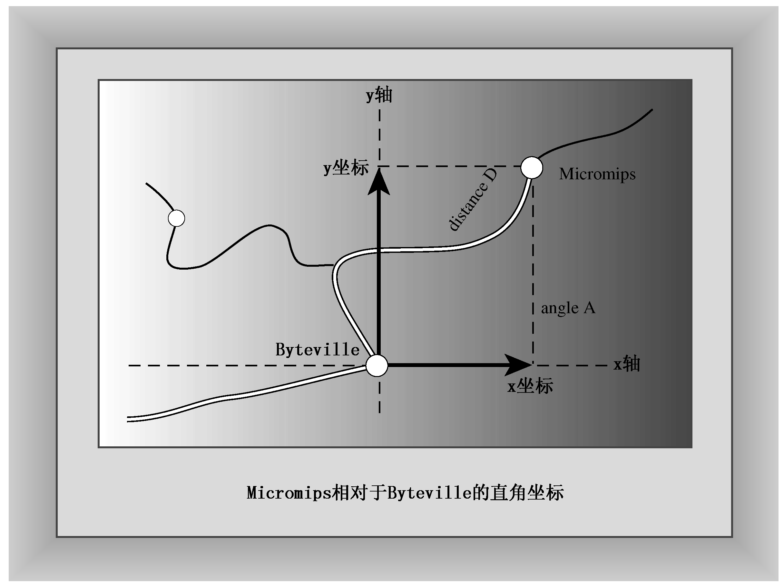
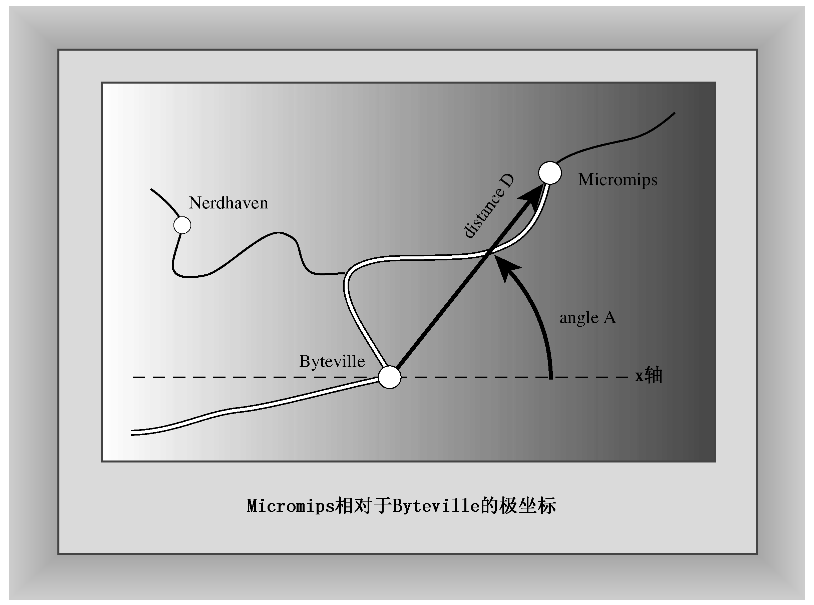

### 7.6.2　另一个处理结构的函数示例

前面介绍的有关函数和C++结构的大部分知识都可用于C++类中，因此有必要介绍另一个示例。这次要处理的是空间，而不是时间。具体地说，这个例子将定义两个结构，用于表示两种不同的描述位置的方法，然后开发一个函数，将一种格式转换为另一种格式，并显示结果。这个例子用到的数学知识比前一个要多，但并不需要像学习数学那样学习C++。

假设要描述屏幕上某点的位置，或地图上某点相对于原点的位置，则一种方法是指出该点相对于原点的水平偏移量和垂直偏移量。传统上，数学家使用x表示水平偏移量，使用y表示垂直偏移量（参见图7.6）。x和y一起构成了直角坐标（rectangular coordinates）。可以定义由两个坐标组成的结构来表示位置：

```css
struct rect
{
      double x; // horizontal distance from origin
      double y; // vertical distance from origin
};
```


<center class="my_markdown"><b class="my_markdown">图7.6　直角坐标</b></center>

另一种描述点的位置的方法是，指出它偏离原点的距离和方向（例如，东偏北40度）。传统上，数学家从正水平轴开始按逆时针方向度量角度（参见图7.7）。距离和角度一起构成了极坐标（polar coordinates）。可以定义另一个结构来表示这种位置：

```css
struct polar
{
       double distance; // distance from origin
       double angle;    // direction from origin
};
```


<center class="my_markdown"><b class="my_markdown">图7.7　极坐标</b></center>

下面来创建一个显示polar结构的内容的函数。C++库（从C语言借鉴而来）中的数学函数假设角度的单位为弧度，因此应以弧度为单位来测量角度。但为了便于显示，我们将弧度值转换为角度值。这意味着需要将弧度值乘以180/π——约为57.29577951。该函数的代码如下：

```css
// show polar coordinates, converting angle to degrees
void show_polar (polar dapos)
{
    using namespace std;
    const double Rad_to_deg = 57.29577951;
    cout << "distance = " << dapos.distance;
    cout << ", angle = " << dapos.angle * Rad_to_deg;
    cout << " degrees\n";
}
```

请注意，形参的类型为polar。将一个polar结构传递给该函数时，该结构的内容将被复制到dapos结构中，函数随后将使用该拷贝完成工作。由于dapos是一个结构，因此该函数使用成员运算符句点（参见第4章）来标识结构成员。

接下来，让我们试着再前进一步，编写一个将直角坐标转换为极坐标的函数。该函数接受一个rect参数，并返回一个polar结构。这需要使用数学库中的函数，因此程序必须包含头文件cmath（在较旧的系统中为math.h）。另外，在有些系统中，还必须命令编译器载入数学库（参见第1章）。可以根据毕达哥拉斯定理，使用水平和垂直坐标来计算距离：

```css
distance = sqrt( x * x + y * y)
```

数学库中的atan2()函数可根据x和y的值计算角度：

```css
angle = atan2(y, x)
```

还有一个atan()函数，但它不能区分180度之内和之外的角度。在数学函数中，这种不确定性与在生存手册中一样不受人欢迎。

有了这些公式后，便可以这样编写该函数：

```css
// convert rectangular to polar coordinates
polar rect_to_polar(rect xypos) // type polar
{
    polar answer;
    answer.distance =
        sqrt( xypos.x * xypos.x + xypos.y * xypos.y);
    answer.angle = atan2(xypos.y, xypos.x);
    return answer; // returns a polar structure
}
```

编写好函数后，程序的其他部分编写起来就非常简单了。程序清单7.12列出了程序的代码。

程序清单7.12　strctfun.cpp

```css
// strctfun.cpp -- functions with a structure argument
#include <iostream>
#include <cmath>
// structure declarations
struct polar
{
    double distance; // distance from origin
    double angle;    // direction from origin
};
struct rect
{
    double x; // horizontal distance from origin
    double y; // vertical distance from origin
};
// prototypes
polar rect_to_polar(rect xypos);
void show_polar(polar dapos);
int main()
{
    using namespace std;
    rect rplace;
    polar pplace;
    cout << "Enter the x and y values: ";
    while (cin >> rplace.x >> rplace.y) // slick use of cin
    {
        pplace = rect_to_polar(rplace);
        show_polar(pplace);
        cout << "Next two numbers (q to quit): ";
    }
    cout << "Done.\n";
    return 0;
}
// convert rectangular to polar coordinates
polar rect_to_polar(rect xypos)
{
    using namespace std;
    polar answer;
    answer.distance =
        sqrt( xypos.x * xypos.x + xypos.y * xypos.y);
    answer.angle = atan2(xypos.y, xypos.x);
    return answer; // returns a polar structure
}
// show polar coordinates, converting angle to degrees
void show_polar (polar dapos)
{
    using namespace std;
    const double Rad_to_deg = 57.29577951;
    cout << "distance = " << dapos.distance;
    cout << ", angle = " << dapos.angle * Rad_to_deg;
    cout << " degrees\n";
}
```

> **注意：**
> 有些编译器仅当被明确指示后，才会搜索数学库。例如，较早的g++版本使用下面这样的命令行：

```css
g++ structfun.C -lm
```

下面是该程序的运行情况：

```css
Enter the x and y values: 30 40
distance = 50, angle = 53.1301 degrees
Next two numbers (q to quit): -100 100
distance = 141.421, angle = 135 degrees
Next two numbers (q to quit): q
```

**程序说明**

程序清单7.12中的两个函数已经在前面讨论了，因此下面复习一下该程序如何使用cin来控制while循环：

```css
while (cin >> rplace.x >> rplace.y)
```

前面讲过，cin是istream类的一个对象。抽取运算符（>>）被设计成使得cin>>rplace.x也是一个istream对象。正如第11章将介绍的，类运算符是使用函数实现的。使用cin>>rplace.x时，程序将调用一个函数，该函数返回一个istream值。将抽取运算符用于cin>>rplace.x对象（就像cin>>rplace.x>>rplace.y这样），也将获得一个istream对象。因此，整个while循环的测试表达式的最终结果为cin，而cin被用于测试表达式中时，将根据输入是否成功，被转换为bool值true或false。例如，在程序清单7.12中的循环中，cin期望用户输入两个数字，如果用户输入了q（前面的输出示例就是这样做的），cin>>将知道q不是数字，从而将q留在输入队列中，并返回一个将被转换为fasle的值，导致循环结束。

请将这种读取数字的方法与下面更为简单的方法进行比较：

```css
for (int i = 0; i < limit; i++)
{
    cout << "Enter value #" << (i + 1) << ": ";
    cin >> temp;
    if (temp < 0)
        break;
    ar[i] = temp;
}
```

要提早结束该循环，可以输入一个负值。这将输入限制为非负值。这种限制符合某些程序的需要，但通常需要一种不会将某些数值排除在外的、终止循环的方式。将cin>>用作测试条件消除了这种限制，因为它接受任何有效的数字输入。在需要使用循环来输入数字时，别忘了考虑使用这种方式。另外请记住，非数字输入将设置一个错误条件，禁止进一步读取输入。如果程序在输入循环后还需要进行输入，则必须使用cin.clear()重置输入，然后还可能需要通过读取不合法的输入来丢弃它们。程序清单7.7演示了这些技术。

