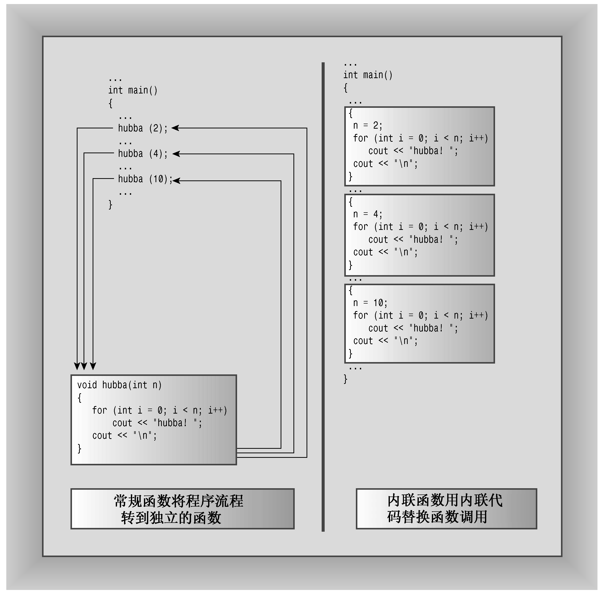

### 8.1　C++内联函数

内联函数是C++为提高程序运行速度所做的一项改进。常规函数和内联函数之间的主要区别不在于编写方式，而在于C++编译器如何将它们组合到程序中。要了解内联函数与常规函数之间的区别，必须深入到程序内部。

编译过程的最终产品是可执行程序——由一组机器语言指令组成。运行程序时，操作系统将这些指令载入到计算机内存中，因此每条指令都有特定的内存地址。计算机随后将逐步执行这些指令。有时（如有循环或分支语句时），将跳过一些指令，向前或向后跳到特定地址。常规函数调用也使程序跳到另一个地址（函数的地址），并在函数结束时返回。下面更详细地介绍这一过程的典型实现。执行到函数调用指令时，程序将在函数调用后立即存储该指令的内存地址，并将函数参数复制到堆栈（为此保留的内存块），跳到标记函数起点的内存单元，执行函数代码（也许还需将返回值放入到寄存器中），然后跳回到地址被保存的指令处（这与阅读文章时停下来看脚注，并在阅读完脚注后返回到以前阅读的地方类似）。来回跳跃并记录跳跃位置意味着以前使用函数时，需要一定的开销。

C++内联函数提供了另一种选择。内联函数的编译代码与其他程序代码“内联”起来了。也就是说，编译器将使用相应的函数代码替换函数调用。对于内联代码，程序无需跳到另一个位置处执行代码，再跳回来。因此，内联函数的运行速度比常规函数稍快，但代价是需要占用更多内存。如果程序在10个不同的地方调用同一个内联函数，则该程序将包含该函数代码的10个副本（参见图8.1）。

应有选择地使用内联函数。如果执行函数代码的时间比处理函数调用机制的时间长，则节省的时间将只占整个过程的很小一部分。如果代码执行时间很短，则内联调用就可以节省非内联调用使用的大部分时间。另一方面，由于这个过程相当快，因此尽管节省了该过程的大部分时间，但节省的时间绝对值并不大，除非该函数经常被调用。


<center class="my_markdown"><b class="my_markdown">图8.1　内联函数与常规函数</b></center>

要使用这项特性，必须采取下述措施之一：

+ 在函数声明前加上关键字inline；
+ 在函数定义前加上关键字inline。

通常的做法是省略原型，将整个定义（即函数头和所有函数代码）放在本应提供原型的地方。

程序员请求将函数作为内联函数时，编译器并不一定会满足这种要求。它可能认为该函数过大或注意到函数调用了自己（内联函数不能递归），因此不将其作为内联函数；而有些编译器没有启用或实现这种特性。

程序清单8.1通过内联函数square()（计算参数的平方）演示了内联技术。注意到整个函数定义都放在一行中，但并不一定非得这样做。然而，如果函数定义占用多行（假定没有使用冗长的标识符），则将其作为内联函数就不太合适。

程序清单8.1　inline.cpp

```css
// inline.cpp -- using an inline function
#include <iostream>
// an inline function definition
inline double square(double x) { return x * x; }
int main()
{
    using namespace std;
    double a, b;
    double c = 13.0;
    a = square(5.0);
    b = square(4.5 + 7.5); // can pass expressions
    cout << "a = " << a << ", b = " << b << "\n";
    cout << "c = " << c;
    cout << ", c squared = " << square(c++) << "\n";
    cout << "Now c = " << c << "\n";
    return 0;
}
```

下面是该程序的输出：

```css
a = 25, b = 144
c = 13, c squared = 169
Now c = 14
```

输出表明，内联函数和常规函数一样，也是按值来传递参数的。如果参数为表达式，如4.5 + 7.5，则函数将传递表达式的值（这里为12）。这使得C++的内联功能远远胜过C语言的宏定义，请参见旁注“内联与宏”。

尽管程序没有提供独立的原型，但C++原型特性仍在起作用。这是因为在函数首次使用前出现的整个函数定义充当了原型。这意味着可以给square()传递int或long值，将值传递给函数前，程序自动将这个值强制转换为double类型。


**内联与宏**

inline工具是C++新增的特性。C语言使用预处理器语句#define来提供宏——内联代码的原始实现。例如，下面是一个计算平方的宏：

```css
#define SQUARE(X) X*X
```

这并不是通过传递参数实现的，而是通过文本替换来实现的——X是“参数”的符号标记。

```css
a = SQUARE(5.0); is replaced by a = 5.0*5.0;
b = SQUARE(4.5 + 7.5); is replaced by b = 4.5 + 7.5 * 4.5 + 7.5;
d = SQUARE(c++); is replaced by d = c++*c++;
```

上述示例只有第一个能正常工作。可以通过使用括号来进行改进：

```css
#define SQUARE(X) ((X)*(X))
```

但仍然存在这样的问题，即宏不能按值传递。即使使用新的定义，SQUARE（C++）仍将c递增两次，但是程序清单8.1中的内联函数square()计算c的结果，传递它，以计算其平方值，然后将c递增一次。

这里的目的不是演示如何编写C宏，而是要指出，如果使用C语言的宏执行了类似函数的功能，应考虑将它们转换为C++内联函数。


