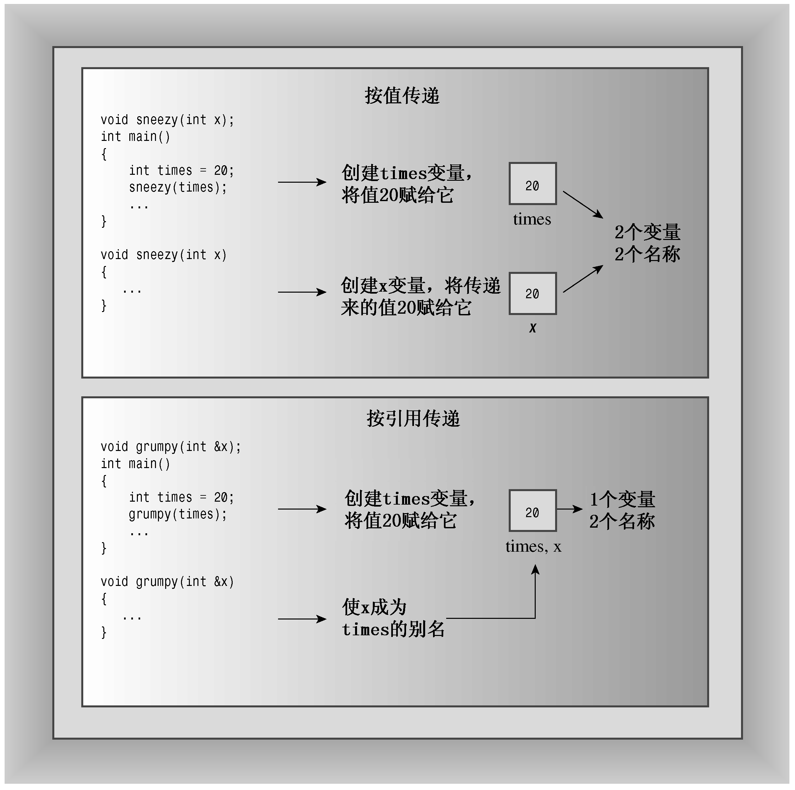

### 8.2.2　将引用用作函数参数

引用经常被用作函数参数，使得函数中的变量名成为调用程序中的变量的别名。这种传递参数的方法称为按引用传递。按引用传递允许被调用的函数能够访问调用函数中的变量。C++新增的这项特性是对C语言的超越，C语言只能按值传递。按值传递导致被调用函数使用调用程序的值的拷贝（参见图8.2）。当然，C语言也允许避开按值传递的限制，采用按指针传递的方式。


<center class="my_markdown"><b class="my_markdown">图8.2　按值传递和按引用传递</b></center>

现在我们通过一个常见的的计算机问题——交换两个变量的值，对使用引用和使用指针做一下比较。交换函数必须能够修改调用程序中的变量的值。这意味着按值传递变量将不管用，因为函数将交换原始变量副本的内容，而不是变量本身的内容。但传递引用时，函数将可以使用原始数据。另一种方法是，传递指针来访问原始数据。程序清单8.4演示了这三种方法，其中包括一种不可行的方法，以便您能对这些方法进行比较。

程序清单8.4　swaps.cpp

```css
// swaps.cpp -- swapping with references and with pointers
#include <iostream>
void swapr(int & a, int & b); // a, b are aliases for ints
void swapp(int * p, int * q); // p, q are addresses of ints
void swapv(int a, int b);     // a, b are new variables
int main()
{
    using namespace std;
    int wallet1 = 300;
    int wallet2 = 350;
    cout << "wallet1 = $" << wallet1;
    cout << " wallet2 = $" << wallet2 << endl;
    cout << "Using references to swap contents:\n";
    swapr(wallet1, wallet2);  // pass variables
    cout << "wallet1 = $" << wallet1;
    cout << " wallet2 = $" << wallet2 << endl;
    cout << "Using pointers to swap contents again:\n";
    swapp(&wallet1, &wallet2);// pass addresses of variables
    cout << "wallet1 = $" << wallet1;
    cout << " wallet2 = $" << wallet2 << endl;
    cout << "Trying to use passing by value:\n";
    swapv(wallet1, wallet2);  // pass values of variables
    cout << "wallet1 = $" << wallet1;
    cout << " wallet2 = $" << wallet2 << endl;
    return 0;
}
void swapr(int & a, int & b)  // use references
{
    int temp;
    temp = a;                 // use a, b for values of variables
    a = b;
    b = temp;
}
void swapp(int * p, int * q) // use pointers
{
    int temp;
    temp = *p;               // use *p, *q for values of variables
    *p = *q;
    *q = temp;
}
void swapv(int a, int b)     // try using values
{
    int temp;
    temp = a;                // use a, b for values of variables
    a = b;
    b = temp;
}
```

下面是程序清单8.4中程序的输出：

```css
wallet1 = $300 wallet2 = $350      << original values
Using references to swap contents:
wallet1 = $350 wallet2 = $300      << values swapped
Using pointers to swap contents again:
wallet1 = $300 wallet2 = $350      << values swapped again
Trying to use passing by value:
wallet1 = $300 wallet2 = $350      << swap failed
```

正如您预想的，引用和指针方法都成功地交换了两个钱夹（wallet）中的内容，而按值传递的方法没能完成这项任务。

**程序说明**

首先来看程序清单8.4中每个函数是如何被调用的：

```css
swapr(wallet1, wallet2);   // pass variables
swapp(&wallet1, &wallet2); // pass addresses of variables
swapv(wallet1, wallet2);   // pass values of variables
```

按引用传递（swapr(wallet1, wallet2)）和按值传递（swapv(wallet1, waller2)）看起来相同。只能通过原型或函数定义才能知道swapr()是按引用传递的。然而，地址运算符（&）使得按地址传递（swapp(&wallet1, &wallet2)）一目了然（类型声明int * p表明，p是一个int指针，因此与p对应的参数应为地址，如&wallet1）。

接下来，比较函数swapr()（按引用传递）和swapv()（按值传递）的代码，唯一的外在区别是声明函数参数的方式不同：

```css
void swapr(int & a, int & b)
void swapv(int a, int b)
```

当然还有内在区别：在swapr()中，变量a和b是wallet1和wallet2的别名，所以交换a和b的值相当于交换wallet1和wallet2的值；但在swapv()中，变量a和b是复制了wallet1和waller2的值的新变量，因此交换a和b的值并不会影响wallet1和wallet2的值。

最后，比较函数swapr()（传递引用）和swapp()（传递指针）。第一个区别是声明函数参数的方式不同：

```css
void swapr(int & a, int & b)
void swapp(int * p, int * q)
```

另一个区别是指针版本需要在函数使用p和q的整个过程中使用解除引用运算符*。

前面说过，应在定义引用变量时对其进行初始化。函数调用使用实参初始化形参，因此函数的引用参数被初始化为函数调用传递的实参。也就是说，下面的函数调用将形参a和b分别初始化为wallet1和wallet2：

```css
swapr(wallet1, wallet2);
```

