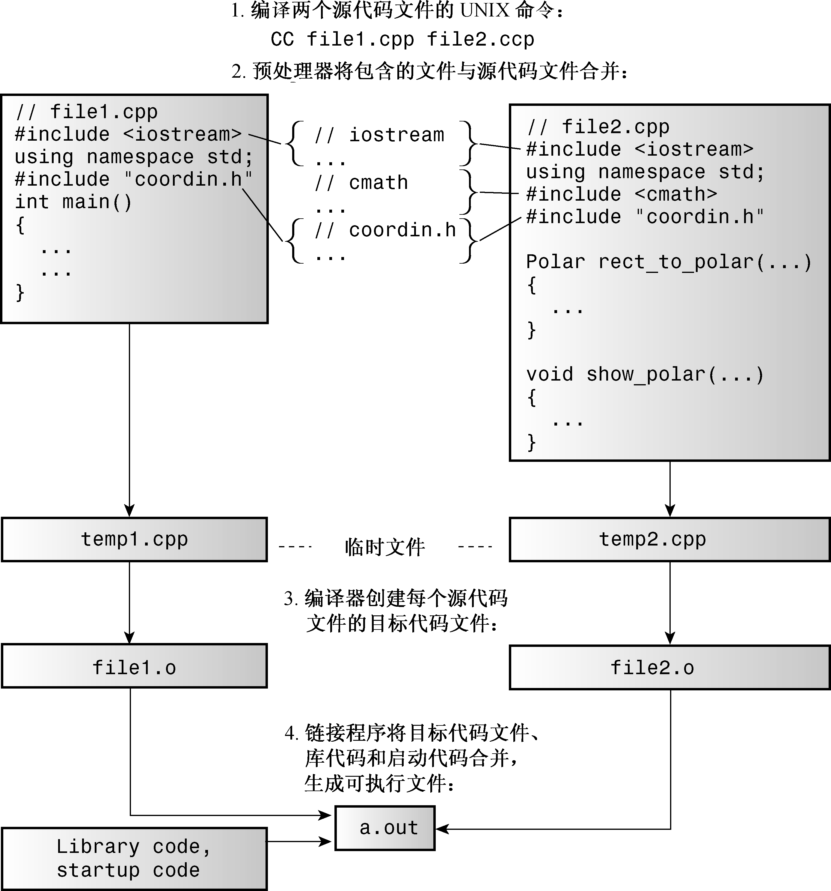

### 9.1　单独编译

和C语言一样，C++也允许甚至鼓励程序员将组件函数放在独立的文件中。第1章介绍过，可以单独编译这些文件，然后将它们链接成可执行的程序。（通常，C++编译器既编译程序，也管理链接器。）如果只修改了一个文件，则可以只重新编译该文件，然后将它与其他文件的编译版本链接。这使得大程序的管理更便捷。另外，大多数C++环境都提供了其他工具来帮助管理。例如，UNIX和Linux系统都具有make程序，可以跟踪程序依赖的文件以及这些文件的最后修改时间。运行make时，如果它检测到上次编译后修改了源文件，make将记住重新构建程序所需的步骤。大多数集成开发环境（包括Embarcadero C++ Builder、Microsoft Visual C++、Apple Xcode和Freescale CodeWarrior）都在Project菜单中提供了类似的工具。

现在看一个简单的示例。我们不是要从中了解编译的细节（这取决于实现），而是要重点介绍更通用的方面，如设计。

例如，假设程序员决定分解程序清单7.12中的程序，将支持函数放在一个独立的文件中。清单7.12将直角坐标转换为极坐标，然后显示结果。不能简单地以main()之后的虚线为界，将原来的文件分为两个。问题在于，main()和其他两个函数使用了同一个结构声明，因此两个文件都应包含该声明。简单地将它们输入进去无疑是自找麻烦。即使正确地复制了结构声明，如果以后要作修改，则必须记住对这两组声明都进行修改。简而言之，将一个程序放在多个文件中将引出新的问题。

谁希望出现更多的问题呢？C和C++的开发人员都不希望，因此他们提供了#include来处理这种情况。与其将结构声明加入到每一个文件中，不如将其放在头文件中，然后在每一个源代码文件中包含该头文件。这样，要修改结构声明时，只需在头文件中做一次改动即可。另外，也可以将函数原型放在头文件中。因此，可以将原来的程序分成三部分。

+ 头文件：包含结构声明和使用这些结构的函数的原型。
+ 源代码文件：包含与结构有关的函数的代码。
+ 源代码文件：包含调用与结构相关的函数的代码。

这是一种非常有用的组织程序的策略。例如，如果编写另一个程序时，也需要使用这些函数，则只需包含头文件，并将函数文件添加到项目列表或make列表中即可。另外，这种组织方式也与OOP方法一致。一个文件（头文件）包含了用户定义类型的定义；另一个文件包含操纵用户定义类型的函数的代码。这两个文件组成了一个软件包，可用于各种程序中。

请不要将函数定义或变量声明放到头文件中。这样做对于简单的情况可能是可行的，但通常会引来麻烦。例如，如果在头文件包含一个函数定义，然后在其他两个文件（属于同一个程序）中包含该头文件，则同一个程序中将包含同一个函数的两个定义，除非函数是内联的，否则这将出错。下面列出了头文件中常包含的内容。

+ 函数原型。
+ 使用#define或const定义的符号常量。
+ 结构声明。
+ 类声明。
+ 模板声明。
+ 内联函数。

将结构声明放在头文件中是可以的，因为它们不创建变量，而只是在源代码文件中声明结构变量时，告诉编译器如何创建该结构变量。同样，模板声明不是将被编译的代码，它们指示编译器如何生成与源代码中的函数调用相匹配的函数定义。被声明为const的数据和内联函数有特殊的链接属性（稍后将介绍），因此可以将其放在头文件中，而不会引起问题。

程序清单9.1、程序清单9.2和程序清单9.3是将程序清单7.12分成几个独立部分后得到的结果。注意，在包含头文件时，我们使用“coordin.h”，而不是<coo din.h>。如果文件名包含在尖括号中，则C++编译器将在存储标准头文件的主机系统的文件系统中查找；但如果文件名包含在双引号中，则编译器将首先查找当前的工作目录或源代码目录（或其他目录，这取决于编译器）。如果没有在那里找到头文件，则将在标准位置查找。因此在包含自己的头文件时，应使用引号而不是尖括号。

图9.1简要地说明了在UNIX系统中将该程序组合起来的步骤。注意，只需执行编译命令CC即可，其他步骤将自动完成。g++和gpp命令行编译器以及Borland C++命令行编译器（bcc32.exe）的行为类似。Apple Xcode、Embarcadero C++ Builder和Microsoft Visual C++基本上执行同样的步骤，但正如第1章介绍的，启动这个过程的方式不同——使用能够创建项目并将其与源代码文件关联起来的菜单。注意，只需将源代码文件加入到项目中，而不用加入头文件。这是因为#include指令管理头文件。另外，不要使用#include来包含源代码文件，这样做将导致多重声明。

> **警告：**
> 在IDE中，不要将头文件加入到项目列表中，也不要在源代码文件中使用#include来包含其他源代码文件。

程序清单9.1　coordin.h

```css
// coordin.h -- structure templates and function prototypes
// structure templates
#ifndef COORDIN_H_
#define COORDIN_H_
struct polar
{
    double distance; // distance from origin
    double angle; // direction from origin
};
struct rect
{
    double x; // horizontal distance from origin
    double y; // vertical distance from origin
};
// prototypes
polar rect_to_polar(rect xypos);
void show_polar(polar dapos);
#endif
```


<center class="my_markdown"><b class="my_markdown">图9.1　在UNIX系统中编译由多个文件组成的C++程序</b></center>


**头文件管理**

在同一个文件中只能将同一个头文件包含一次。记住这个规则很容易，但很可能在不知情的情况下将头文件包含多次。例如，可能使用包含了另外一个头文件的头文件。有一种标准的C/C++技术可以避免多次包含同一个头文件。它是基于预处理器编译指令#ifndef（即if not defined）的。下面的代码片段意味着仅当以前没有使用预处理器编译指令#define定义名称COORDINH时，才处理#ifndef和#endif之间的语句：

```css
#ifndef COORDIN_H_
...
#endif
```

通常，使用#define语句来创建符号常量，如下所示：

```css
#define MAXIMUM 4096
```

但只要将#define用于名称，就足以完成该名称的定义，如下所示：

```css
#define COORDIN_H_
```

程序清单9.1使用这种技术是为了将文件内容包含在#ifndef中：

```css
#ifndef COORDIN_H_
#define COORDIN_H_
// place include file contents here
#endif
```

编译器首次遇到该文件时，名称COORDINH没有定义（我们根据include文件名来选择名称，并加上一些下划线，以创建一个在其他地方不太可能被定义的名称）。在这种情况下，编译器将查看#ifndef和#endif之间的内容（这正是我们希望的），并读取定义COORDINH的一行。如果在同一个文件中遇到其他包含coordin.h的代码，编译器将知道COORDINH已经被定义了，从而跳到#endif后面的一行上。注意，这种方法并不能防止编译器将文件包含两次，而只是让它忽略除第一次包含之外的所有内容。大多数标准C和C++头文件都使用这种防护（guarding）方案。否则，可能在一个文件中定义同一个结构两次，这将导致编译错误。


程序清单9.2　file1.cpp

```css
// file1.cpp -- example of a three-file program
#include <iostream>
#include "coordin.h" // structure templates, function prototypes
using namespace std;
int main()
{
    rect rplace;
    polar pplace;
    cout << "Enter the x and y values: ";
    while (cin >> rplace.x >> rplace.y) // slick use of cin
    {
        pplace = rect_to_polar(rplace);
        show_polar(pplace);
        cout << "Next two numbers (q to quit): ";
    }
    cout << "Bye!\n";
    return 0;
}
```

程序清单9.3　file2.cpp

```css
// file2.cpp -- contains functions called in file1.cpp
#include <iostream>
#include <cmath>
#include "coordin.h" // structure templates, function prototypes
// convert rectangular to polar coordinates
polar rect_to_polar(rect xypos)
{
    using namespace std;
    polar answer;
    answer.distance =
        sqrt( xypos.x * xypos.x + xypos.y * xypos.y);
    answer.angle = atan2(xypos.y, xypos.x);
    return answer; // returns a polar structure
}
// show polar coordinates, converting angle to degrees
void show_polar (polar dapos)
{
    using namespace std;
    const double Rad_to_deg = 57.29577951;
    cout << "distance = " << dapos.distance;
    cout << ", angle = " << dapos.angle * Rad_to_deg;
    cout << " degrees\n";
}
```

将这两个源代码文件和新的头文件一起进行编译和链接，将生成一个可执行程序。下面是该程序的运行情况：

```css
Enter the x and y values: 120 80
distance = 144.222, angle = 33.6901 degrees
Next two numbers (q to quit): 120 50
distance = 130, angle = 22.6199 degrees
Next two numbers (q to quit): q
```

顺便说一句，虽然我们讨论的是根据文件进行单独编译，但为保持通用性，C++标准使用了术语翻译单元（translation unit），而不是文件；文件并不是计算机组织信息时的唯一方式。出于简化的目的，本书使用术语文件，您可将其解释为翻译单元。


**多个库的链接**

C++标准允许每个编译器设计人员以他认为合适的方式实现名称修饰（参见第8章的旁注“什么是名称修饰”），因此由不同编译器创建的二进制模块（对象代码文件）很可能无法正确地链接。也就是说，两个编译器将为同一个函数生成不同的修饰名称。名称的不同将使链接器无法将一个编译器生成的函数调用与另一个编译器生成的函数定义匹配。在链接编译模块时，请确保所有对象文件或库都是由同一个编译器生成的。如果有源代码，通常可以用自己的编译器重新编译源代码来消除链接错误。


