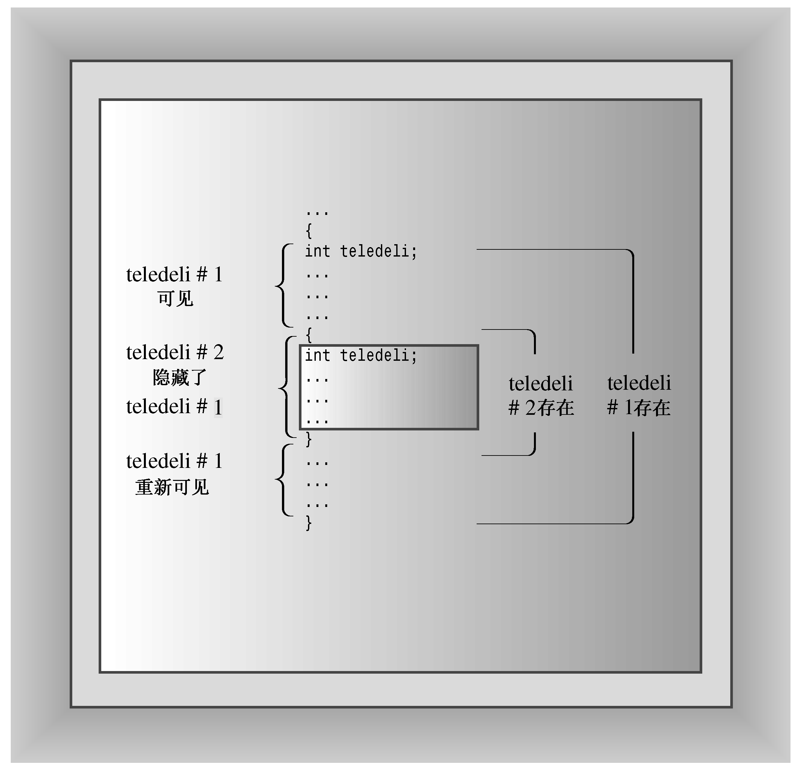
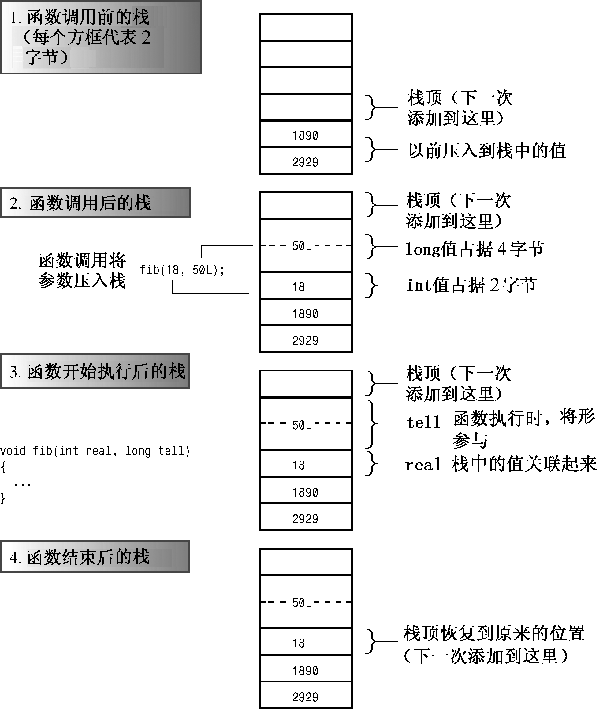

### 9.2.2　自动存储持续性

在默认情况下，在函数中声明的函数参数和变量的存储持续性为自动，作用域为局部，没有链接性。也就是说，如果在main()中声明了一个名为texas的变量，并在函数oil()中也声明了一个名为texas变量，则创建了两个独立的变量——只有在定义它们的函数中才能使用它们。对oil()中的texas执行的任何操作都不会影响main()中的texas，反之亦然。另外，当程序开始执行这些变量所属的代码块时，将为其分配内存；当函数结束时，这些变量都将消失（注意，执行到代码块时，将为变量分配内存，但其作用域的起点为其声明位置）。

如果在代码块中定义了变量，则该变量的存在时间和作用域将被限制在该代码块内。例如，假设在main()的开头定义了一个名为teledeli的变量，然后在main()中开始一个新的代码块，并其中定义了一个新的变量websight，则teledeli在内部代码块和外部代码块中都是可见的，而websight就只在内部代码块中可见，它的作用域是从定义它的位置到该代码块的结尾：

```css
int main()
{
    int teledeli = 5;
    {         // websight allocated
        cout << "Hello\n";
        int websight = -2;       
                  // websight scope begins
        cout << websight << ' ' << teledeli << endl;
    }        // websight expires
    cout << teledeli << endl;
    ...
} // teledeli expires
```

然而，如果将内部代码块中的变量命名为teledeli，而不是websight，使得有两个同名的变量（一个位于外部代码块中，另一个位于内部代码块中），情况将如何呢？在这种情况下，程序执行内部代码块中的语句时，将teledeli解释为局部代码块变量。我们说，新的定义隐藏了（hide）以前的定义，新定义可见，旧定义暂时不可见。在程序离开该代码块时，原来的定义又重新可见（参见图9.2）。


<center class="my_markdown"><b class="my_markdown">图9.2　代码块和作用域</b></center>

程序清单9.4表明，自动变量只在包含它们的函数或代码块中可见。

程序清单9.4　autoscp.cpp

```css
// autoscp.cpp -- illustrating scope of automatic variables
#include <iostream>
void oil(int x);
int main()
{
    using namespace std;
    int texas = 31;
    int year = 2011;
    cout << "In main(), texas = " << texas << ", &texas = ";
    cout << &texas << endl;
    cout << "In main(), year = " << year << ", &year = ";
    cout << &year << endl;
    oil(texas);
    cout << "In main(), texas = " << texas << ", &texas = ";
    cout << &texas << endl;
    cout << "In main(), year = " << year << ", &year = ";
    cout << &year << endl;
    return 0;
}
void oil(int x)
{
    using namespace std;
    int texas = 5;
    cout << "In oil(), texas = " << texas << ", &texas = ";
    cout << &texas << endl;
    cout << "In oil(), x = " << x << ", &x = ";
    cout << &x << endl;
    { // start a block
        int texas = 113;
        cout << "In block, texas = " << texas;
        cout << ", &texas = " << &texas << endl;
                cout << "In block, x = " << x << ", &x = ";
        cout << &x << endl;
    } // end a block
    cout << "Post-block texas = " << texas;
    cout << ", &texas = " << &texas << endl;
}
```

下面是该程序的输出：

```css
In main(), texas = 31, &texas = 0012FED4
In main(), year = 2011, &year = 0012FEC8
In oil(), texas = 5, &texas = 0012FDE4
In oil(), x = 31, &x = 0012FDF4
In block, texas = 113, &texas = 0012FDD8
In block, x = 31, &x = 0012FDF4
Post-block texas = 5, &texas = 0012FDE4
In main(), texas = 31, &texas = 0012FED4
In main(), year = 2011, &year = 0012FEC8
```

在程序清单9.4中，3个texas变量的地址各不相同，而程序使用当前可见的那个变量，因此将113赋给oil()中的内部代码块中的texas，对其他同名变量没有影响。同样，实际的地址值和地址格式随系统而异。

现在总结一下整个过程。执行到main()时，程序为texas和year分配空间，使得这些变量可见。当程序调用oil()时，这些变量仍留在内存中，但不可见。为两个新变量（x和texas）分配内存，从而使它们可见。在程序执行到oil()中的内部代码块时，新的texas将不可见，它被一个更新的定义代替。然而，变量x仍然可见，这是因为该代码块没有定义x变量。当程序流程离开该代码块时，将释放最新的texas使用的内存，而第二个texas再次可见。当oil()函数结束时，texas和x都将过期，而最初的texas和year再次变得可见。


**使用C++11中的auto**

在C++11中，关键字auto用于自动类型推断，这在第3章、第7章和第8章介绍过。但在C语言和以前的C++版本中，auto的含义截然不同，它用于显式地指出变量为自动存储：

```css
int froob(int n)
{
    auto float ford; // ford has automatic storage
    ...
}
```

由于只能将关键字auto用于默认为自动的变量，因此程序员几乎不使用它。它的主要用途是指出当前变量为局部自动变量。

在C++11中，这种用法不再合法。制定标准的人不愿引入新关键字，因为这样做可能导致将该关键字用于其他目的的代码非法。考虑到auto的老用法很少使用，因此赋予其新含义比引入新关键字是更好的选择。


#### 1．自动变量的初始化

可以使用任何在声明时其值为已知的表达式来初始化自动变量，下面的示例初始化变量x、y和z：

```css
int w;          // value of w is indeterminate
int x = 5;      // initialized with a numeric literal
int big = INT_MAX – 1; // initialized with a constant expression
int y = 2 * x;  // use previously determined value of x
cin >> w;
int z = 3 * w;  // use new value of w
```

#### 2．自动变量和栈

了解典型的C++编译器如何实现自动变量有助于更深入地了解自动变量。由于自动变量的数目随函数的开始和结束而增减，因此程序必须在运行时对自动变量进行管理。常用的方法是留出一段内存，并将其视为栈，以管理变量的增减。之所以被称为栈，是由于新数据被象征性地放在原有数据的上面（也就是说，在相邻的内存单元中，而不是在同一个内存单元中），当程序使用完后，将其从栈中删除。栈的默认长度取决于实现，但编译器通常提供改变栈长度的选项。程序使用两个指针来跟踪栈，一个指针指向栈底——栈的开始位置，另一个指针指向堆顶——下一个可用内存单元。当函数被调用时，其自动变量将被加入到栈中，栈顶指针指向变量后面的下一个可用的内存单元。函数结束时，栈顶指针被重置为函数被调用前的值，从而释放新变量使用的内存。

栈是LIFO（后进先出）的，即最后加入到栈中的变量首先被弹出。这种设计简化了参数传递。函数调用将其参数的值放在栈顶，然后重新设置栈顶指针。被调用的函数根据其形参描述来确定每个参数的地址。例如，图9.3表明，函数fib()被调用时，传递一个2字节的int和一个4字节的long。这些值被加入到栈中。当fib()开始执行时，它将名称real和tell同这两个值关联起来。当fib()结束时，栈顶指针重新指向以前的位置。新值没有被删除，但不再被标记，它们所占据的空间将被下一个将值加入到栈中的函数调用所使用（图9.3做了简化，因为函数调用可能传递其他信息，如返回地址）。

#### 3．寄存器变量

关键字register最初是由C语言引入的，它建议编译器使用CPU寄存器来存储自动变量：

```css
register int count_fast; // request for a register variable
```

这旨在提高访问变量的速度。

在C++11之前，这个关键字在C++中的用法始终未变，只是随着硬件和编译器变得越来越复杂，这种提示表明变量用得很多，编译器可对其做特殊处理。在C++11中，这种提示作用也失去了，关键字register只是显式地指出变量是自动的。鉴于关键字register只能用于原本就是自动的变量，使用它的唯一原因是，指出程序员想使用一个自动变量，这个变量的名称可能与外部变量相同。这与auto以前的用途完全相同。然而，保留关键字register的重要原因是，避免使用了该关键字的现有代码非法。


<center class="my_markdown"><b class="my_markdown">图9.3　使用栈传递参数</b></center>

