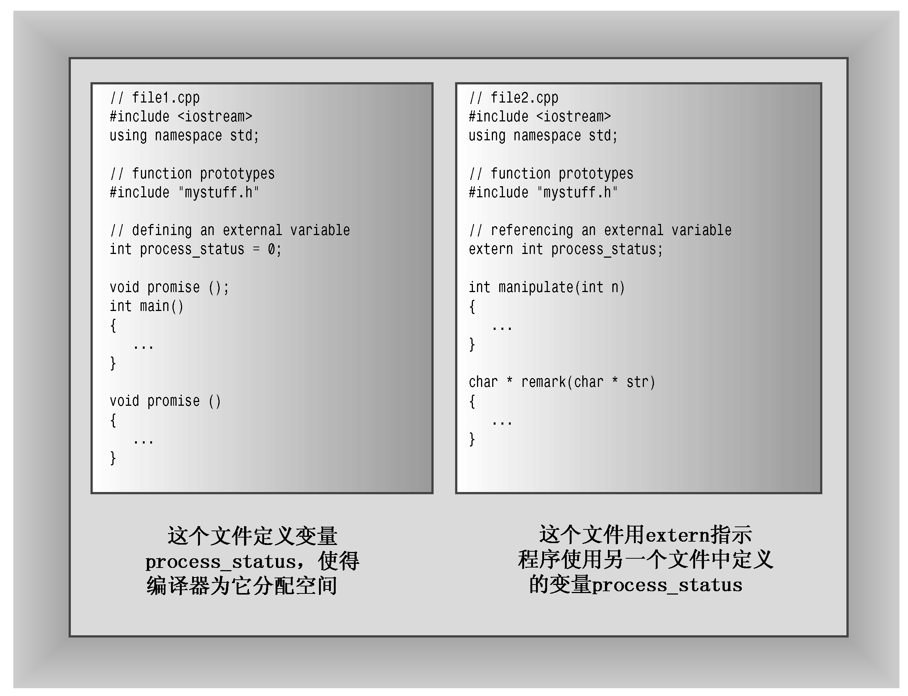

### 9.2.4　静态持续性、外部链接性

链接性为外部的变量通常简称为外部变量，它们的存储持续性为静态，作用域为整个文件。外部变量是在函数外部定义的，因此对所有函数而言都是外部的。例如，可以在main()前面或头文件中定义它们。可以在文件中位于外部变量定义后面的任何函数中使用它，因此外部变量也称全局变量（相对于局部的自动变量）。

#### 1．单定义规则

一方面，在每个使用外部变量的文件中，都必须声明它；另一方面，C++有“单定义规则”（One Definition Rule，ODR），该规则指出，变量只能有一次定义。为满足这种需求，C++提供了两种变量声明。一种是定义声明（defining declaration）或简称为定义（definition），它给变量分配存储空间；另一种是引用声明（referencing declaration）或简称为声明（declaration），它不给变量分配存储空间，因为它引用已有的变量。

引用声明使用关键字extern，且不进行初始化；否则，声明为定义，导致分配存储空间：

```css
double up;            // definition, up is 0
extern int blem;      // blem defined elsewhere
extern char gr = 'z'; // definition because initialized
```

如果要在多个文件中使用外部变量，只需在一个文件中包含该变量的定义（单定义规则），但在使用该变量的其他所有文件中，都必须使用关键字extern声明它：

```css
// file01.cpp
extern int cats = 20; // definition because of initialization
int dogs = 22;        // also a definition
int fleas;            // also a definition
...
// file02.cpp
// use cats and dogs from file01.cpp
extern int cats;       // not definitions because they use
extern int dogs;       // extern and have no initialization
...
// file98.cpp
// use cats, dogs, and fleas from file01.cpp
extern int cats;
extern int dogs;
extern int fleas;
...
```

在这里，所有文件都使用了在file01.cpp中定义的变量cats和dogs，但file02.cpp没有重新声明变量fleas，因此无法访问它。在文件file01.cpp中，关键字extern并非必不可少的，因为即使省略它，效果也相同（参见图9.4）


<center class="my_markdown"><b class="my_markdown">图9.4　定义声明和引用声明</b></center>

请注意，单定义规则并非意味着不能有多个变量的名称相同。例如，在不同函数中声明的同名自动变量是彼此独立的，它们都有自己的地址。另外，正如后面的示例将表明的，局部变量可能隐藏同名的全局变量。然而，虽然程序中可包含多个同名的变量，但每个变量都只有一个定义。

如果在函数中声明了一个与外部变量同名的变量，结果将如何呢？这种声明将被视为一个自动变量的定义，当程序执行自动变量所属的函数时，该变量将位于作用域内。程序清单9.5和程序清单9.6在两个文件中使用了一个外部变量，还演示了自动变量将隐藏同名的全局变量。它还演示了如何使用关键字extern来重新声明以前定义过的外部变量，以及如何使用C++的作用域解析运算符来访问被隐藏的外部变量。

程序清单9.5　external.cpp

```css
// external.cpp -- external variables
// compile with support.cpp
#include <iostream>
using namespace std;
// external variable
double warming = 0.3; // warming defined
// function prototypes
void update(double dt);
void local();
int main()               // uses global variable
{
    cout << "Global warming is " << warming << " degrees.\n";
    update(0.1);       // call function to change warming
    cout << "Global warming is " << warming << " degrees.\n";
    local();            // call function with local warming
    cout << "Global warming is " << warming << " degrees.\n";
    return 0;
}
```

程序清单9.6　support.cpp

```css
// support.cpp -- use external variable
// compile with external.cpp
#include <iostream>
extern double warming; // use warming from another file
// function prototypes
void update(double dt);
void local();
using std::cout;
void update(double dt) // modifies global variable
{
    extern double warming; // optional redeclaration
    warming += dt; // uses global warming
    cout << "Updating global warming to " << warming;
    cout << " degrees.\n";
}
void local() // uses local variable
{
    double warming = 0.8; // new variable hides external one
    cout << "Local warming = " << warming << " degrees.\n";
        // Access global variable with the
        // scope resolution operator
    cout << "But global warming = " << ::warming;
    cout << " degrees.\n";
}
```

下面是该程序的输出：

```css
Global warming is 0.3 degrees.
Updating global warming to 0.4 degrees.
Global warming is 0.4 degrees.
Local warming = 0.8 degrees.
But global warming = 0.4 degrees.
Global warming is 0.4 degrees.
```

#### 2．程序说明

程序清单9.5和程序清单9.6所示程序的输出表明，main()和update()都可以访问外部变量warming。注意，update()修改了warming，这种修改在随后使用该变量时显现出来了。

在程序清单9.5中，warming的定义如下：

```css
double warming = 0.3; // warming defined
```

在程序清单9.6中，使用关键字extern声明变量warming，让该文件中的函数能够使用它：

```css
extern double warming; // use warming from another file
```

正如注释指出的，该声明的的意思是，使用外部定义的变量warming。

另外，函数update()使用关键字extern重新声明了变量warming，这个关键字的意思是，通过这个名称使用在外部定义的变量。由于即使省略该声明，update()的功能也相同，因此该声明是可选的。它指出该函数被设计成使用外部变量。

local()函数表明，定义与全局变量同名的局部变量后，局部变量将隐藏全局变量。例如，local()函数显示warming的值时，将使用warming的局部定义。

C++比C语言更进了一步——它提供了作用域解析运算符（::）。放在变量名前面时，该运算符表示使用变量的全局版本。因此，local()将warming显示为0.8，但将::warming显示为0.4。后面介绍名称空间和类时，将再次介绍该运算符。从清晰和避免错误的角度说，相对于使用warming并依赖于作用域规则，在函数update()中使用::warming是更好的选择，也更安全。


**全局变量和局部变量**

既然可以选择使用全局变量或局部变量，那么到底应使用哪种呢？首先，全局变量很有吸引力——因为所有的函数能访问全局变量，因此不用传递参数。但易于访问的代价很大——程序不可靠。计算经验表明，程序越能避免对数据进行不必要的访问，就越能保持数据的完整性。通常情况下，应使用局部变量，应在需要知晓时才传递数据，而不应不加区分地使用全局变量来使数据可用。读者将会看到，OOP在数据隔离方面又向前迈进了一步。

然而，全局变量也有它们的用处。例如，可以让多个函数可以使用同一个数据块（如月份名数组或原子量数组）。外部存储尤其适于表示常量数据，因为这样可以使用关键字const来防止数据被修改。

```css
const char * const months[12] =
{
    "January", "February", "March", "April", "May",
    "June", "July", "August", "September", "October",
    "November", "December"
};
```

在上述示例中，第一个const防止字符串被修改，第二个const确保数组中每个指针始终指向它最初指向的字符串。


