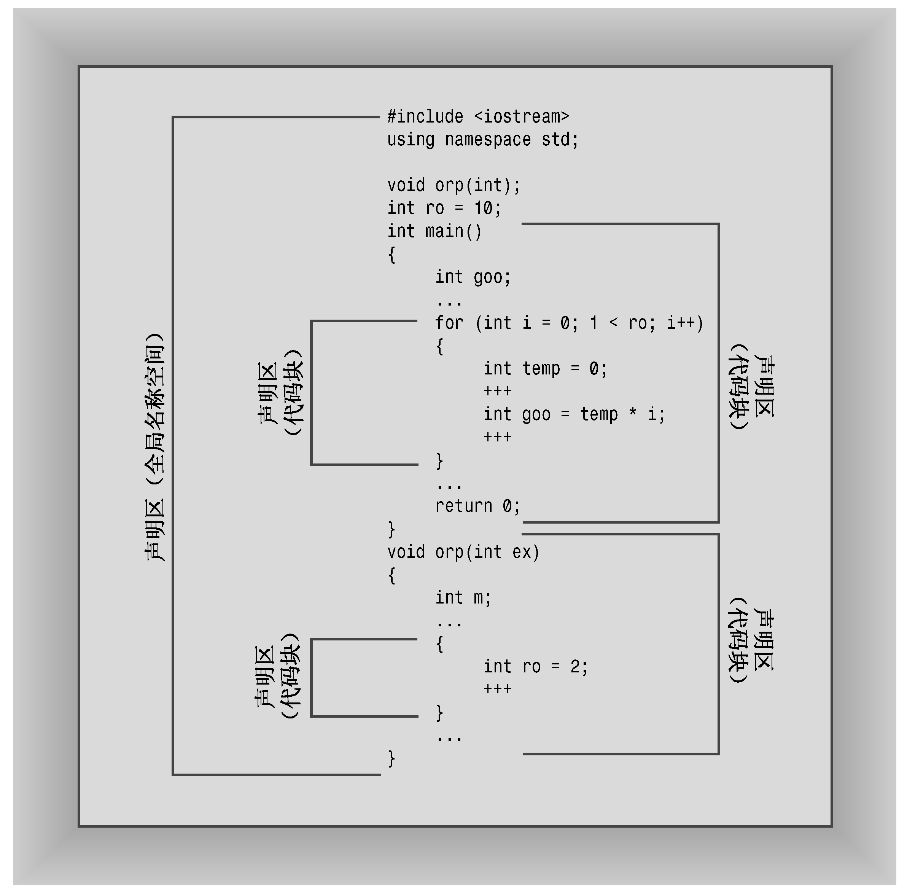
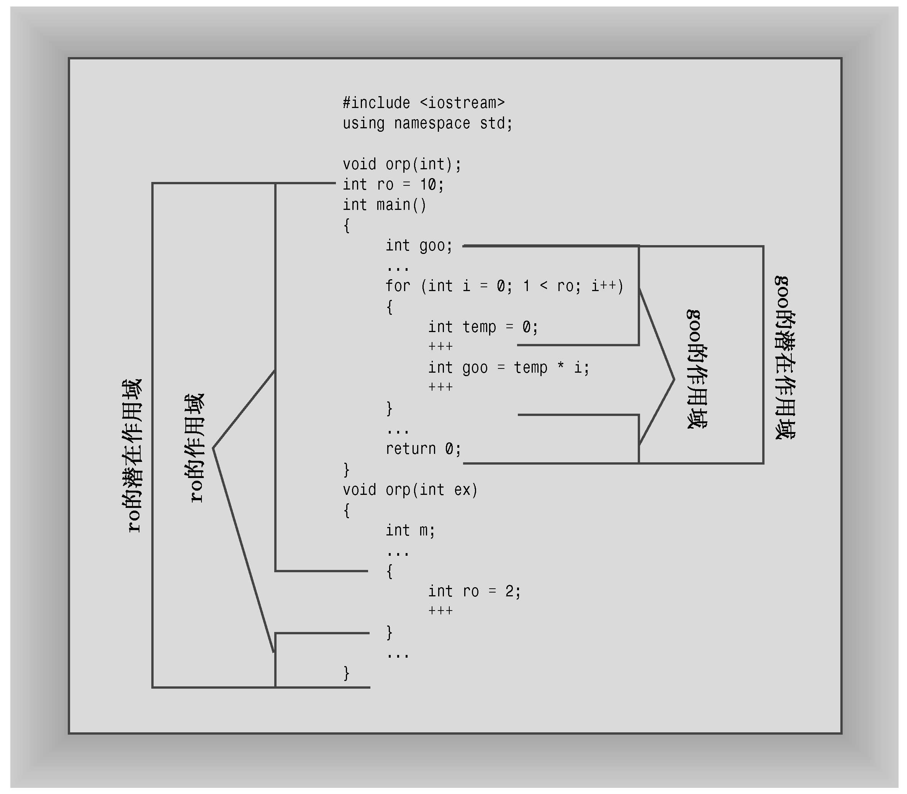

### 9.3.1　传统的C++名称空间

介绍C++中新增的名称空间特性之前，先复习一下C++中已有的名称空间属性，并介绍一些术语，让读者熟悉名称空间的概念。

第一个需要知道的术语是声明区域（declaration region）。声明区域是可以在其中进行声明的区域。例如，可以在函数外面声明全局变量，对于这种变量，其声明区域为其声明所在的文件。对于在函数中声明的变量，其声明区域为其声明所在的代码块。

第二个需要知道的术语是潜在作用域（potential scope）。变量的潜在作用域从声明点开始，到其声明区域的结尾。因此潜在作用域比声明区域小，这是由于变量必须定义后才能使用。

然而，变量并非在其潜在作用域内的任何位置都是可见的。例如，它可能被另一个在嵌套声明区域中声明的同名变量隐藏。例如，在函数中声明的局部变量（对于这种变量，声明区域为整个函数）将隐藏在同一个文件中声明的全局变量（对于这种变量，声明区域为整个文件）。变量对程序而言可见的范围被称为作用域（scope），前面正是以这种方式使用该术语的。图9.5和图9.6对术语声明区域、潜在作用域和作用域进行了说明。

<b class="my_markdown">图9.5　声明区域</b>

C++关于全局变量和局部变量的规则定义了一种名称空间层次。每个声明区域都可以声明名称，这些名称独立于在其他声明区域中声明的名称。在一个函数中声明的局部变量不会与在另一个函数中声明的局部变量发生冲突。

<b class="my_markdown">图9.6　潜在作用域和作用域</b>

