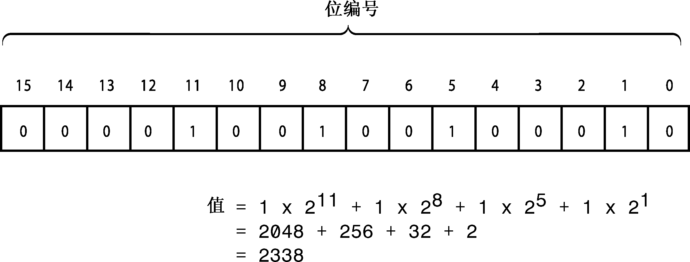

### A.4　二进制数

不管是使用十进制、八进制，还是十六进制表示法来书写整数，计算机都将它存储为二进制值（即基数为2）。二进制表示法只使用两个数字——0和1。例如，10011011就是二进制数。但C++没有提供二进制表示法来书写数字的方式。二进制数是基于2的幂。

| 二　进　制 | 十　进　制 |
| :-----  | :-----  | :-----  | :-----  |
| 10011011 | = 1 × 27 + 0 × 26 + 0 × 25 + 1 × 24 + 1 × 23 + 0 × 22 + 1 × 21 + 1 × 20 |
| = 128 + 0 + 0 + 16 + 8 + 0 + 2 + 1 |
| = 155 |

二进制表示法与计算机内存完全对应，在内存中，每个单元（位）都可以设置成开或关。只是将关表示为0，将开表示为1。内存通常是以字节为单位组织的，每个字节包含8位（正如第2章指出的，C++字节并非一定是8位，但本附录采用常见的做法，用字节表示八位组）。字节中的位被编号，对应于相关的2的幂。这样，最右侧的位编号为0，然后是1，依此类推。例如，图A.1表示一个2字节的整数。

<b class="my_markdown">图A.1　2字节整数值</b>

