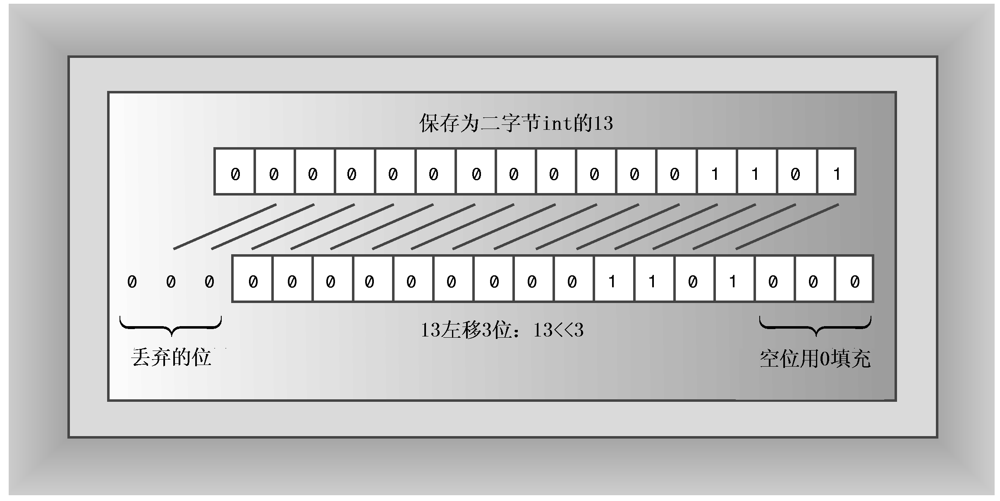
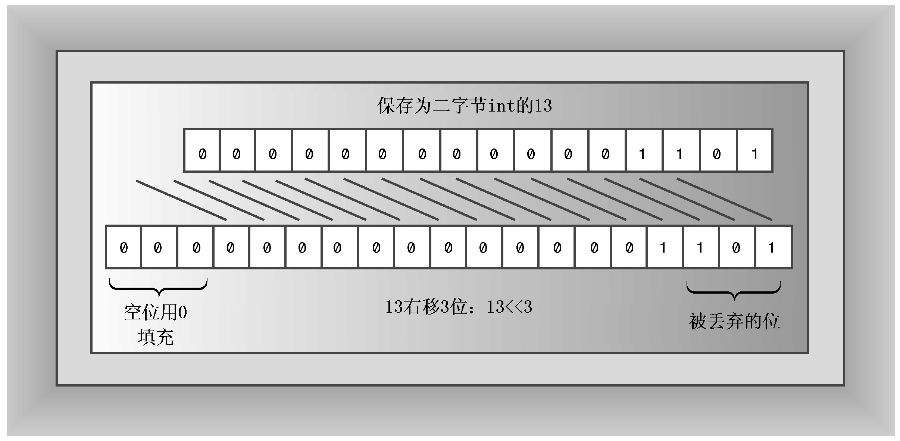

### E.1.1　移位运算符

左移运算符的语法如下：

```css
value << shift
```

其中，value是要被操作的整数值，shift是要移动的位数。例如，下面的代码将值13的所有位都向左移3位：

```css
13 << 3
```

腾出的位置用0填充，超出边界的位被丢弃（参见图E.1）。

由于每个位都表示右边一位的2倍（参见附录A），所以左移一位相当于乘以2。同样，左移2位相当于乘以2<sup class="my_markdown">2</sup>，左移n位相当于乘以2<sup>n</sup>。因此，13<<3的值为13 × 2<sup>3</sup>，即104。


<center class="my_markdown"><b class="my_markdown">图E.1　左移运算符</b></center>

左移运算符提供了通常可以在汇编语言中找到的功能。不过，左移运算符在汇编语言中会直接修改寄存器的内容，而C++左移运算符生成一个新值，而不修改原来的值。例如，请看下面的代码：

```css
int x = 20;
int y = x << 3;
```

上述代码不会修改x的值。表达式x<<3使用x的值来生成一个新值，就像x+3会生成一个新值，而不会修改x一样。

如果要用左移运算符来修改变量的值，则还必须使用赋值运算符。可以使用常规的赋值运算符或<<=运算符（该运算符将移动与赋值结合在一起）：

```css
= x << 4; // regular assignment
y <<= 2; // shift and assign
```

正如所期望的，右移运算符（>>）将位向右移，其语法如下：

```css
value >>shift
```

其中，value是要移动的整数值，shift是要移动的位数。例如，下面的代码将值17中所有的位向右移两位：

```css
17 >> 2
```

对于无符号整数，腾出的位置用0填充，超过边界的位被删除。对于有符号整数，腾出的位置可能用0填充，也可能用原来最左边的位填充，这取决于C++实现（图E.2是一个用0填充的例子）。


<center class="my_markdown"><b class="my_markdown">图E.2　右移运算符</b></center>

向右移动一位相当于除以2。向右移动n位相当于除以2<sup class="my_markdown">n</sup>。

C++还定义了一个“右移并赋值”运算符，如果要用移动后的值替换变量的值，可以这样做：

```css
int q = 43;
q >>= 2;             // replace 43 by 43 >> 2, or 10
```

在有些系统上，使用左移运算符（右移运算符）实现将整数乘（除）以2的速度比使用乘（除）法运算符更快，但由于编译器在优化代码方面越来越好，因此这种差异正在减小。

