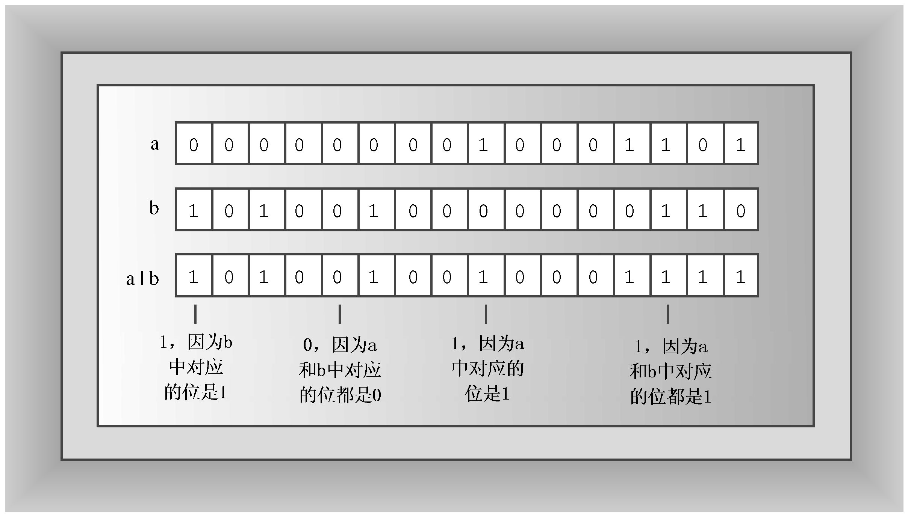
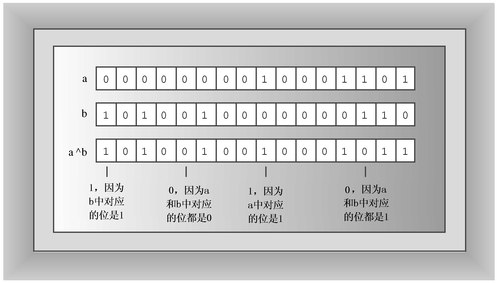

### E.1.2　逻辑按位运算符

逻辑按位运算符类似于常规的逻辑运算符，只是它们用于值的每一位，而不是整个值。例如，请看常规的非运算符（!）和位非（或求反）运算符（～）。!运算符将true（或非零值）转换为false，将false值转换为true。～运算符将每一位转换为它的反面（1转换为0，0转换为1）。例如，对于unsigned char值3：

```css
unsigned char x = 3;
```

表达式!x的值为0。要知道~x的值，先把它写成二进制形式：00000011。然后将每个0转换为1，将每个1转换为0。这样将得到值11111100，在十进制中，为252（图E.3是一个16位的例子）。新值是原值的补值。


<center class="my_markdown"><b class="my_markdown">图E.3　按位非运算符</b></center>

按位运算符OR（|）对两个整数值进行操作，生成一个新的整数值。如果被操作的两个值的对应位至少有一个为1，则新值中相应位为1，否则为0（参见图E.4）。


<center class="my_markdown"><b class="my_markdown">图E.4　按位运算符OR</b></center>

表E.1对∣运算符的操作方式进行了总结。

<center class="my_markdown"><b class="my_markdown">表E.1　b1|b2的值</b></center>

| 位值 | b1 = 0 | b1 = 1 |
| :-----  | :-----  | :-----  | :-----  | :-----  |
| b2 = 0 | 0 | 1 |
| b2 = 1 | 1 | 1 |

运算符| =组合了按位运算符OR与赋值运算符的功能：

```css
a |= b; // set a to a | b
```

按位运算符XOR（^）将两个整数值结合起来，生成一个新的整数值。如果原始值中对应的位有一个（而不是两个）为1，则新值中相应位为1；如果对应的位都为0或1，则新值中相应位为0（参见图E.5）。


<center class="my_markdown"><b class="my_markdown">图E.5　按位运算符XOR</b></center>

表E.2总结了^运算符的结合方式。

<center class="my_markdown"><b class="my_markdown">表E.2　b1^b2的值</b></center>

| 位值 | b1 = 0 | b1 = 1 |
| :-----  | :-----  | :-----  | :-----  | :-----  |
| b2 = 0 | 0 | 1 |
| b2 = 1 | 1 | 0 |

^ =运算符结合了按位运算符XOR和赋值运算符的功能：

```css
a ^= b; // set a to a ^ b
```

按位运算符AND（&）将两个整数结合起来，生成一个新的整数值。如果原始值中对应位都为1，则新值中相应位为1，否则为0（参见图E.6）。


<center class="my_markdown"><b class="my_markdown">图E.6　按位运算符AND</b></center>

表E.3总结了&运算符是如何运算的。

<center class="my_markdown"><b class="my_markdown">表E.3　b1&b2的值</b></center>

| 位值 | b1 = 0 | b2 = 1 |
| :-----  | :-----  | :-----  | :-----  | :-----  |
| b2 = 0 | 0 | 0 |
| b2 = 1 | 0 | 1 |

& =运算符结合了按位运算符AND和赋值运算符的功能：

```css
a &= b; // set a to a & b
```

