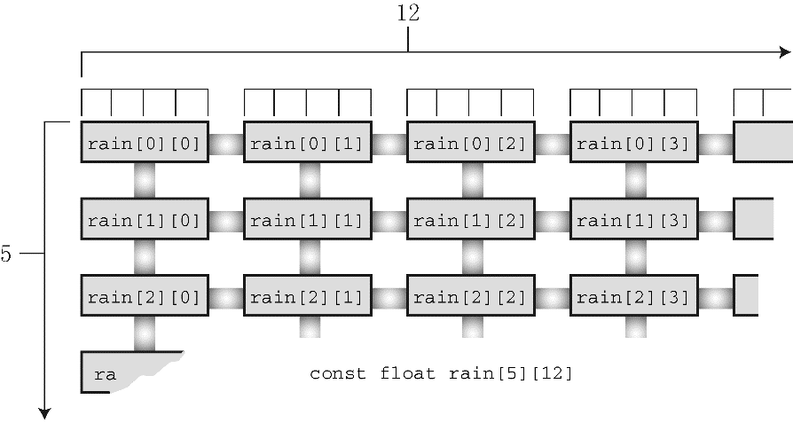

### 10.2　多维数组

气象研究员Tempest Cloud为完成她的研究项目要分析5年内每个月的降水量数据，她首先要解决的问题是如何表示数据。一个方案是创建60个变量，每个变量存储一个数据项（我们曾经提到过这一笨拙的方案，和以前一样，这个方案并不合适）。使用一个内含60个元素的数组比创建60个变量好，但是如果能把各年的数据分开存储会更好，即创建5个数组，每个数组12个元素。然而，这样做也很麻烦，如果Tempest决定研究50年的降水量，岂不是要创建50个数组。是否能有更好的方案？

处理这种情况应该使用数组的数组。主数组（master array）有5个元素（每个元素表示一年），每个元素是内含 `12` 个元素的数组（每个元素表示一个月）。下面是该数组的声明：

```c
float rain[5][12]; // 内含5个数组元素的数组，每个数组元素内含12个float类型的元素
```

理解该声明的一种方法是，先查看中间部分（粗体部分）：

```c
float rain[5][12];    // rain是一个内含5个元素的数组

```

这说明数组 `rain` 有 `5` 个元素，至于每个元素的情况，要查看声明的其余部分（粗体部分）：

```c
float rain[5][12] ;    // 一个内含12个float类型元素的数组

```

这说明每个元素的类型是 `float[12]` ，也就是说， `rain` 的每个元素本身都是一个内含 `12` 个 `float` 类型值的数组。

根据以上分析可知， `rain` 的首元素 `rain[0]` 是一个内含 `12` 个 `float` 类型值的数组。所以， `rain[1]` 、 `rain[2]` 等也是如此。如果 `rain[0]` 是一个数组，那么它的首元素就是 `rain[0][0]` ，第 `2` 个元素是 `rain[0][1]` ，以此类推。简而言之，数组 `rain` 有 `5` 个元素，每个元素都是内含 `12` 个 `float` 类型元素的数组， `rain[0]` 是内含 `12` 个 `float` 值的数组， `rain[0][0]` 是一个 `float` 类型的值。假设要访问位于 `2` 行 `3` 列的值，则使用 `rain[1][2]` 。


<center class="my_markdown"><b class="my_markdown">图10.1　二维数组</b></center>

该二维视图有助于帮助读者理解二维数组的两个下标。在计算机内部，这样的数组是按顺序存储的，从第1个内含12个元素的数组开始，然后是第2个内含12个元素的数组，以此类推。

我们要在气象分析程序中用到这个二维数组。该程序的目标是，计算每年的总降水量、年平均降水量和月平均降水量。要计算年总降水量，必须对一行数据求和；要计算某月份的平均降水量，必须对一列数据求和。二维数组很直观，实现这些操作也很容易。程序清单10.7演示了这个程序。

程序清单10.7　 `rain.c` 程序

```c
/* rain.c  -- 计算每年的总降水量、年平均降水量和5年中每月的平均降水量 */
#include <stdio.h>
#define MONTHS 12        // 一年的月份数
#define YEARS   5        // 年数
int main(void)
{
     // 用2010～2014年的降水量数据初始化数组
     const float rain[YEARS][MONTHS] =
     {
          { 4.3, 4.3, 4.3, 3.0, 2.0, 1.2, 0.2, 0.2, 0.4, 2.4, 3.5, 6.6 },
          { 8.5, 8.2, 1.2, 1.6, 2.4, 0.0, 5.2, 0.9, 0.3, 0.9, 1.4, 7.3 },
          { 9.1, 8.5, 6.7, 4.3, 2.1, 0.8, 0.2, 0.2, 1.1, 2.3, 6.1, 8.4 },
          { 7.2, 9.9, 8.4, 3.3, 1.2, 0.8, 0.4, 0.0, 0.6, 1.7, 4.3, 6.2 },
          { 7.6, 5.6, 3.8, 2.8, 3.8, 0.2, 0.0, 0.0, 0.0, 1.3, 2.6, 5.2 }
     };
     int year, month;
     float subtot, total;
     printf(" YEAR    RAINFALL  (inches)\n");
     for (year = 0, total = 0; year < YEARS; year++)
     {                    // 每一年，各月的降水量总和
          for (month = 0, subtot = 0; month < MONTHS; month++)
               subtot += rain[year][month];
          printf("%5d %15.1f\n", 2010 + year, subtot);
          total += subtot;    // 5年的总降水量
     }
     printf("\nThe yearly average is %.1f inches.\n\n", total / YEARS);
     printf("MONTHLY AVERAGES:\n\n");
     printf(" Jan  Feb  Mar  Apr  May  Jun  Jul  Aug  Sep  Oct ");
     printf(" Nov  Dec\n");
     for (month = 0; month < MONTHS; month++)
     {                    // 每个月，5年的总降水量
          for (year = 0, subtot = 0; year < YEARS; year++)
               subtot += rain[year][month];
          printf("%4.1f ", subtot / YEARS);
     }
     printf("\n");
     return 0;
}
```

下面是该程序的输出：

```c
YEAR     RAINFALL  (inches)
2010             32.4
2011             37.9
2012             49.8
2013             44.0
2014             32.9
The yearly average is 39.4 inches.
MONTHLY AVERAGES:
Jan Feb Mar Apr May Jun Jul Aug Sep Oct Nov Dec
7.3 7.3 4.9 3.0 2.3 0.6 1.2 0.3 0.5 1.7 3.6 6.7
```

学习该程序的重点是数组初始化和计算方案。初始化二维数组比较复杂，我们先来看较为简单的计算部分。

程序使用了两个嵌套 `for` 循环。第1个嵌套 `for` 循环的内层循环，在 `year` 不变的情况下，遍历 `month` 计算某年的总降水量；而外层循环，改变 `year` 的值，重复遍历 `month` ，计算5年的总降水量。这种嵌套循环结构常用于处理二维数组，一个循环处理数组的第1个下标，另一个循环处理数组的第2个下标：

```c
for (year = 0, total = 0; year < YEARS; year++)
{ // 处理每一年的数据
     for (month = 0, subtot = 0; month < MONTHS; month++)
     ... // 处理每月的数据
     ... //处理每一年的数据
}
```

第2个嵌套 `for` 循环和第1个的结构相同，但是内层循环遍历 `year` ，外层循环遍历 `month` 。记住，每执行一次外层循环，就完整遍历一次内层循环。因此，在改变月份之前，先遍历完年，得到某月5年间的平均降水量，以此类推：

```c
for (month = 0; month < MONTHS; month++)
{ // 处理每月的数据
     for (year = 0, subtot =0; year < YEARS; year++)
     ... // 处理每年的数据
     ... // 处理每月的数据
}
```

