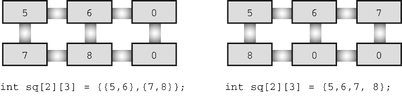

#### 10.2.1　初始化二维数组

初始化二维数组是建立在初始化一维数组的基础上。首先，初始化一维数组如下：

```c
sometype ar1[5] = {val1, val2, val3, val4, val5};
```

这里， `val1` 、 `val2` 等表示 `sometype` 类型的值。例如，如果 `sometype` 是 `int` ，那么 `val1` 可能是 `7` ；如果 `sometype` 是 `double` ，那么 `val1` 可能是 `11.34` ，诸如此类。但是 `rain` 是一个内含 `5` 个元素的数组，每个元素又是内含 `12` 个 `float` 类型元素的数组。所以，对 `rain` 而言， `val1` 应该包含 `12` 个值，用于初始化内含 `12` 个 `float` 类型元素的一维数组，如下所示：

```c
{4.3,4.3,4.3,3.0,2.0,1.2,0.2,0.2,0.4,2.4,3.5,6.6}
```

也就是说，如果 `arl` 每个元素是一个内含 `12` 个 `double` 类型元素的数组，那么 `val1` 就是一个由12个 `double` 类型值构成的数值列表。因此，为了初始化二维数组 `rain` ，要用逗号分隔5个这样的数值列表：

```c
const float rain[YEARS][MONTHS] =
{
     {4.3,4.3,4.3,3.0,2.0,1.2,0.2,0.2,0.4,2.4,3.5,6.6},
     {8.5,8.2,1.2,1.6,2.4,0.0,5.2,0.9,0.3,0.9,1.4,7.3},
     {9.1,8.5,6.7,4.3,2.1,0.8,0.2,0.2,1.1,2.3,6.1,8.4},
     {7.2,9.9,8.4,3.3,1.2,0.8,0.4,0.0,0.6,1.7,4.3,6.2},
     {7.6,5.6,3.8,2.8,3.8,0.2,0.0,0.0,0.0,1.3,2.6,5.2}
};
```

这个初始化使用了 `5` 个数值列表，每个数值列表都用花括号括起来。第1个列表的数据用于初始化数组的第1行，第2个列表的数据用于初始化数组的第2行，以此类推。前面讨论的数据个数和数组大小不匹配的问题同样适用于这里的每一行。也就是说，如果第1个列表中只有10个数，则只会初始化数组第1行的前10个元素，而最后两个元素将被默认初始化为0。如果某列表中的数值个数超出了数组每行的元素个数，则会出错，但是这并不会影响其他行的初始化。

初始化时也可省略内部的花括号，只保留最外面的一对花括号。只要保证初始化的数值个数正确，初始化的效果与上面相同。但是如果初始化的数值不够，则按照先后顺序逐行初始化，直到用完所有的值。后面没有值初始化的元素被统一初始化为 `0` 。图10.2演示了这种初始化数组的方法。


<center class="my_markdown"><b class="my_markdown">图10.2　初始化二维数组的两种方法</b></center>

因为存储在数组 `rain` 中的数据不能修改，所以程序使用了 `const` 关键字声明该数组。

