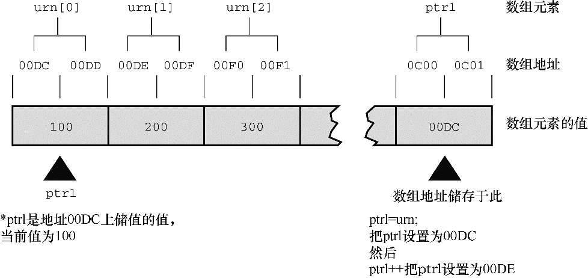

### 10.5　指针操作

可以对指针进行哪些操作？C提供了一些基本的指针操作，下面的程序示例中演示了8种不同的操作。为了显示每种操作的结果，该程序打印了指针的值（该指针指向的地址）、存储在指针指向地址上的值，以及指针自己的地址。如果编译器不支持 `%p` 转换说明，可以用 `%u` 或 `%lu` 代替 `%p` ；如果编译器不支持用 `%td` 转换说明打印地址的差值，可以用 `%d` 或 `%ld` 来代替。

程序清单10.13演示了指针变量的8种基本操作。除了这些操作，还可以使用关系运算符来比较指针。

程序清单10.13　 `ptr_ops.c` 程序

```c
// ptr_ops.c -- 指针操作
#include <stdio.h>
int main(void)
{
     int urn[5] = { 100, 200, 300, 400, 500 };
     int * ptr1, *ptr2, *ptr3;
     ptr1 = urn;            // 把一个地址赋给指针
     ptr2 = &urn[2];        // 把一个地址赋给指针
                            // 解引用指针，以及获得指针的地址
     printf("pointer value, dereferenced pointer, pointer address:\n");
     printf("ptr1 = %p, *ptr1 =%d, &ptr1 = %p\n", ptr1, *ptr1, &ptr1);
     // 指针加法
     ptr3 = ptr1 + 4;
     printf("\nadding an int to a pointer:\n");
     printf("ptr1 + 4 = %p, *(ptr1 + 4) = %d\n", ptr1 + 4, *(ptr1 + 4));
     ptr1++;                // 递增指针
     printf("\nvalues after ptr1++:\n");
     printf("ptr1 = %p, *ptr1 =%d, &ptr1 = %p\n", ptr1, *ptr1, &ptr1);
     ptr2--;                // 递减指针
     printf("\nvalues after --ptr2:\n");
     printf("ptr2 = %p, *ptr2 = %d, &ptr2 = %p\n", ptr2, *ptr2, &ptr2);
     --ptr1;                // 恢复为初始值
     ++ptr2;                // 恢复为初始值
     printf("\nPointers reset to original values:\n");
     printf("ptr1 = %p, ptr2 = %p\n", ptr1, ptr2);
     // 一个指针减去另一个指针
     printf("\nsubtracting one pointer from another:\n");
     printf("ptr2 = %p, ptr1 = %p, ptr2 - ptr1 = %td\n", ptr2, ptr1, ptr2 - ptr1);
     // 一个指针减去一个整数
     printf("\nsubtracting an int from a pointer:\n");
     printf("ptr3 = %p, ptr3 - 2 = %p\n", ptr3, ptr3 - 2);
     return 0;
}
```

下面是我们的系统运行该程序后的输出：

```c
pointer value, dereferenced pointer, pointer address:
ptr1 = 0x7fff5fbff8d0, *ptr1 =100, &ptr1 = 0x7fff5fbff8c8
adding an int to a pointer:
ptr1 + 4 = 0x7fff5fbff8e0, *(ptr1 + 4) = 500
values after ptr1++:
ptr1 = 0x7fff5fbff8d4, *ptr1 =200, &ptr1 = 0x7fff5fbff8c8
values after --ptr2:
ptr2 = 0x7fff5fbff8d4, *ptr2 = 200, &ptr2 = 0x7fff5fbff8c0
Pointers reset to original values:
ptr1 = 0x7fff5fbff8d0, ptr2 = 0x7fff5fbff8d8
subtracting one pointer from another:
ptr2 = 0x7fff5fbff8d8, ptr1 = 0x7fff5fbff8d0, ptr2 - ptr1 = 2
subtracting an int from a pointer:
ptr3 = 0x7fff5fbff8e0, ptr3 - 2 = 0x7fff5fbff8d8
```

下面分别描述了指针变量的基本操作。

+ **赋值：** 可以把地址赋给指针。例如，用数组名、带地址运算符（ `&` ）的变量名、另一个指针进行赋值。在该例中，把 `urn` 数组的首地址赋给了 `ptr1` ，该地址的编号恰好是 `0x7fff5fbff8d0` 。变量 `ptr2` 获得数组 `urn` 的第3个元素（ `urn[2]` ）的地址。注意，地址应该和指针类型兼容。也就是说，不能把 `double` 类型的地址赋给指向 `int` 的指针，至少要避免不明智的类型转换。C99/C11已经强制不允许这样做。
+ **解引用：** *运算符给出指针指向地址上存储的值。因此，* `ptr1` 的初值是 `100` ，该值存储在编号为 `0x7fff5fbff8d0` 的地址上。
+ **取址：** 和所有变量一样，指针变量也有自己的地址和值。对指针而言， `&` 运算符给出指针本身的地址。本例中， `ptr1` 存储在内存编号为 `0x7fff5fbff8c8` 的地址上，该存储单元存储的内容是 `0x7fff5fbff8d0` ，即 `urn` 的地址。因此 `&ptr1` 是指向 `ptr1` 的指针，而 `ptr1` 是指向 `utn[0]` 的指针。
+ **指针与整数相加：** 可以使用 `+` 运算符把指针与整数相加，或整数与指针相加。无论哪种情况，整数都会和指针所指向类型的大小（以字节为单位）相乘，然后把结果与初始地址相加。因此 `ptr1 + 4` 与 `&urn[4]` 等价。如果相加的结果超出了初始指针指向的数组范围，计算结果则是未定义的。除非正好超过数组末尾第一个位置，C保证该指针有效。
+ **递增指针：** 递增指向数组元素的指针可以让该指针移动至数组的下一个元素。因此， `ptr1++` 相当于把 `ptr1` 的值加上 `4` （我们的系统中 `int` 为 `4` 字节）， `ptr1` 指向 `urn[1]` （见图10.4，该图中使用了简化的地址）。现在 `ptr1` 的值是 `0x7fff5fbff8d4` （数组的下一个元素的地址），* `ptr` 的值为 `200` （即 `urn[1]` 的值）。注意， `ptr1` 本身的地址仍是 `0x7fff5fbff8c8` 。毕竟，变量不会因为值发生变化就移动位置。


<center class="my_markdown"><b class="my_markdown">图10.4　递增指向 `int` 的指针</b></center>

+ **指针减去一个整数：** 可以使用 `-` 运算符从一个指针中减去一个整数。指针必须是第1个运算对象，整数是第2个运算对象。该整数将乘以指针指向类型的大小（以字节为单位），然后用初始地址减去乘积。所以 `ptr3 - 2` 与 `&urn[2]` 等价，因为 `ptr3` 指向的是 `&urn[4]` 。如果相减的结果超出了初始指针所指向数组的范围，计算结果则是未定义的。除非正好超过数组末尾第一个位置，C保证该指针有效。
+ **递减指针：** 当然，除了递增指针还可以递减指针。在本例中，递减 `ptr2` 使其指向数组的第2个元素而不是第3个元素。前缀或后缀的递增和递减运算符都可以使用。注意，在重置 `ptr1` 和 `ptr2` 前，它们都指向相同的元素 `urn[1]` 。
+ **指针求差：** 可以计算两个指针的差值。通常，求差的两个指针分别指向同一个数组的不同元素，通过计算求出两元素之间的距离。差值的单位与数组类型的单位相同。例如，程序清单10.13的输出中， `ptr2 - ptr1` 得 `2` ，意思是这两个指针所指向的两个元素相隔两个 `int` ，而不是 `2` 字节。只要两个指针都指向相同的数组（或者其中一个指针指向数组后面的第1个地址），C都能保证相减运算有效。如果指向两个不同数组的指针进行求差运算可能会得出一个值，或者导致运行时错误。
+ **比较：** 使用关系运算符可以比较两个指针的值，前提是两个指针都指向相同类型的对象。

注意，这里的减法有两种。可以用一个指针减去另一个指针得到一个整数，或者用一个指针减去一个整数得到另一个指针。

在递增或递减指针时还要注意一些问题。编译器不会检查指针是否仍指向数组元素。C只能保证指向数组任意元素的指针和指向数组后面第1个位置的指针有效。但是，如果递增或递减一个指针后超出了这个范围，则是未定义的。另外，可以解引用指向数组任意元素的指针。但是，即使指针指向数组后面一个位置是有效的，也不能保证可以解引用这样的越界指针。


**解引用未初始化的指针**

说到注意事项，一定要牢记一点：千万不要解引用未初始化的指针。例如，考虑下面的例子：

```c
int * pt;      // 未初始化的指针
*pt = 5;       // 严重的错误
```

为何不行？第2行的意思是把5存储在 `pt` 指向的位置。但是 `pt` 未被初始化，其值是一个随机值，所以不知道5将存储在何处。这可能不会出什么错，也可能会擦写数据或代码，或者导致程序崩溃。切记：创建一个指针时，系统只分配了存储指针本身的内存，并未分配存储数据的内存。因此，在使用指针之前，必须先用已分配的地址初始化它。例如，可以用一个现有变量的地址初始化该指针（使用带指针形参的函数时，就属于这种情况）。或者还可以使用第12章将介绍的 `malloc()` 函数先分配内存。无论如何，使用指针时一定要注意，不要解引用未初始化的指针！

```c
double * pd;  // 未初始化的指针
*pd = 2.4;    // 不要这样做
```


假设

```c
int urn[3];
int * ptr1, * ptr2;
```

下面是一些有效和无效的语句：

**有效语句　　　　　　　　无效语句**

`ptr1++;` 　　　　　　　　 `urn++;`

`ptr2 = ptr1 + 2;`  　 　　 `ptr2 = ptr2 + ptr1;`

`ptr2 = urn + 1;` 　　　　 `ptr2 = urn * ptr1;`

基于这些有效的操作，C程序员创建了指针数组、函数指针、指向指针的指针数组、指向函数的指针数组等。别紧张，接下来我们将根据已学的内容介绍指针的一些基本用法。指针的第1个基本用法是在函数间传递信息。前面学过，如果希望在被调函数中改变主调函数的变量，必须使用指针。指针的第2个基本用法是用在处理数组的函数中。下面我们再来看一个使用函数和数组的编程示例。

