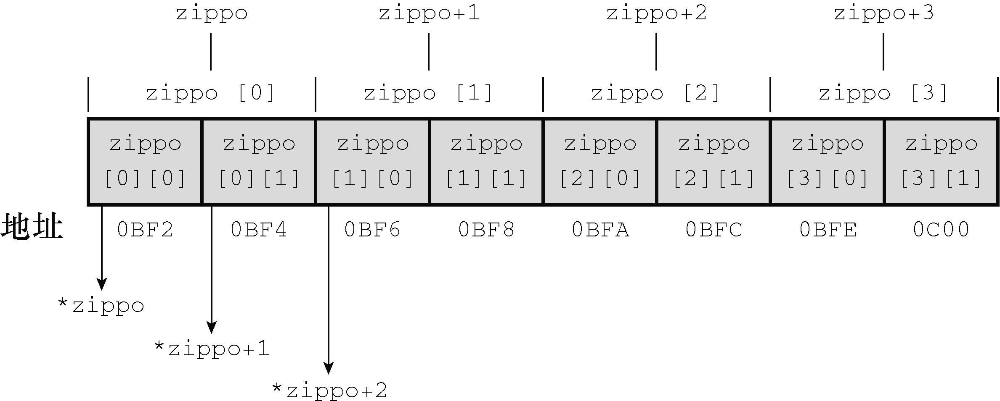

### 10.7　指针和多维数组

指针和多维数组有什么关系？为什么要了解它们的关系？处理多维数组的函数要用到指针，所以在使用这种函数之前，先要更深入地学习指针。至于第1个问题，我们通过几个示例来回答。为简化讨论，我们使用较小的数组。假设有下面的声明：

```c
int zippo[4][2]; /* 内含int数组的数组 */
```

然后数组名 `zippo` 是该数组首元素的地址。在本例中， `zippo` 的首元素是一个内含两个 `int` 值的数组，所以 `zippo` 是这个内含两个 `int` 值的数组的地址。下面，我们从指针的属性进一步分析。

+ 因为 `zippo` 是数组首元素的地址，所以 `zippo` 的值和 `&zippo[0]` 的值相同。而 `zippo[0]` 本身是一个内含两个整数的数组，所以 `zippo[0]` 的值和它首元素（一个整数）的地址（即 `&zippo[0][0]` 的值）相同。简而言之， `zippo[0]` 是一个占用一个 `int` 大小对象的地址，而 `zippo` 是一个占用两个 `int` 大小对象的地址。由于这个整数和内含两个整数的数组都开始于同一个地址，所以 `zippo` 和 `zippo[0]` 的值相同。
+ 给指针或地址加 `1` ，其值会增加对应类型大小的数值。在这方面， `zippo` 和 `zippo[0]` 不同，因为 `zippo` 指向的对象占用了两个 `int` 大小，而 `zippo[0]` 指向的对象只占用一个 `int` 大小。因此， `zippo + 1` 和 `zippo[0] + 1` 的值不同。
+ 解引用一个指针（在指针前使用*运算符）或在数组名后使用带下标的[]运算符，得到引用对象代表的值。因为 `zippo[0]` 是该数组首元素（ `zippo[0][0]` ）的地址，所以 `*(zippo[0])` 表示存储在 `zippo[0][0]` 上的值（即一个 `int` 类型的值）。与此类似， `*zippo` 代表该数组首元素（ `zippo[0]` ）的值，但是 `zippo[0]` 本身是一个 `int` 类型值的地址。该值的地址是 `&zippo[0][0]` ，所以 `*zippo` 就是 `&zippo[0][0]` 。对两个表达式应用解引用运算符表明， `**zippo` 与 `*&zippo[0][0]` 等价，这相当于 `zippo[0][0]` ，即一个 `int` 类型的值。简而言之， `zippo` 是地址的地址，必须解引用两次才能获得原始值。地址的地址或指针的指针是就是双重间接（double indirection）的例子。

显然，增加数组维数会增加指针的复杂度。现在，大部分初学者都开始意识到指针为什么是 `C` 语言中最难的部分。认真思考上述内容，看看是否能用所学的知识解释程序清单10.15中的程序。该程序显示了一些地址值和数组的内容。

程序清单10.15　 `zippo1.c` 程序

```c
/* zippo1.c --  zippo的相关信息 */
#include <stdio.h>
int main(void)
{
     int zippo[4][2] = { { 2, 4 }, { 6, 8 }, { 1, 3 }, { 5, 7 } };
     printf("   zippo = %p,    zippo + 1 = %p\n",zippo, zippo + 1);
     printf("zippo[0] = %p, zippo[0] + 1 = %p\n",zippo[0], zippo[0] + 1);
     printf("  *zippo = %p,   *zippo + 1 = %p\n",*zippo, *zippo + 1);
     printf("zippo[0][0] = %d\n", zippo[0][0]);
     printf("  *zippo[0] = %d\n", *zippo[0]);
     printf("    **zippo = %d\n", **zippo);
     printf("      zippo[2][1] = %d\n", zippo[2][1]);
     printf("*(*(zippo+2) + 1) = %d\n", *(*(zippo + 2) + 1));
     return 0;
}
```

下面是我们的系统运行该程序后的输出：

```c
    zippo = 0x0064fd38,       zippo + 1 = 0x0064fd40
  zippo[0]= 0x0064fd38,    zippo[0] + 1 = 0x0064fd3c
   *zippo = 0x0064fd38,      *zippo + 1 = 0x0064fd3c
zippo[0][0] = 2
  *zippo[0] = 2
    **zippo = 2
      zippo[2][1] = 3
*(*(zippo+2) + 1) = 3
```

其他系统显示的地址值和地址形式可能不同，但是地址之间的关系与以上输出相同。该输出显示了二维数组 `zippo` 的地址和一维数组 `zippo[0]` 的地址相同。它们的地址都是各自数组首元素的地址，因而与 `&zippo[0][0]` 的值也相同。

尽管如此，它们也有差别。在我们的系统中， `int` 是4字节。前面讨论过， `zippo[0]` 指向一个4字节的数据对象。 `zippo[0]` 加 `1` ，其值加 `4` （十六进制中， `38+4` 得 `3c` ）。数组名 `zippo` 是一个内含2个 `int` 类型值的数组的地址，所以 `zippo` 指向一个8字节的数据对象。因此， `zippo` 加 `1` ，它所指向的地址加8字节（十六进制中， `38+8` 得 `40` ）。

该程序演示了 `zippo[0]` 和* `zippo` 完全相同，实际上确实如此。然后，对二维数组名解引用两次，得到存储在数组中的值。使用两个间接运算符（*）或者使用两对方括号（ `[]` ）都能获得该值（还可以使用一个*和一对 `[]` ，但是我们暂不讨论这么多情况）。

要特别注意，与 `zippo[2][1]` 等价的指针表示法是* `(` * `(zippo+2) + 1)` 。看上去比较复杂，应最好能理解。下面列出了理解该表达式的思路：

```c
zippo             ←二维数组首元素的地址（每个元素都是内含两个int类型元素的一维数组）
zippo+2           ←二维数组的第3个元素（即一维数组）的地址
*(zippo+2)        ←二维数组的第3个元素（即一维数组）的首元素（一个int类型的值）地址
*(zippo+2) + 1    ←二维数组的第3个元素（即一维数组）的第2个元素（也是一个int类型的值）地址
*(*(zippo+2) + 1) ←二维数组的第3个一维数组元素的第2个int类型元素的值，即数组的第3行第2
                    列的值（zippo[2][1]）
```

以上分析并不是为了说明用指针表示法（* `(` * `(zippo+2) + 1)` ）代替数组表示法（ `zippo[2][1]` ），而是提示读者，如果程序恰巧使用一个指向二维数组的指针，而且要通过该指针获取值时，最好用简单的数组表示法，而不是指针表示法。

图10.5以另一种视图演示了数组地址、数组内容和指针之间的关系。


<center class="my_markdown"><b class="my_markdown">图10.5　数组的数组</b></center>

