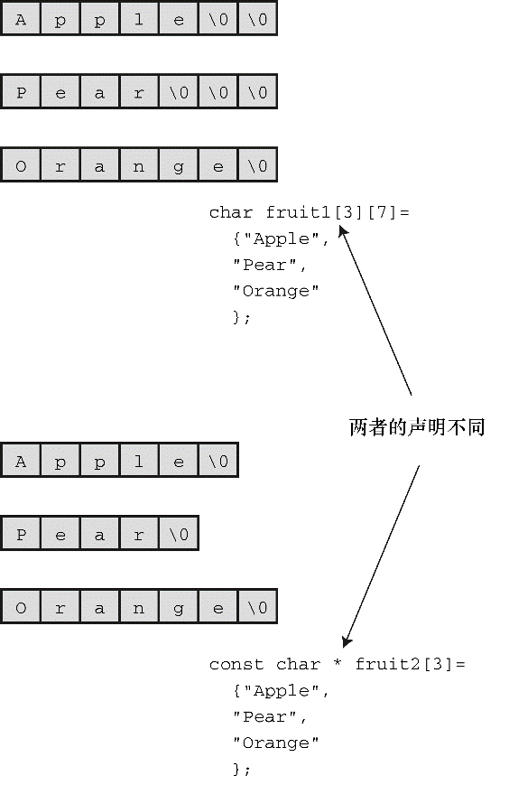

#### 11.1.1　在程序中定义字符串

程序清单11.1中使用了多种方法（即字符串常量、 `char` 类型数组、指向 `char` 的指针）定义字符串。程序应该确保有足够的空间存储字符串，这一点我们稍后讨论。

#### 1．字符串字面量（字符串常量）

用双引号括起来的内容称为字符串字面量（string literal），也叫作字符串常量（string constant）。双引号中的字符和编译器自动加入末尾的 `\0` 字符，都作为字符串存储在内存中，所以 `"I am a symbolic string constant."` 、 `"I am a string in an array."` 、
`"Something is pointed at me."` 、 `"Here are some strings:"` 都是字符串字面量。

从ANSI C标准起，如果字符串字面量之间没有间隔，或者用空白字符分隔，C会将其视为串联起来的字符串字面量。例如：

```c
char greeting[50] = "Hello, and"" how are" " you"
                    " today!";
```

与下面的代码等价：

```c
char greeting[50] = "Hello, and how are you today!";
```

如果要在字符串内部使用双引号，必须在双引号前面加上一个反斜杠（ `\` ）：

```c
printf("\"Run, Spot, run!\" exclaimed Dick.\n");
```

输出如下：

```c
"Run, Spot, run!" exclaimed Dick.
```

字符串常量属于静态存储类别（static storage class），这说明如果在函数中使用字符串常量，该字符串只会被存储一次，在整个程序的生命期内存在，即使函数被调用多次。用双引号括起来的内容被视为指向该字符串存储位置的指针。这类似于把数组名作为指向该数组位置的指针。如果确实如此，程序清单11.2中的程序会输出什么？

程序清单11.2　 `strptr.c` 程序

```c
/* strptr.c -- 把字符串看作指针 */
#include <stdio.h>
int main(void)
{
     printf("%s, %p, %c\n", "We", "are", *"space farers");
     return 0;
}
```

`printf()` 根据 `%s` 转换说明打印 `We` ，根据 `%p` 转换说明打印一个地址。因此，如果 `"are"` 代表一个地址， `printf()` 将打印该字符串首字符的地址（如果使用ANSI之前的实现，可能要用 `%u` 或 `%lu` 代替 `%p` ）。最后，* `"space farers"` 表示该字符串所指向地址上存储的值，应该是字符串 `"space farers"` 的首字符。是否真的是这样？下面是该程序的输出：

```c
We, 0x100000f61, s
```

#### 2．字符串数组和初始化

定义字符串数组时，必须让编译器知道需要多少空间。一种方法是用足够空间的数组存储字符串。在下面的声明中，用指定的字符串初始化数组 `m1` ：

```c
const char m1[40] = "Limit yourself to one line's worth.";
```

`const` 表明不会更改这个字符串。

这种形式的初始化比标准的数组初始化形式简单得多：

```c
const char m1[40] = { 'L','i', 'm', 'i', 't', ' ', 'y', 'o', 'u', 'r', 's', 'e', 'l',
                      'f', ' ', 't', 'o', ' ', 'o', 'n', 'e', ' ','l', 'i', 'n', 'e',   
                      '\', 's', ' ', 'w', 'o', 'r','t', 'h', '.', '\0'
};
```

注意最后的空字符。没有这个空字符，这就不是一个字符串，而是一个字符数组。

在指定数组大小时，要确保数组的元素个数至少比字符串长度多1（为了容纳空字符）。所有未被使用的元素都被自动初始化为 `0` （这里的 `0` 指的是 `char` 形式的空字符，不是数字字符 `0` ），如图11.1所示。


<center class="my_markdown"><b class="my_markdown">图11.1　初始化数组</b></center>

通常，让编译器确定数组的大小很方便。回忆一下，省略数组初始化声明中的大小，编译器会自动计算数组的大小：

```c
const char m2[] = "If you can't think of anything, fake it.";
```

让编译器确定初始化字符数组的大小很合理。因为处理字符串的函数通常都不知道数组的大小，这些函数通过查找字符串末尾的空字符确定字符串在何处结束。

让编译器计算数组的大小只能用在初始化数组时。如果创建一个稍后再填充的数组，就必须在声明时指定大小。声明数组时，数组大小必须是可求值的整数。在C99新增变长数组之前，数组的大小必须是整型常量，包括由整型常量组成的表达式。

```c
int n = 8;
char cookies[1];        // 有效
char cakes[2 + 5];    // 有效，数组大小是整型常量表达式
char pies[2*sizeof(long double) + 1]; // 有效
char crumbs[n];        // 在C99标准之前无效，C99标准之后这种数组是变长数组
```

字符数组名和其他数组名一样，是该数组首元素的地址。因此，假设有下面的初始化：

```c
char car[10] = "Tata";
```

那么，以下表达式都为真：

```c
car == &car[0]、*car == 'T'、*(car+1) == car[1] == 'a'。
```

还可以使用指针表示法创建字符串。例如，程序清单11.1中使用了下面的声明：

```c
const char * pt1 = "Something is pointing at me.";
```

该声明和下面的声明几乎相同：

```c
const char ar1[] = "Something is pointing at me.";
```

以上两个声明表明， `pt1` 和 `ar1` 都是该字符串的地址。在这两种情况下，带双引号的字符串本身决定了预留给字符串的存储空间。尽管如此，这两种形式并不完全相同。

#### 3．数组和指针

数组形式和指针形式有何不同？以上面的声明为例，数组形式（ `ar1[]` ）在计算机的内存中分配为一个内含29个元素的数组（每个元素对应一个字符，还加上一个末尾的空字符 `'\0'` ），每个元素被初始化为字符串字面量对应的字符。通常，字符串都作为可执行文件的一部分存储在数据段中。当把程序载入内存时，也载入了程序中的字符串。字符串存储在静态存储区（static memory）中。但是，程序在开始运行时才会为该数组分配内存。此时，才将字符串拷贝到数组中（第12章将详细讲解）。注意，此时字符串有两个副本。一个是在静态内存中的字符串字面量，另一个是存储在 `ar1` 数组中的字符串。

此后，编译器便把数组名 `ar1` 识别为该数组首元素地址（ `&ar1[0]` ）的别名。这里关键要理解，在数组形式中， `ar1` 是地址常量。不能更改 `ar1` ，如果改变了 `ar1` ，则意味着改变了数组的存储位置（即地址）。可以进行类似 `ar1+1` 这样的操作，标识数组的下一个元素。但是不允许进行 `++ar1` 这样的操作。递增运算符只能用于变量名前（或概括地说，只能用于可修改的左值），不能用于常量。

指针形式（* `pt1` ）也使得编译器为字符串在静态存储区预留29个元素的空间。另外，一旦开始执行程序，它会为指针变量 `pt1` 留出一个存储位置，并把字符串的地址存储在指针变量中。该变量最初指向该字符串的首字符，但是它的值可以改变。因此，可以使用递增运算符。例如， `++pt1` 将指向第2个字符（ `o` ）。

字符串字面量被视为 `const` 数据。由于 `pt1` 指向这个 `const` 数据，所以应该把 `pt1` 声明为指向 `const` 数据的指针。这意味着不能用 `pt1` 改变它所指向的数据，但是仍然可以改变 `pt1` 的值（即， `pt1` 指向的位置）。如果把一个字符串字面量拷贝给一个数组，就可以随意改变数据，除非把数组声明为 `const` 。

总之，初始化数组把静态存储区的字符串拷贝到数组中，而初始化指针只把字符串的地址拷贝给指针。程序清单11.3演示了这一点。

程序清单11.3　 `addresses.c` 程序

```c
//  addresses.c  -- 字符串的地址
#define MSG "I'm special"
#include <stdio.h>
int main()
{
     char ar[] = MSG;
     const char *pt = MSG;
     printf("address of \"I'm special\": %p \n", "I'm special");
     printf("              address ar: %p\n", ar);
     printf("              address pt: %p\n", pt);
     printf("          address of MSG: %p\n", MSG);
     printf("address of \"I'm special\": %p \n", "I'm special");
     return 0;
}
```

下面是在我们的系统中运行该程序后的输出：

```c
address of "I'm special": 0x100000f10
              address ar: 0x7fff5fbff858
              address pt: 0x100000f10
          address of MSG: 0x100000f10
address of "I'm special": 0x100000f10
```

该程序的输出说明了什么？第一， `pt` 和 `MSG` 的地址相同，而 `ar` 的地址不同，这与我们前面讨论的内容一致。第二，虽然字符串字面量 `"I'm special"` 在程序的两个 `printf()` 函数中出现了两次，但是编译器只使用了一个存储位置，而且与 `MSG` 的地址相同。编译器可以把多次使用的相同字面量存储在一处或多处。另一个编译器可能在不同的位置存储3个 `"I'm special"` 。第三，静态数据使用的内存与 `ar` 使用的动态内存不同。不仅值不同，特定编译器甚至使用不同的位数表示两种内存。

数组和指针表示字符串的区别是否很重要？通常不太重要，但是这取决于想用程序做什么。我们来进一步讨论这个主题。

#### 4．数组和指针的区别

初始化字符数组来存储字符串和初始化指针来指向字符串有何区别（“指向字符串”的意思是指向字符串的首字符）？例如，假设有下面两个声明：

```c
char heart[] = "I love Tillie!";
const char *head = "I love Millie!";
```

两者主要的区别是：数组名 `heart` 是常量，而指针名 `head` 是变量。那么，实际使用有什么区别？

首先，两者都可以使用数组表示法：

```c
for (i = 0; i < 6; i++)
     putchar(heart[i]);
putchar('\n');
for (i = 0; i < 6; i++)
     putchar(head[i]);
putchar('\n');
```

上面两段代码的输出是：

```c
I love
I love
```

其次，两者都能进行指针加法操作：

```c
for (i = 0; i < 6; i++)
     putchar(*(heart + i));
putchar('\n');
for (i = 0; i < 6; i++)
     putchar(*(head + i));
putchar('\n');
```

输出如下：

```c
I love
I love
```

但是，只有指针表示法可以进行递增操作：

```c
while (*(head) != '\0')     /* 在字符串末尾处停止*/
     putchar(*(head++));    /* 打印字符，指针指向下一个位置 */
```

这段代码的输出如下：

```c
I love Millie!
```

假设想让 `head` 和 `heart` 统一，可以这样做：

```c
head = heart;        /* head现在指向数组heart */
```

这使得 `head` 指针指向 `heart` 数组的首元素。

但是，不能这样做：

```c
heart = head;        /* 非法构造，不能这样写 */
```

这类似于 `x = 3;` 和 `3 = x;` 的情况。赋值运算符的左侧必须是变量（或概括地说是可修改的左值），如* `pt_int` 。顺带一提， `head = heart;` 不会导致 `head` 指向的字符串消失，这样做只是改变了存储在 `head` 中的地址。除非已经保存了 `"I love Millie!"` 的地址，否则当 `head` 指向别处时，就无法再访问该字符串。

另外，还可以改变 `heart` 数组中元素的信息：

```c
heart[7]= 'M';或者*(heart + 7) = 'M';
```

数组的元素是变量（除非数组被声明为 `const` ），但是数组名不是变量。

我们来看一下未使用 `const` 限定符的指针初始化：

```c
char * word = "frame";
```

是否能使用该指针修改这个字符串？

```c
word[1] = 'l'; // 是否允许？
```

编译器可能允许这样做，但是对当前的C标准而言，这样的行为是未定义的。例如，这样的语句可能导致内存访问错误。原因前面提到过，编译器可以使用内存中的一个副本来表示所有完全相同的字符串字面量。例如，下面的语句都引用字符串 `"Klingon"` 的一个内存位置：

```c
char * p1 = "Klingon";
p1[0] = 'F'; // ok?
printf("Klingon");
printf(": Beware the %ss!\n", "Klingon");
```

也就是说，编译器可以用相同的地址替换每个 `"Klingon"` 实例。如果编译器使用这种单次副本表示法，并允许 `p1[0]` 修改 `'F'` ，那将影响所有使用该字符串的代码。所以以上语句打印字符串字面量 `"Klingon"` 时实际上显示的是 `"Flingon"` ：

```c
Flingon: Beware the Flingons!
```

实际上在过去，一些编译器由于这方面的原因，其行为难以捉摸，而另一些编译器则导致程序异常中断。因此，建议在把指针初始化为字符串字面量时使用 `const` 限定符：

```c
const char * pl = "Klingon";    // 推荐用法
```

然而，把非 `const` 数组初始化为字符串字面量却不会导致类似的问题。因为数组获得的是原始字符串的副本。

总之，如果打算修改字符串，就不要用指针指向字符串字面量。

#### 5．字符串数组

创建一个字符串数组通常很方便，可以通过数组下标访问多个不同的字符串。程序清单11.4演示了两种方法：指向字符串的指针数组和 `char` 类型数组的数组。

程序清单11.4　 `arrchar.c` 程序

```c
//  arrchar.c -- 指针数组，字符串数组
#include <stdio.h>
#define SLEN 40
#define LIM 5
int main(void)
{
     const char *mytalents[LIM] = {
          "Adding numbers swiftly",
          "Multiplying accurately", "Stashing data",
          "Following instructions to the letter",
          "Understanding the C language"
     };
     char yourtalents[LIM][SLEN] = {
          "Walking in a straight line",
          "Sleeping", "Watching television",
          "Mailing letters", "Reading email"
     };
     int i;
     puts("Let's compare talents.");
     printf("%-36s  %-25s\n", "My Talents", "Your Talents");
     for (i = 0; i < LIM; i++)
          printf("%-36s  %-25s\n", mytalents[i], yourtalents[i]);
     printf("\nsizeof mytalents: %zd, sizeof yourtalents: %zd\n",
                       sizeof(mytalents), sizeof(yourtalents));
     return 0;
}
```

下面是该程序的输出：

```c
Let's compare talents.
My Talents                              Your Talents
Adding numbers swiftly                  Walking in a straight line
Multiplying accurately                  Sleeping
Stashing data                           Watching television
Following instructions to the letter    Mailing letters
Understanding the C language            Reading email
sizeof mytalents: 40, sizeof yourtalents: 200
```

从某些方面来看， `mytalents` 和 `yourtalents` 非常相似。两者都代表5个字符串。使用一个下标时都分别表示一个字符串，如 `mytalents[0]` 和 `yourtalents[0]` ；使用两个下标时都分别表示一个字符，例如 `mytalents[1][2]` 表示 `mytalents` 数组中第2个指针所指向的字符串的第3个字符 `'l'` ， `yourtalents[1][2]` 表示 `youttalentes` 数组的第2个字符串的第3个字符 `'e'` 。而且，两者的初始化方式也相同。

但是，它们也有区别。 `mytalents` 数组是一个内含5个指针的数组，在我们的系统中共占用40字节。而 `yourtalents` 是一个内含5个数组的数组，每个数组内含40个 `char` 类型的值，共占用200字节。所以，虽然 `mytalents[0]` 和 `yourtalents[0]` 都分别表示一个字符串，但 `mytalents` 和 `yourtalents` 的类型并不相同。 `mytalents` 中的指针指向初始化时所用的字符串字面量的位置，这些字符串字面量被存储在静态内存中；而 `yourtalents` 中的数组则存储着字符串字面量的副本，所以每个字符串都被存储了两次。此外，为字符串数组分配内存的使用率较低。 `yourtalents` 中的每个元素的大小必须相同，而且必须是能存储最长字符串的大小。

我们可以把 `yourtalents` 想象成矩形二维数组，每行的长度都是40字节；把 `mytalents` 想象成不规则的数组，每行的长度不同。图11.2演示了这两种数组的情况（实际上， `mytalents` 数组的指针元素所指向的字符串不必存储在连续的内存中，图中所示只是为了强调两种数组的不同）。


<center class="my_markdown"><b class="my_markdown">图11.2　矩形数组和不规则数组</b></center>

综上所述，如果要用数组表示一系列待显示的字符串，请使用指针数组，因为它比二维字符数组的效率高。但是，指针数组也有自身的缺点。 `mytalents` 中的指针指向的字符串字面量不能更改；而 `yourtalentsde` 中的内容可以更改。所以，如果要改变字符串或为字符串输入预留空间，不要使用指向字符串字面量的指针。

