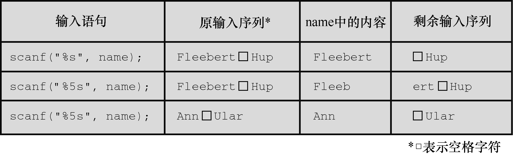

#### 11.2.4　 `scanf()` 函数

我们再来研究一下 `scanf()` 。前面的程序中用 `scanf()` 和 `%s` 转换说明读取字符串。 `scanf()` 和 `gets()` 或 `fgets()` 的区别在于它们如何确定字符串的末尾： `scanf()` 更像是“获取单词”函数，而不是“获取字符串”函数；如果预留的存储区装得下输入行， `gets()` 和 `fgets()` 会读取第1个换行符之前所有的字符。 `scanf()` 函数有两种方法确定输入结束。无论哪种方法，都从第1个非空白字符作为字符串的开始。如果使用 `%s` 转换说明，以下一个空白字符（空行、空格、制表符或换行符）作为字符串的结束（字符串不包括空白字符）。如果指定了字段宽度，如 `%10s` ，那么 `scanf()` 将读取10个字符或读到第1个空白字符停止（先满足的条件即是结束输入的条件），见图11.3。


<center class="my_markdown"><b class="my_markdown">图11.3　字段宽度和 `scanf()`</b></center>

前面介绍过， `scanf()` 函数返回一个整数值，该值等于 `scanf()` 成功读取的项数或 `EOF` （读到文件结尾时返回 `EOF` ）。

程序清单11.11演示了在 `scanf()` 函数中指定字段宽度的用法。

程序清单11.11　 `scan_str.c` 程序

```c
/* scan_str.c -- 使用 scanf() */
#include <stdio.h>
int main(void)
{
     char name1[11], name2[11];
     int count;
     printf("Please enter 2 names.\n");
     count = scanf("%5s %10s", name1, name2);
     printf("I read the %d names %s and %s.\n", count, name1, name2);
     return 0;
}
```

下面是该程序的3个输出示例：

```c
Please enter 2 names.
Jesse Jukes
I read the 2 names Jesse and Jukes.
Please enter 2 names.
Liza Applebottham
I read the 2 names Liza and Applebotth.
Please enter 2 names.
Portensia Callowit
I read the 2 names Porte and nsia.

```

第1个输出示例，两个名字的字符个数都未超过字段宽度。第2个输出示例，只读入了 `Applebottham` 的前10个字符 `Applebotth` （因为使用了 `%10s` 转换说明）。第3个输出示例， `Portensia` 的后4个字符 `nsia` 被写入 `name2` 中，因为第2次调用 `scanf()` 时，从上一次调用结束的地方继续读取数据。在该例中，读取的仍是 `Portensia` 中的字母。

根据输入数据的性质，用 `fgets()` 读取从键盘输入的数据更合适。例如， `scanf()` 无法完整读取书名或歌曲名，除非这些名称是一个单词。 `scanf()` 的典型用法是读取并转换混合数据类型为某种标准形式。例如，如果输入行包含一种工具名、库存量和单价，就可以使用 `scanf()` 。否则可能要自己拼凑一个函数处理一些输入检查。如果一次只输入一个单词，用 `scanf()` 也没问题。

`scanf()` 和 `gets()` 类似，也存在一些潜在的缺点。如果输入行的内容过长， `scanf()` 也会导致数据溢出。不过，在 `%s` 转换说明中使用字段宽度可防止溢出。

