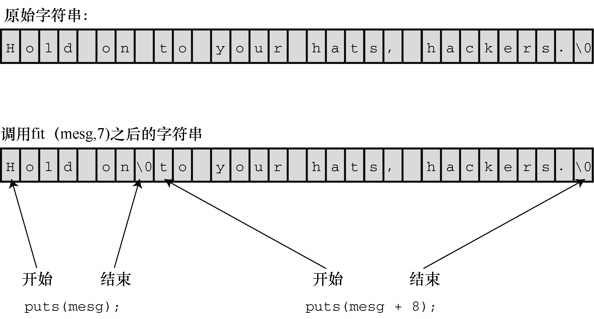

#### 11.5.1　 `strlen()` 函数

`strlen()` 函数用于统计字符串的长度。下面的函数可以缩短字符串的长度，其中用到了 `strlen()` ：

```c
void fit(char *string, unsigned int size)
{
     if (strlen(string) > size)
         string[size] = '\0';
}
```

该函数要改变字符串，所以函数头在声明形式参数 `string` 时没有使用 `const` 限定符。

程序清单11.17中的程序测试了 `fit()` 函数。注意代码中使用了C字符串常量的串联特性。

程序清单11.17　 `test_fit.c` 程序

```c
/* test_fit.c -- 使用缩短字符串长度的函数 */
#include <stdio.h>
#include <string.h>    /* 内含字符串函数原型 */
void fit(char *, unsigned int);
int main(void)
{
     char mesg [] = "Things should be as simple as possible,"
                                 " but not simpler.";
     puts(mesg);
     fit(mesg, 38);
     puts(mesg);
     puts("Let's look at some more of the string.");
     puts(mesg + 39);
     return 0;
}
void fit(char *string, unsigned int size)
{
     if (strlen(string) > size)
          string[size] = '\0';
}
```

下面是该程序的输出：

```c
Things should be as simple as possible, but not simpler.
Things should be as simple as possible
Let's look at some more of the string.
 but not simpler.
```

`fit()` 函数把第39个元素的逗号替换成 `'\0'` 字符。 `puts()` 函数在空字符处停止输出，并忽略其余字符。然而，这些字符还在缓冲区中，下面的函数调用把这些字符打印了出来：

```c
puts(mesg + 39);
```

表达式 `mesg + 39` 是 `mesg[39]` 的地址，该地址上存储的是空格字符。所以 `puts()` 显示该字符并继续输出直至遇到原来字符串中的空字符。图11.4演示了这一过程。


<center class="my_markdown"><b class="my_markdown">图11.4　 `puts()` 函数和空字符</b></center>

> **注意**
> 一些ANSI之前的系统使用 `strings.h` 头文件，而有些系统可能根本没有字符串头文件。

`string.h` 头文件中包含了C字符串函数系列的原型，因此程序清单11.17要包含该头文件。

