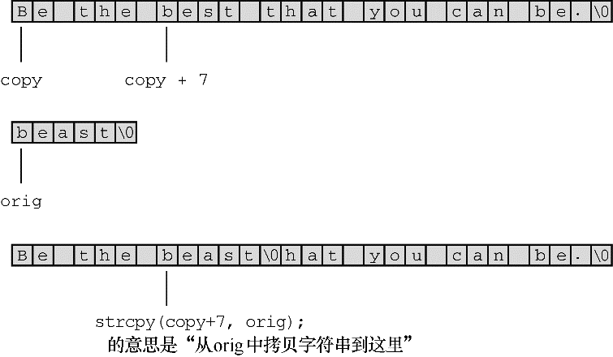

#### 11.5.5　 `strcpy()` 和 `strncpy()` 函数

前面提到过，如果 `pts1` 和 `pts2` 都是指向字符串的指针，那么下面语句拷贝的是字符串的地址而不是字符串本身：

```c
pts2 = pts1;
```

如果希望拷贝整个字符串，要使用 `strcpy()` 函数。程序清单11.25要求用户输入以 `q` 开头的单词。该程序把输入拷贝至一个临时数组中，如果第1个字母是 `q` ，程序调用 `strcpy()` 把整个字符串从临时数组拷贝至目标数组中。 `strcpy()` 函数相当于字符串赋值运算符。

程序清单11.25　 `copy1.c` 程序

```c
/* copy1.c -- 演示 strcpy() */
#include <stdio.h>
#include <string.h>  // strcpy()的原型在该头文件中
#define SIZE 40
#define LIM 5
char * s_gets(char * st, int n);
int main(void)
{
     char qwords[LIM][SIZE];
     char temp[SIZE];
     int i = 0;
     printf("Enter %d words beginning with q:\n", LIM);
     while (i < LIM && s_gets(temp, SIZE))
     {
          if (temp[0] != 'q')
               printf("%s doesn't begin with q!\n", temp);
          else
          {
               strcpy(qwords[i], temp);
               i++;
          }
     }
     puts("Here are the words accepted:");
     for (i = 0; i < LIM; i++)
          puts(qwords[i]);
     return 0;
}
char * s_gets(char * st, int n)
{
     char * ret_val;
     int i = 0;
     ret_val = fgets(st, n, stdin);
     if (ret_val)
     {
          while (st[i] != '\n' && st[i] != '\0')
               i++;
          if (st[i] == '\n')
               st[i] = '\0';
          else 
               while (getchar() != '\n')
                     continue;
     }
     return ret_val;
}
```

下面是该程序的运行示例：

```c
Enter 5 words beginning with q:
quackery
quasar
quilt
quotient
no more
no more doesn't begin with q!
quiz
Here are the words accepted:
quackery
quasar
quilt
quotient
quiz

```

注意，只有在输入以 `q` 开头的单词后才会递增计数器 `i` ，而且该程序通过比较字符进行判断：

```c
if (temp[0] != 'q')
```

这行代码的意思是： `temp` 中的第1个字符是否是 `q` ？当然，也可以通过比较字符串进行判断：

```c
if (strncmp(temp, "q", 1) != 0)
```

这行代码的意思是： `temp` 字符串和 `"q"` 的第1个元素是否相等？

请注意， `strcpy()` 第2个参数（ `temp` ）指向的字符串被拷贝至第1个参数（ `qword[i]` ）指向的数组中。拷贝出来的字符串被称为目标字符串，最初的字符串被称为源字符串。参考赋值表达式语句，很容易记住 `strcpy()` 参数的顺序，即第1个是目标字符串，第2个是源字符串。

```c
char target[20];
int x;
x = 50;                    /* 数字赋值*/
strcpy(target, "Hi ho!");  /* 字符串赋值*/
target = "So long";        /* 语法错误 */
```

程序员有责任确保目标数组有足够的空间容纳源字符串的副本。下面的代码有点问题：

```c
char * str;
strcpy(str, "The C of Tranquility");    // 有问题
```

`strcpy()` 把 `"The C of Tranquility"` 拷贝至 `str` 指向的地址上，但是 `str` 未被初始化，所以该字符串可能被拷贝到任意的地方！

总之， `strcpy()` 接受两个字符串指针作为参数，可以把指向源字符串的第2个指针声明为指针、数组名或字符串常量；而指向源字符串副本的第1个指针应指向一个数据对象（如，数组），且该对象有足够的空间存储源字符串的副本。记住，声明数组将分配存储数据的空间，而声明指针只分配存储一个地址的空间。

#### 1． `strcpy()` 的其他属性

`strcpy()` 函数还有两个有用的属性。第一， `strcpy()` 的返回类型是 `char`  *，该函数返回的是第1个参数的值，即一个字符的地址。第二，第1个参数不必指向数组的开始。这个属性可用于拷贝数组的一部分。程序清单11.26演示了该函数的这两个属性。

程序清单11.26　 `copy2.c` 程序

```c
/* copy2.c -- 使用 strcpy() */
#include <stdio.h>
#include <string.h>    // 提供strcpy()的函数原型
#define WORDS  "beast"
#define SIZE 40
int main(void)
{
     const char * orig = WORDS;
     char copy[SIZE] = "Be the best that you can be.";
     char * ps;
     puts(orig);
     puts(copy);
     ps = strcpy(copy + 7, orig);
     puts(copy);
     puts(ps);
     return 0;
}
```

下面是该程序的输出：

```c
beast
Be the best that you can be.
Be the beast
beast
```

注意， `strcpy()` 把源字符串中的空字符也拷贝在内。在该例中，空字符覆盖了 `copy` 数组中 `that` 的第1个 `t` （见图11.5）。注意，由于第1个参数是 `copy + 7` ，所以 `ps` 指向 `copy` 中的第8个元素（下标为 `7` ）。因此 `puts(ps)` 从该处开始打印字符串。


<center class="my_markdown"><b class="my_markdown">图11.5　使用指针 `strcpy()` 函数</b></center>

#### 2．更谨慎的选择： `strncpy()` 

`strcpy()` 和 `strcat()` 都有同样的问题，它们都不能检查目标空间是否能容纳源字符串的副本。拷贝字符串用 `strncpy()` 更安全，该函数的第3个参数指明可拷贝的最大字符数。程序清单11.27用 `strncpy()` 代替程序清单11.25中的 `strcpy()` 。为了演示目标空间装不下源字符串的副本会发生什么情况，该程序使用了一个相当小的目标字符串（共7个元素，包含6个字符）。

程序清单11.27　 `copy3.c` 程序

```c
/* copy3.c -- 使用strncpy() */
#include <stdio.h>
#include <string.h>    /* 提供strncpy()的函数原型*/
#define SIZE 40
#define TARGSIZE 7
#define LIM 5
char * s_gets(char * st, int n);
int main(void)
{
     char qwords[LIM][TARGSIZE];
     char temp[SIZE];
     int i = 0;
     printf("Enter %d words beginning with q:\n", LIM);
     while (i < LIM && s_gets(temp, SIZE))
     {
          if (temp[0] != 'q')
               printf("%s doesn't begin with q!\n", temp);
          else
          {
               strncpy(qwords[i], temp, TARGSIZE - 1);
               qwords[i][TARGSIZE - 1] = '\0';
               i++;
          }
     }
     puts("Here are the words accepted:");
     for (i = 0; i < LIM; i++)
          puts(qwords[i]);
     return 0;
}
char * s_gets(char * st, int n)
{
     char * ret_val;
     int i = 0;
     ret_val = fgets(st, n, stdin);
     if (ret_val)
     {
          while (st[i] != '\n' && st[i] != '\0')
               i++;
          if (st[i] == '\n')
               st[i] = '\0';
          else 
               while (getchar() != '\n')
                      continue;
     }
     return ret_val;
}
```

下面是该程序的运行示例：

```c
Enter 5 words beginning with q:
quack
quadratic
quisling
quota
quagga
Here are the words accepted:
quack
quadra
quisli
quota
quagga

```

`strncpy(target, source, n)` 把 `source` 中的 `n` 个字符或空字符之前的字符（先满足哪个条件就拷贝到何处）拷贝至 `target` 中。因此，如果 `source` 中的字符数小于 `n` ，则拷贝整个字符串，包括空字符。但是， `strncpy()` 拷贝字符串的长度不会超过 `n` ，如果拷贝到第 `n` 个字符时还未拷贝完整个源字符串，就不会拷贝空字符。所以，拷贝的副本中不一定有空字符。鉴于此，该程序把 `n` 设置为比目标数组大小少 `1` （ `TARGSIZE-1` ），然后把数组最后一个元素设置为空字符：

```c
strncpy(qwords[i], temp, TARGSIZE - 1);
qwords[i][TARGSIZE - 1] = '\0';
```

这样做确保存储的是一个字符串。如果目标空间能容纳源字符串的副本，那么从源字符串拷贝的空字符便是该副本的结尾；如果目标空间装不下副本，则把副本最后一个元素设置为空字符。

