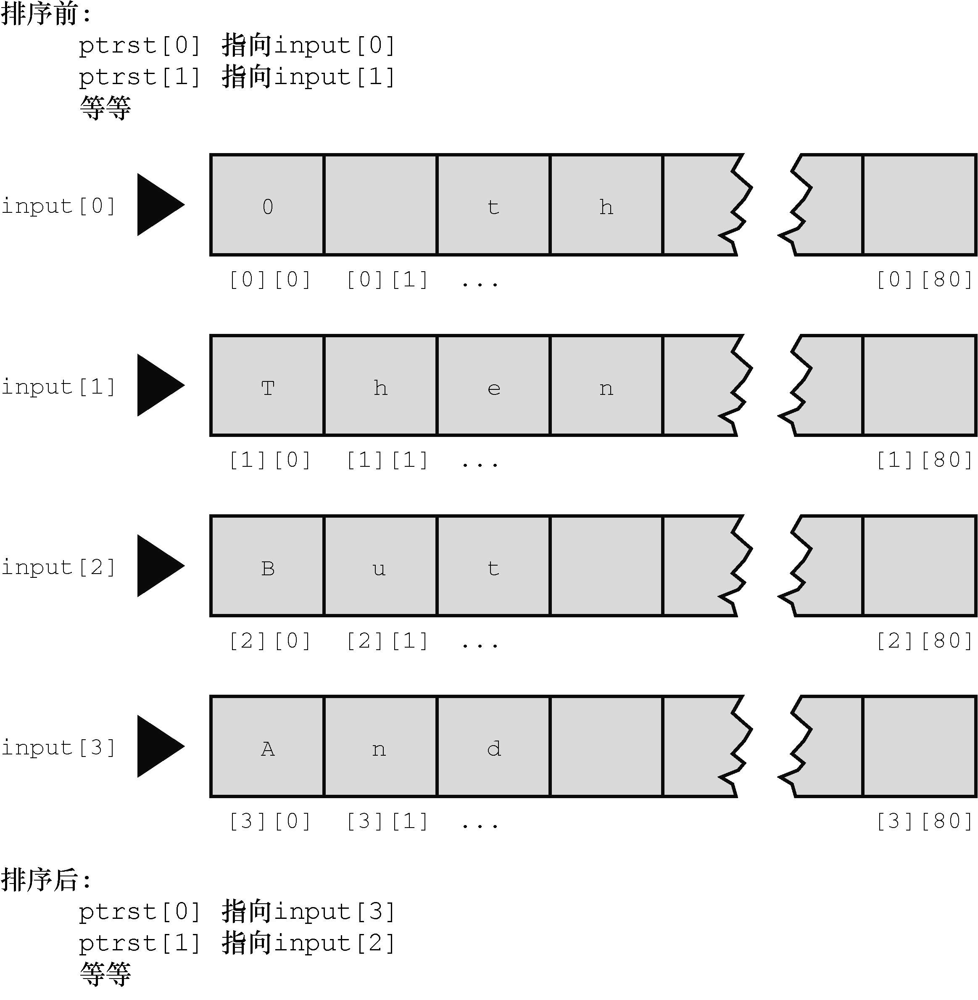

#### 11.6.1　排序指针而非字符串

该程序的巧妙之处在于排序的是指向字符串的指针，而不是字符串本身。我们来分析一下具体怎么做。最初， `ptrst[0]` 被设置为 `input[0]` ， `ptrst[1]` 被设置为 `input[1]` ，以此类推。这意味着指针 `ptrst[i]` 指向数组 `input[i]` 的首字符。每个 `input[i]` 都是一个内含81个元素的数组，每个 `ptrst[i]` 都是一个单独的变量。排序过程把 `ptrst` 重新排列，并未改变 `input` 。例如，如果按字母顺序 `input[1]` 在 `intput[0]` 前面，程序便交换指向它们的指针（即 `ptrst[0]` 指向 `input[1]` 的开始，而 `ptrst[1]` 指向 `input[0]` 的开始）。这样做比用 `strcpy()` 交换两个 `input` 字符串的内容简单得多，而且还保留了 `input` 数组中的原始顺序。图11.6从另一个视角演示了这一过程。

<b class="my_markdown">图11.6　排序字符串指针</b>

