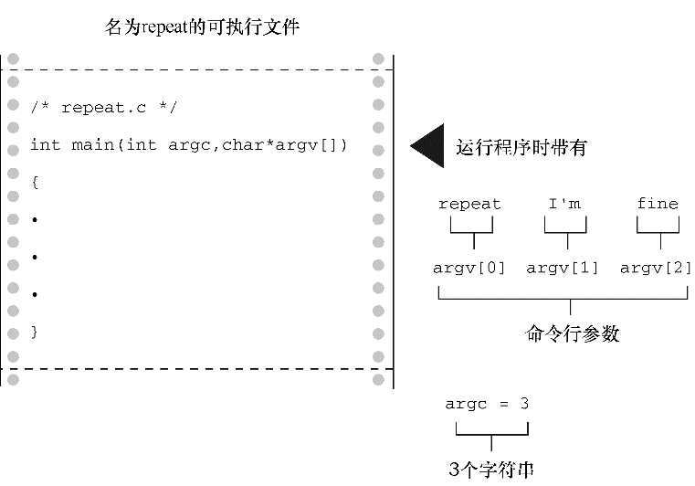

### 11.8　命令行参数

在图形界面普及之前都使用命令行界面。DOS和UNIX就是例子。Linux终端提供类UNIX命令行环境。命令行（command line）是在命令行环境中，用户为运行程序输入命令的行。假设一个文件中有一个名为 `fuss` 的程序。在UNIX环境中运行该程序的命令行是：

```c
$ fuss
```

或者在 `Windows` 命令提示模式下是：

```c
C> fuss
```

命令行参数（command-line argument）是同一行的附加项。如下例：

```c
$ fuss -r Ginger
```

一个C程序可以读取并使用这些附加项（见图11.7）。


<center class="my_markdown"><b class="my_markdown">图11.7　命令行参数</b></center>

程序清单11.31是一个典型的例子，该程序通过 `main()` 的参数读取这些附加项。

程序清单11.31　 `repeat.c` 程序

```c
/* repeat.c -- 带参数的 main() */
#include <stdio.h>
int main(int argc, char *argv [])
{
     int count;
     printf("The command line has %d arguments:\n", argc - 1);
     for (count = 1; count < argc; count++)
          printf("%d: %s\n", count, argv[count]);
     printf("\n");
     return 0;
}
```

把该程序编译为可执行文件 `repeat` 。下面是通过命令行运行该程序后的输出：

```c
C>repeat Resistance is futile
The command line has 3 arguments:
1: Resistance
2: is
3: futile

```

由此可见该程序为何名为 `repeat` 。下面我们解释一下它的运行原理。

C编译器允许 `main()` 没有参数或者有两个参数（一些实现允许 `main()` 有更多参数，属于对标准的扩展）。 `main()` 有两个参数时，第1个参数是命令行中的字符串数量。过去，这个 `int` 类型的参数被称为 `argc` （表示参数计数`(` argument count `)`）。系统用空格表示一个字符串的结束和下一个字符串的开始。因此，上面的 `repeat` 示例中包括命令名共有4个字符串，其中后3个供 `repeat` 使用。该程序把命令行字符串存储在内存中，并把每个字符串的地址存储在指针数组中。而该数组的地址则被存储在 `main()` 的第2个参数中。按照惯例，这个指向指针的指针称为 `argv` （表示参数值[argument value]）。如果系统允许（一些操作系统不允许这样），就把程序本身的名称赋给 `argv[0]` ，然后把随后的第1个字符串赋给 `argv[1]` ，以此类推。在我们的例子中，有下面的关系：

```c
argv[0] 指向 repeat （对大部分系统而言）
argv[1] 指向Resistance
argv[2] 指向is
argv[3] 指向futile
```

程序清单11.31的程序通过一个 `for` 循环依次打印每个字符串。 `printf()` 中的 `%s` 转换说明表明，要提供一个字符串的地址作为参数，而指针数组中的每个元素（ `argv[0]` 、 `argv[1]` 等）都是这样的地址。

`main()` 中的形参形式与其他带形参的函数相同。许多程序员用不同的形式声明 `argv` ：

```c
int main(int argc, char **argv)
```

`char`  ** `argv` 与 `char`  * `argv[]` 等价。也就是说， `argv` 是一个指向指针的指针，它所指向的指针指向 `char` 。因此，即使在原始定义中， `argv` 也是指向指针（该指针指向 `char` ）的指针。两种形式都可以使用，但我们认为第1种形式更清楚地表明 `argv` 表示一系列字符串。

顺带一提，许多环境（包括UNIX和DOS）都允许用双引号把多个单词括起来形成一个参数。例如：

```c
repeat "I am hungry" now
```

这行命令把字符串 `"I am hungry"` 赋给 `argv[1]` ，把 `"now"` 赋给 `argv[2]` 。

