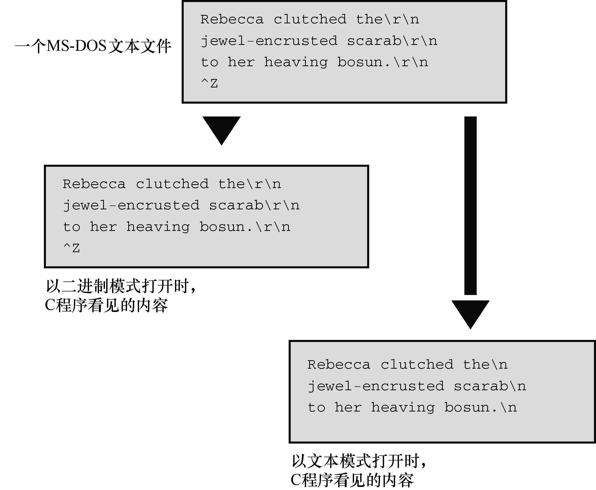

#### 13.1.2　文本模式和二进制模式

首先，要区分文本内容和二进制内容、文本文件格式和二进制文件格式，以及文件的文本模式和二进制模式。

所有文件的内容都以二进制形式（ `0` 或 `1` ）存储。但是，如果文件最初使用二进制编码的字符（例如，ASCII或Unicode）表示文本（就像C字符串那样），该文件就是文本文件，其中包含文本内容。如果文件中的二进制值代表机器语言代码或数值数据（使用相同的内部表示，假设，用于 `long` 或 `double` 类型的值）或图片或音乐编码，该文件就是二进制文件，其中包含二进制内容。

UNIX用同一种文件格式处理文本文件和二进制文件的内容。不奇怪，鉴于C是作为开发UNIX的工具而创建的，C和UNIX在文本中都使用 `\n` （换行符）表示换行。UNIX目录中有一个统计文件大小的计数，程序可使用该计数确定是否读到文件结尾。然而，其他系统在此之前已经有其他方法处理文件，专门用于保存文本。也就是说，其他系统已经有一种与UNIX模型不同的格式处理文本文件。例如，以前的OS X Macintosh文件用 `\r` （回车符）表示新的一行。早期的MS-DOS文件用 `\r\n` 组合表示新的一行，用嵌入的Ctrl+Z字符表示文件结尾，即使实际文件用添加空字符的方法使其总大小是256的倍数（在Windows中，Notepad仍然生成MS-DOS格式的文本文件，但是新的编辑器可能使用类UNIX格式居多）。其他系统可能保持文本文件中的每一行长度相同，如有必要，用空字符填充每一行，使其长度保持一致。或者，系统可能在每行的开始标出每行的长度。

为了规范文本文件的处理，C提供两种访问文件的途径：二进制模式和文本模式。在二进制模式中，程序可以访问文件的每个字节。而在文本模式中，程序所见的内容和文件的实际内容不同。程序以文本模式读取文件时，把本地环境表示的行末尾或文件结尾映射为C模式。例如，C程序在旧式Macintosh中以文本模式读取文件时，把文件中的 `\r` 转换成 `\n` ；以文本模式写入文件时，把 `\n` 转换成 `\r` 。或者，C文本模式程序在MS-DOS平台读取文件时，把 `\r\n` 转换成 `\n` ；写入文件时，把 `\n` 转换成 `\r\n` 。在其他环境中编写的文本模式程序也会做类似的转换。

除了以文本模式读写文本文件，还能以二进制模式读写文本文件。如果读写一个旧式MS-DOS文本文件，程序会看到文件中的\ `r` 和\ `n` 字符，不会发生映射（图13.1演示了一些文本）。如果要编写旧式Mac格式、MS-DOS格式或UNIX/Linux格式的文件模式程序，应该使用二进制模式，这样程序才能确定实际的文件内容并执行相应的动作。

<b class="my_markdown">图13.1　二进制模式和文本模式</b>

虽然C提供了二进制模式和文本模式，但是这两种模式的实现可以相同。前面提到过，因为UNIX使用一种文件格式，这两种模式对于UNIX实现而言完全相同。Linux也是如此。

