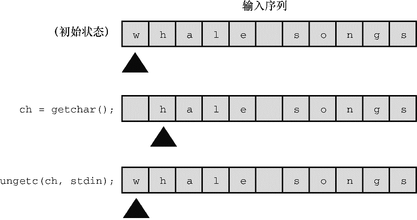

#### 13.7.1　 `int ungetc(int c, FILE`  * `fp)` 函数

`int ungetc()` 函数把 `c` 指定的字符放回输入流中。如果把一个字符放回输入流，下次调用标准输入函数时将读取该字符（见图13.2）。例如，假设要读取下一个冒号之前的所有字符，但是不包括冒号本身，可以使用 `getchar()` 或 `getc()` 函数读取字符到冒号，然后使用 `ungetc()` 函数把冒号放回输入流中。ANSI C标准保证每次只会放回一个字符。如果实现允许把一行中的多个字符放回输入流，那么下一次输入函数读入的字符顺序与放回时的顺序相反。

<b class="my_markdown">图13.2　 `ungetc()` 函数</b>

