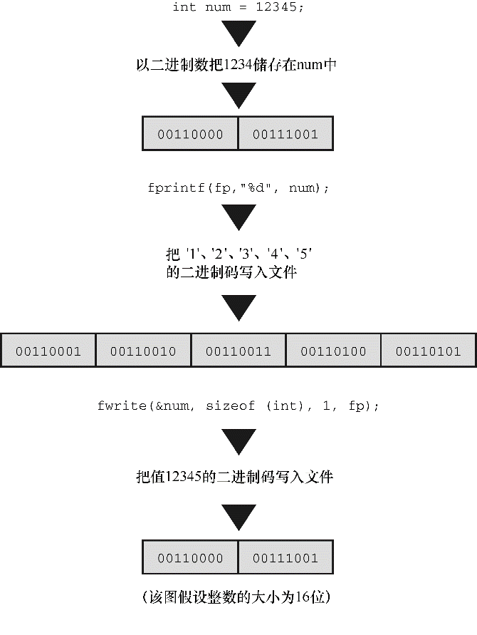

#### 13.7.4　二进制I/O： `fread()` 和 `fwrite()` 

介绍 `fread()` 和 `fwrite()` 函数之前，先要了解一些背景知识。之前用到的标准I/O函数都是面向文本的，用于处理字符和字符串。如何在文件中保存数值数据？用 `fprintf()` 函数和 `%f` 转换说明只是把数值保存为字符串。例如，下面的代码：

```c
double num = 1./3.;
fprintf(fp,"%f", num);
```

把 `num` 存储为8个字符： `0.333333` 。使用 `%.2f` 转换说明将其存储为4个字符： `0.33` ，用 `%.12f` 转换说明则将其存储为14个字符： `0.333333333333` 。改变转换说明将改变存储该值所需的空间数量，也会导致存储不同的值。把 `num` 存储为 `0.33` 后，读取文件时就无法将其恢复为更高的精度。一般而言， `fprintf()` 把数值转换为字符数据，这种转换可能会改变值。

为保证数值在存储前后一致，最精确的做法是使用与计算机相同的位组合来存储。因此， `double` 类型的值应该存储在一个 `double` 大小的单元中。如果以程序所用的表示法把数据存储在文件中，则称以二进制形式存储数据。不存在从数值形式到字符串的转换过程。对于标准I/O， `fread()` 和 `fwrite` 函数用于以二进制形式处理数据（见图13.3）。


<center class="my_markdown"><b class="my_markdown">图13.3　二进制输出和文本输出</b></center>

实际上，所有的数据都是以二进制形式存储的，甚至连字符都以字符码的二进制表示来存储。如果文件中的所有数据都被解释成字符码，则称该文件包含文本数据。如果部分或所有的数据都被解释成二进制形式的数值数据，则称该文件包含二进制数据（另外，用数据表示机器语言指令的文件都是二进制文件）。

二进制和文本的用法很容易混淆。ANSI C和许多操作系统都识别两种文件格式：二进制和文本。能以二进制数据或文本数据形式存储或读取信息。可以用二进制模式打开文本格式的文件，可以把文本存储在二进制形式的文件中。可以调用 `getc()` 拷贝包含二进制数据的文件。然而，一般而言，用二进制模式在二进制格式文件中存储二进制数据。类似地，最常用的还是以文本格式打开文本文件中的文本数据（通常文字处理器生成的文件都是二进制文件，因为这些文件中包含了大量非文本信息，如字体和格式等）。

