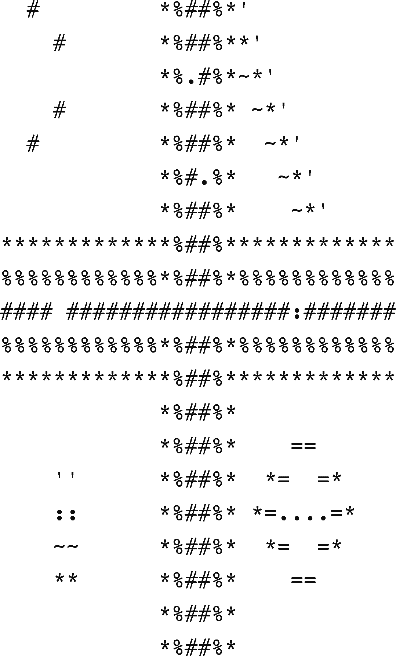

### 13.11　编程练习

1．修改程序清单13.1中的程序，要求提示用户输入文件名，并读取用户输入的信息，不使用命令行参数。

2．编写一个文件拷贝程序，该程序通过命令行获取原始文件名和拷贝文件名。尽量使用标准I/O和二进制模式。

3．编写一个文件拷贝程序，提示用户输入文本文件名，并以该文件名作为原始文件名和输出文件名。该程序要使用 `ctype.h` 中的 `toupper()` 函数，在写入到输出文件时把所有文本转换成大写。使用标准I/O和文本模式。

4．编写一个程序，按顺序在屏幕上显示命令行中列出的所有文件。使用 `argc` 控制循环。

5．修改程序清单13.5中的程序，用命令行界面代替交互式界面。

6．使用命令行参数的程序依赖于用户的内存如何正确地使用它们。重写程序清单13.2中的程序，不使用命令行参数，而是提示用户输入所需信息。

7．编写一个程序打开两个文件。可以使用命令行参数或提示用户输入文件名。

a．　该程序以这样的顺序打印：打印第1个文件的第1行，第2个文件的第1行，第1个文件的第2行，第2个文件的第2行，以此类推，打印到行数较多文件的最后一行。

b．　修改该程序，把行号相同的行打印成一行。

8．编写一个程序，以一个字符和任意文件名作为命令行参数。如果字符后面没有参数，该程序读取标准输入；否则，程序依次打开每个文件并报告每个文件中该字符出现的次数。文件名和字符本身也要一同报告。程序应包含错误检查，以确定参数数量是否正确和是否能打开文件。如果无法打开文件，程序应报告这一情况，然后继续处理下一个文件。

9．修改程序清单13.3中的程序，从1开始，根据加入列表的顺序为每个单词编号。当程序下次运行时，确保新的单词编号接着上次的编号开始。

10．编写一个程序打开一个文本文件，通过交互方式获得文件名。通过一个循环，提示用户输入一个文件位置。然后该程序打印从该位置开始到下一个换行符之前的内容。用户输入负数或非数值字符可以结束输入循环。

11．编写一个程序，接受两个命令行参数。第1个参数是一个字符串，第2个参数是一个文件名。然后该程序查找该文件，打印文件中包含该字符串的所有行。因为该任务是面向行而不是面向字符的，所以要使用 `fgets()` 而不是 `getc()` 。使用标准C库函数 `strstr()` （11.5.7节简要介绍过）在每一行中查找指定字符串。假设文件中的所有行都不超过255个字符。

12．创建一个文本文件，内含20行，每行30个整数。这些整数都在 `0` ～ `9` 之间，用空格分开。该文件是用数字表示一张图片， `0` ～ `9` 表示逐渐增加的灰度。编写一个程序，把文件中的内容读入一个20×30的 `int` 数组中。一种把这些数字转换为图片的粗略方法是：该程序使用数组中的值初始化一个20×31的字符数组，用值 `0` 对应空格字符， `1` 对应点字符，以此类推。数字越大表示字符所占的空间越大。例如，用 `#` 表示 `9` 。每行的最后一个字符（第31个）是空字符，这样该数组包含了20个字符串。最后，程序显示最终的图片（即，打印所有的字符串），并将结果存储在文本文件中。例如，下面是开始的数据：

```c
0 0 9 0 0 0 0 0 0 0 0 0 5 8 9 9 8 5 2 0 0 0 0 0 0 0 0 0 0 0
0 0 0 0 9 0 0 0 0 0 0 0 5 8 9 9 8 5 5 2 0 0 0 0 0 0 0 0 0 0
0 0 0 0 0 0 0 0 0 0 0 0 5 8 1 9 8 5 4 5 2 0 0 0 0 0 0 0 0 0
0 0 0 0 9 0 0 0 0 0 0 0 5 8 9 9 8 5 0 4 5 2 0 0 0 0 0 0 0 0
0 0 9 0 0 0 0 0 0 0 0 0 5 8 9 9 8 5 0 0 4 5 2 0 0 0 0 0 0 0
0 0 0 0 0 0 0 0 0 0 0 0 5 8 9 1 8 5 0 0 0 4 5 2 0 0 0 0 0 0
0 0 0 0 0 0 0 0 0 0 0 0 5 8 9 9 8 5 0 0 0 0 4 5 2 0 0 0 0 0
5 5 5 5 5 5 5 5 5 5 5 5 5 8 9 9 8 5 5 5 5 5 5 5 5 5 5 5 5 5
8 8 8 8 8 8 8 8 8 8 8 8 5 8 9 9 8 5 8 8 8 8 8 8 8 8 8 8 8 8
9 9 9 9 0 9 9 9 9 9 9 9 9 9 9 9 9 9 9 9 9 9 3 9 9 9 9 9 9 9
8 8 8 8 8 8 8 8 8 8 8 8 5 8 9 9 8 5 8 8 8 8 8 8 8 8 8 8 8 8
5 5 5 5 5 5 5 5 5 5 5 5 5 8 9 9 8 5 5 5 5 5 5 5 5 5 5 5 5 5
0 0 0 0 0 0 0 0 0 0 0 0 5 8 9 9 8 5 0 0 0 0 0 0 0 0 0 0 0 0
0 0 0 0 0 0 0 0 0 0 0 0 5 8 9 9 8 5 0 0 0 0 6 6 0 0 0 0 0 0
0 0 0 0 2 2 0 0 0 0 0 0 5 8 9 9 8 5 0 0 5 6 0 0 6 5 0 0 0 0
0 0 0 0 3 3 0 0 0 0 0 0 5 8 9 9 8 5 0 5 6 1 1 1 1 6 5 0 0 0
0 0 0 0 4 4 0 0 0 0 0 0 5 8 9 9 8 5 0 0 5 6 0 0 6 5 0 0 0 0
0 0 0 0 5 5 0 0 0 0 0 0 5 8 9 9 8 5 0 0 0 0 6 6 0 0 0 0 0 0
0 0 0 0 0 0 0 0 0 0 0 0 5 8 9 9 8 5 0 0 0 0 0 0 0 0 0 0 0 0
0 0 0 0 0 0 0 0 0 0 0 0 5 8 9 9 8 5 0 0 0 0 0 0 0 0 0 0 0 0
```

根据以上描述选择特定的输出字符，最终输出如下：


13．用变长数组（VLA）代替标准数组，完成编程练习12。

14．数字图像，尤其是从宇宙飞船发回的数字图像，可能会包含一些失真。为编程练习12添加消除失真的函数。该函数把每个值与它上下左右相邻的值作比较，如果该值与其周围相邻值的差都大于1，则用所有相邻值的平均值（四舍五入为整数）代替该值。注意，与边界上的点相邻的点少于4个，所以做特殊处理。

[1]　注意，字符串大小和字符串长度不同。前者指该字符串占用多少空间，后者指该字符串的字符个数。——译者注


