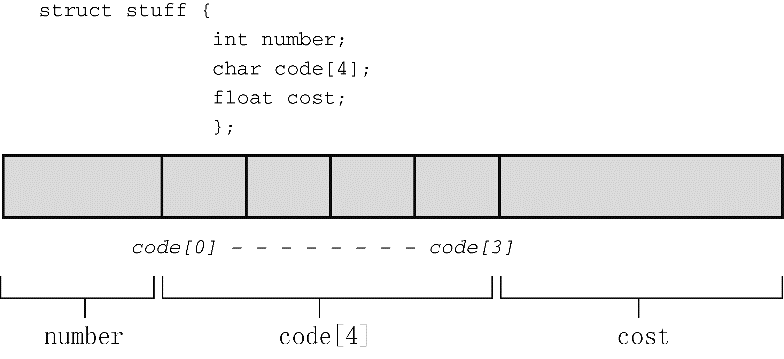

### 14.3　定义结构变量

结构有两层含义。一层含义是“结构布局”，刚才已经讨论过了。结构布局告诉编译器如何表示数据，但是它并未让编译器为数据分配空间。下一步是创建一个结构变量，即是结构的另一层含义。程序中创建结构变量的一行是 `:`

```c
struct book library;
```

编译器执行这行代码便创建了一个结构变量 `library` 。编译器使用 `book` 模板为该变量分配空间：一个内含 `MAXTITL` 个元素的 `char` 数组、一个内含 `MAXAUTL` 个元素的 `char` 数组和一个 `float` 类型的变量。这些存储空间都与一个名称 `library` 结合在一起（见图14.1）。


<center class="my_markdown"><b class="my_markdown">图14.1　一个结构的内存分配</b></center>

在结构变量的声明中， `struct book` 所起的作用相当于一般声明中的 `int` 或 `float` 。例如，可以定义两个 `struct book` 类型的变量，或者甚至是指向 `struct book` 类型结构的指针：

```c
struct book doyle, panshin, * ptbook;
```

结构变量 `doyle` 和 `panshin` 中都包含 `title` 、 `author` 和 `value` 部分。指针 `ptbook` 可以指向 `doyle` 、 `panshin` 或任何其他 `book` 类型的结构变量。从本质上看， `book` 结构声明创建了一个名为 `struct book` 的新类型。

就计算机而言，下面的声明：

```c
struct book library;
```

是以下声明的简化：

```c
struct book {
     char title[MAXTITL];
     char author[AXAUTL];
     float value;
} library;    /* 声明的右花括号后跟变量名*/
```

换言之，声明结构的过程和定义结构变量的过程可以组合成一个步骤。如下所示，组合后的结构声明和结构变量定义不需要使用结构标记：

```c
struct { /* 无结构标记 */
     char title[MAXTITL];
     char author[MAXAUTL];
     float value;
} library;
```

然而，如果打算多次使用结构模板，就要使用带标记的形式；或者，使用本章后面介绍的 `typedef` 。

这是定义结构变量的一个方面，在这个例子中，并未初始化结构变量。

