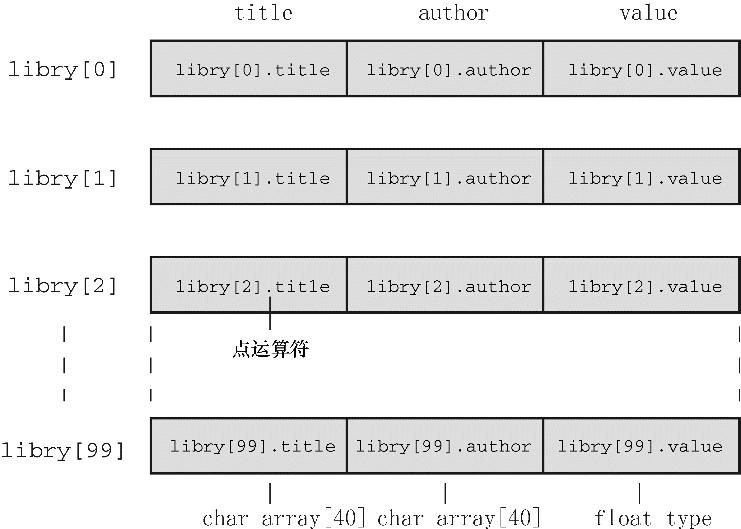

#### 14.4.1　声明结构数组

声明结构数组和声明其他类型的数组类似。下面是一个声明结构数组的例子：

```c
struct book library[MAXBKS];
```

以上代码把 `library` 声明为一个内含 `MAXBKS` 个元素的数组。数组的每个元素都是一个 `book` 类型的结构。因此， `library[0]` 是第1个 `book` 类型的结构变量， `library[1]` 是第2个 `book` 类型的结构变量，以此类推。参看图14.2可以帮助读者理解。数组名 `library` 本身不是结构名，它是一个数组名，该数组中的每个元素都是 `struct book` 类型的结构变量。


<center class="my_markdown"><b class="my_markdown">图14.2　一个结构数组 `library[MAXBKS]`</b></center>

